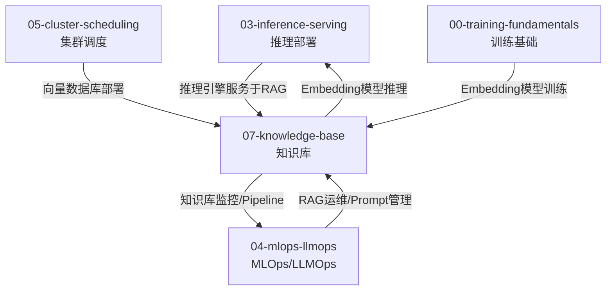
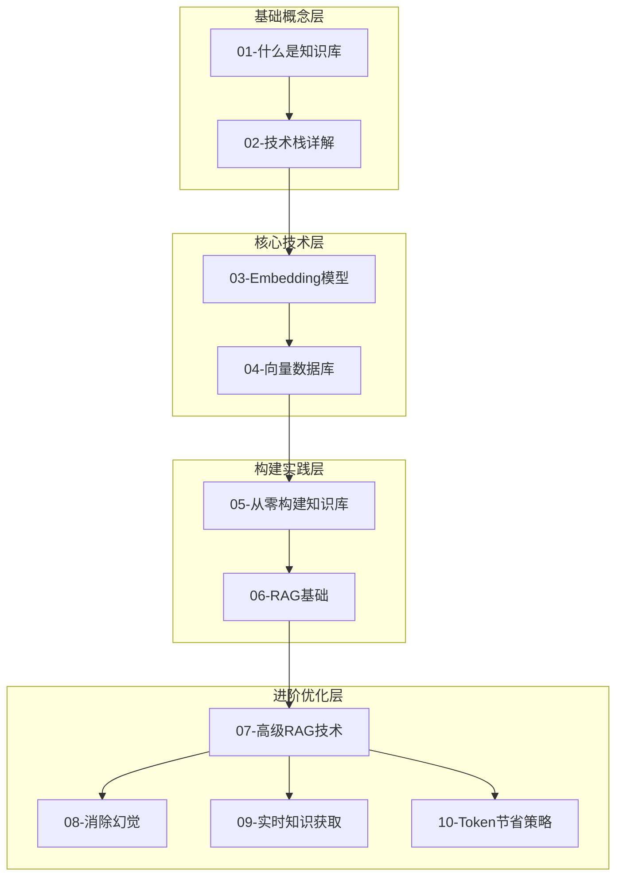

## 用户需求

在 `skills/ai-infra` 知识框架中新增第 7 章：知识库（Knowledge Base），系统性地讲解知识库相关的 AI Infra 技术。

## 产品概述

新增章节编号为 07，作为 AI Infra 全景图中存储层（向量数据库 Milvus）的自然深入扩展。内容需要按照已有章节的结构模式组织：主文件 + 子目录（README + 多个编号子文件），每个子文件深入讲解一个主题。

## 核心功能

1. **知识库基础概念**：定义、分类（结构化/非结构化/知识图谱）、与传统数据库对比
2. **技术栈详解**：向量数据库（Milvus/Pinecone/Weaviate/Qdrant/Chroma）、Embedding 模型、文档处理工具链、图数据库
3. **Embedding 模型深度解析**：原理、主流模型对比（OpenAI/BGE/E5/Cohere）、微调、多模态 Embedding
4. **向量数据库详解**：索引算法（HNSW/IVF/PQ）、相似度计算、选型对比、生产部署
5. **从零构建知识库**：数据采集、文档解析、分块策略（Chunking）、索引构建、Pipeline 设计
6. **RAG 基础**：LLM 接入知识库的核心架构、Naive RAG、检索流程
7. **高级 RAG 技术**：查询改写、HyDE、Self-RAG、Corrective RAG、多跳推理、Re-ranking
8. **消除幻觉与质量提升**（重点）：幻觉分类与成因、基于知识库的事实性验证、引用溯源、置信度评估、Grounding 技术
9. **实时知识获取**（重点）：实时数据接入（如股票价格）、Function Calling + 知识库、流式更新策略、时效性数据管理
10. **Token 节省策略**：Context Window 管理、知识库缓存、Prompt Compression、Semantic Caching、混合检索降低冗余
11. **更新 SKILL.md**：在核心知识领域新增第 6 项、在文档索引表格新增一行、在学习路径中酌情添加知识库内容

## 技术栈

- 文档格式：Markdown（.md）
- 项目类型：AI Infra 技术知识 Skill，非代码项目
- 遵循现有项目的 Skill 规范结构

## 实现方案

### 整体策略

严格遵循现有章节的组织模式，新增第 07 章知识库内容。每个章节由以下三部分组成：

1. **主文件** `references/07-knowledge-base.md`：包含导航块（指向子文件夹）+ 完整内容概览（各小节摘要），与 `04-mlops-llmops.md`、`05-cluster-scheduling.md` 等保持一致格式
2. **子目录 README** `references/07-knowledge-base/README.md`：章节导读，包含学习目标、子文档导航表、知识地图、推荐学习路径、与其他章节关联、环境准备、延伸阅读，与 `04-mlops-llmops/README.md` 保持一致格式
3. **编号子文件** `references/07-knowledge-base/01-xxx.md` ~ `10-xxx.md`：每个子文件深入讲解一个主题，包含目录、ASCII 架构图、代码示例、对比表格、实战练习，与 `04-mlops-llmops/01-what-is-mlops.md` 等保持一致深度和风格

### 关键技术决策

- 主文件顶部使用与已有章节一致的引用导航块格式（`> 📚 **更详细的内容**` 开头）
- ASCII 架构图使用全角框线字符，与已有文件一致
- 代码示例使用 Python，涉及 LangChain/LlamaIndex/OpenAI API 等主流框架
- 子文件命名采用 `编号-英文短语.md` 格式

## 实现注意事项

- 主文件的内容概览部分需要足够详细（参照 `04-mlops-llmops.md` 约 1100 行的规模），涵盖每个子主题的关键信息摘要
- README.md 知识地图需要体现知识库章节与其他章节（尤其是 03-推理部署、04-MLOps/LLMOps）的关联
- SKILL.md 修改需谨慎，仅修改三处：核心知识领域新增第 6 项、文档索引表格新增行、description 字段可选更新
- 学习路径指南中可在路径 B（AI/ML 工程师）和路径 C（从零开始）中酌情提及知识库章节
- 上一章/下一章导航链需正确设置（前接 06-learning-roadmap，无下一章）

## 架构设计

### 与现有章节的关联



### 知识库章节知识体系



## 目录结构

本次实现涉及 1 个修改文件和 12 个新建文件：

```
skills/ai-infra/
├── SKILL.md                                    # [MODIFY] 新增第6项核心知识领域"知识库"、文档索引表格新增一行、学习路径中酌情提及知识库
└── references/
    ├── 07-knowledge-base.md                    # [NEW] 知识库章节主文件。顶部包含指向子文件夹的导航块，后续为完整内容概览，涵盖所有10个子主题的关键摘要。格式参照 04-mlops-llmops.md，包含目录、各主题的核心概念摘要、ASCII架构图、代码示例和对比表格。
    └── 07-knowledge-base/
        ├── README.md                           # [NEW] 章节导读。包含本章概述、学习目标checklist、子文档导航表（含难度评级）、知识地图ASCII图、推荐学习路径（入门/进阶/实战）、与其他章节关联图、核心工具速览表、环境准备命令、延伸阅读。格式参照 04-mlops-llmops/README.md。
        ├── 01-what-is-knowledge-base.md        # [NEW] 什么是知识库。定义知识库概念，分类（结构化/非结构化/知识图谱），与传统数据库对比，知识库在AI系统中的角色，典型应用场景，知识库演进历史。
        ├── 02-tech-stack.md                    # [NEW] 技术栈详解。向量数据库（Milvus/Pinecone/Weaviate/Qdrant/Chroma）、Embedding模型、文档处理工具链（Unstructured/LlamaParse/Docling）、图数据库（Neo4j/ArangoDB）、全文搜索引擎（Elasticsearch）、编排框架（LangChain/LlamaIndex）。
        ├── 03-embedding-models.md              # [NEW] Embedding模型深度解析。文本Embedding原理（Word2Vec到Transformer），主流模型对比（OpenAI text-embedding-3/BGE/E5/Cohere/Jina），Embedding维度与性能权衡，微调Embedding模型，多模态Embedding（CLIP/ImageBind），评估指标（MTEB）。
        ├── 04-vector-databases.md              # [NEW] 向量数据库详解。核心概念（向量索引/相似度搜索），索引算法（HNSW/IVF/PQ/ScaNN），相似度计算（余弦/欧氏/点积），主流数据库选型对比表，生产部署最佳实践（分片/副本/备份），混合搜索（向量+关键词）。
        ├── 05-build-from-scratch.md            # [NEW] 从零构建知识库。数据采集与来源，文档解析（PDF/HTML/Office），分块策略详解（固定大小/语义/递归/文档结构），Embedding生成与索引构建，端到端Pipeline设计，数据清洗与预处理，增量更新策略。
        ├── 06-rag-fundamentals.md              # [NEW] RAG基础。RAG核心架构（Retrieval-Augmented Generation），Naive RAG流程，LLM接入知识库的完整链路，检索-生成解耦设计，Prompt构造模式，LangChain/LlamaIndex实现示例，RAG vs Fine-tuning对比。
        ├── 07-advanced-rag.md                  # [NEW] 高级RAG技术。查询改写（Query Rewriting），HyDE（Hypothetical Document Embedding），Self-RAG，Corrective RAG（CRAG），多跳推理（Multi-hop），Re-ranking（Cross-Encoder/ColBERT），Agentic RAG，Graph RAG，Modular RAG架构。
        ├── 08-eliminate-hallucination.md        # [NEW] 消除幻觉与质量提升（重点章节）。幻觉分类（事实性/忠实性），幻觉成因分析，基于知识库的事实性验证（Grounding），引用溯源与来源标注，置信度评估，RAGAS评估框架，人类反馈闭环，Guardrails实现。
        ├── 09-realtime-knowledge.md            # [NEW] 实时知识获取（重点章节）。实时数据场景（股票价格/新闻/天气），Function Calling + 知识库联合架构，Tool Use模式，流式数据接入与索引更新，时效性标记与过期策略，CDC（Change Data Capture）集成，在线-离线知识库混合架构。
        └── 10-token-optimization.md            # [NEW] Token节省策略。Context Window管理，知识库作为外部记忆减少Prompt长度，Prompt Compression技术（LLMLingua/LongLLMLingua），Semantic Caching（语义缓存），混合检索策略降低冗余，模型路由（按复杂度选模型），成本监控与预算控制。
```

## Agent Extensions

### Skill

- **skill-creator**
- 用途：指导创建和更新 Skill，确保新增的知识库章节符合 Skill 规范结构
- 预期结果：SKILL.md 的修改和新增文档符合 Agent Skills 的规范要求

### SubAgent

- **code-explorer**
- 用途：在实现过程中跨文件搜索和验证已有章节的格式、导航链接、交叉引用关系
- 预期结果：确保新增章节与已有章节风格一致，链接正确无误