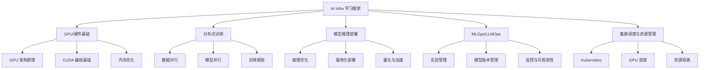

## 用户需求

创建一个 AI Infra（AI 基础设施）深入学习框架，面向多层次读者（后端/系统工程师转型、AI/ML 工程师深入底层、学生/新人入门），形成一个完备的入门文档。

## 产品概述

一个系统性的 AI Infra 知识体系文档，作为 skill 形式存储在项目中，平衡理论与实践，帮助读者从零开始构建对 AI 基础设施的完整认知。

## 核心特性

- **系统性知识框架**：覆盖 GPU/硬件基础、分布式训练、模型推理部署、MLOps/LLMOps、集群调度五大核心领域
- **分层学习路径**：为不同背景的读者（系统工程师、ML 工程师、学生）提供适合的学习路线
- **理论与实践结合**：每个主题包含原理解析、关键技术、实战项目建议和推荐资源
- **渐进式内容组织**：从基础概念到高级主题，循序渐进

## 技术栈

- 文档格式：Markdown
- 文件结构：遵循项目 skill 规范（SKILL.md + references 子目录）
- 图表工具：Mermaid（用于架构图和学习路径图）

## 实现方案

### 整体策略

采用 skill 的 **渐进式披露（Progressive Disclosure）** 设计原则：

- SKILL.md 作为主入口，包含知识框架概览和学习路径导航
- 将五大领域的详细内容拆分到 `references/` 目录下的独立文件
- 每个领域文件控制在合理长度，便于按需加载

### 内容架构设计



### 文档结构设计

主文档 SKILL.md 包含：

1. AI Infra 概述与全景图
2. 学习路径规划（按读者背景）
3. 五大核心领域的概览和导航
4. 推荐学习资源汇总

References 子文件：

- `01-gpu-hardware.md` - GPU/硬件基础详解
- `02-distributed-training.md` - 分布式训练详解
- `03-inference-serving.md` - 模型推理部署详解
- `04-mlops-llmops.md` - MLOps/LLMOps 详解
- `05-cluster-scheduling.md` - 集群调度详解
- `06-learning-roadmap.md` - 完整学习路线图与项目实战建议

## 目录结构

```
skills/
└── ai-infra/
    ├── SKILL.md                      # [NEW] 主入口文件，包含 AI Infra 知识框架概览、学习路径导航、五大核心领域简介。使用 YAML frontmatter 定义 skill 元数据，正文提供系统性的知识地图和学习指引。
    └── references/
        ├── 01-gpu-hardware.md        # [NEW] GPU/硬件基础详解。涵盖 GPU 架构演进（从 Volta 到 Hopper/Blackwell）、CUDA 编程模型、内存层次结构（HBM/GDDR/L2 Cache）、Tensor Core 原理、NVLink/NVSwitch 互联技术、硬件选型指南。
        ├── 02-distributed-training.md # [NEW] 分布式训练详解。涵盖数据并行（DDP/FSDP）、模型并行（张量并行/流水线并行）、3D 并行策略、DeepSpeed/Megatron-LM 框架、通信优化（NCCL/AllReduce）、Checkpoint 策略、大模型训练实战。
        ├── 03-inference-serving.md   # [NEW] 模型推理部署详解。涵盖推理优化技术（量化/剪枝/蒸馏）、推理引擎（TensorRT/ONNX Runtime）、LLM 推理优化（KV Cache/Continuous Batching/PagedAttention）、服务框架（vLLM/TGI/Triton）、部署架构模式。
        ├── 04-mlops-llmops.md        # [NEW] MLOps/LLMOps 详解。涵盖实验跟踪（MLflow/W&B）、模型版本管理、特征工程平台、CI/CD for ML、模型监控与可观测性、LLMOps 特殊考量（Prompt 管理/评估/安全）。
        ├── 05-cluster-scheduling.md  # [NEW] 集群调度详解。涵盖 Kubernetes 基础、GPU 调度（device plugin/MIG/时间分片）、调度器（Volcano/Yunikorn）、资源隔离与配额、多租户管理、成本优化策略。
        └── 06-learning-roadmap.md    # [NEW] 完整学习路线图。按读者背景提供 3-6 个月学习计划、推荐书籍/课程/论文、动手项目建议、面试准备指南、社区资源。
```

## 实现要点

### 内容质量标准

- 每个主题遵循：概念定义 → 核心原理 → 关键技术 → 实战建议 → 深入资源
- 理论部分配合架构图/流程图增强理解
- 实践部分提供具体的开源项目和动手练习建议
- 避免过度深入单一技术细节，保持宏观视角

### 符合 Skill 规范

- SKILL.md 控制在 500 行以内，作为导航入口
- 详细内容分散到 references 目录，按需加载
- 每个 reference 文件开头包含目录结构便于快速定位
- 使用清晰的交叉引用指向相关内容

## Agent Extensions

### Skill

- **skill-creator**
- 目的：遵循 skill 创建规范，确保生成的 AI Infra skill 符合项目标准
- 预期结果：产出符合规范的 SKILL.md 和 references 文件结构

### MCP

- **drawio**
- 目的：为复杂的架构概念（如分布式训练架构、推理服务部署架构）创建可视化图表
- 预期结果：生成清晰的架构图导出为图片，增强文档可读性