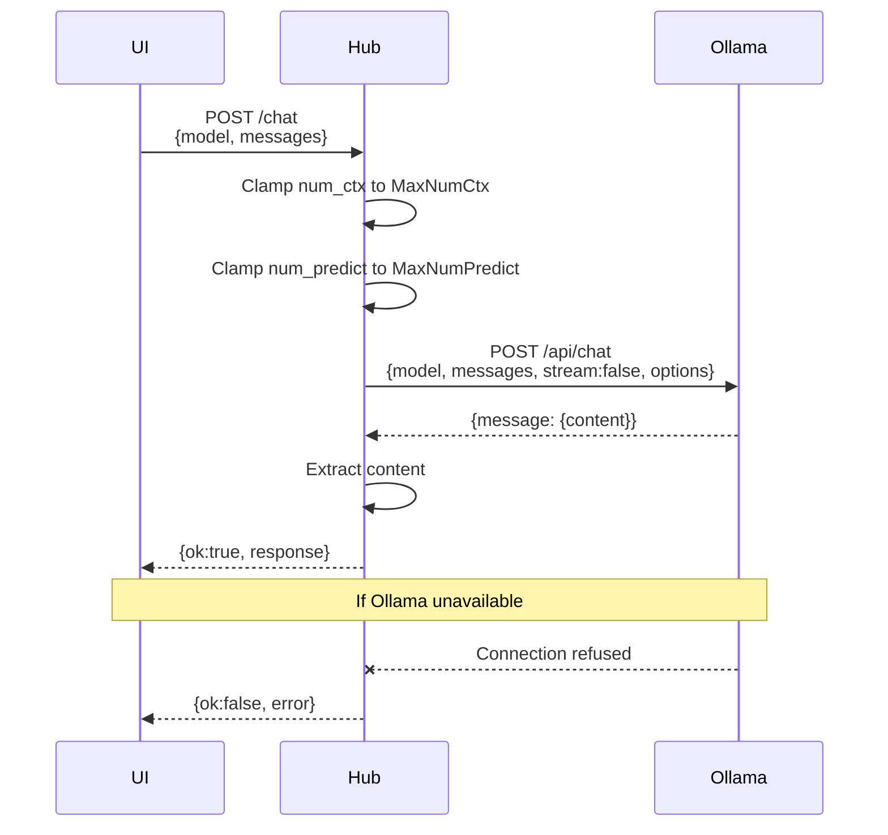
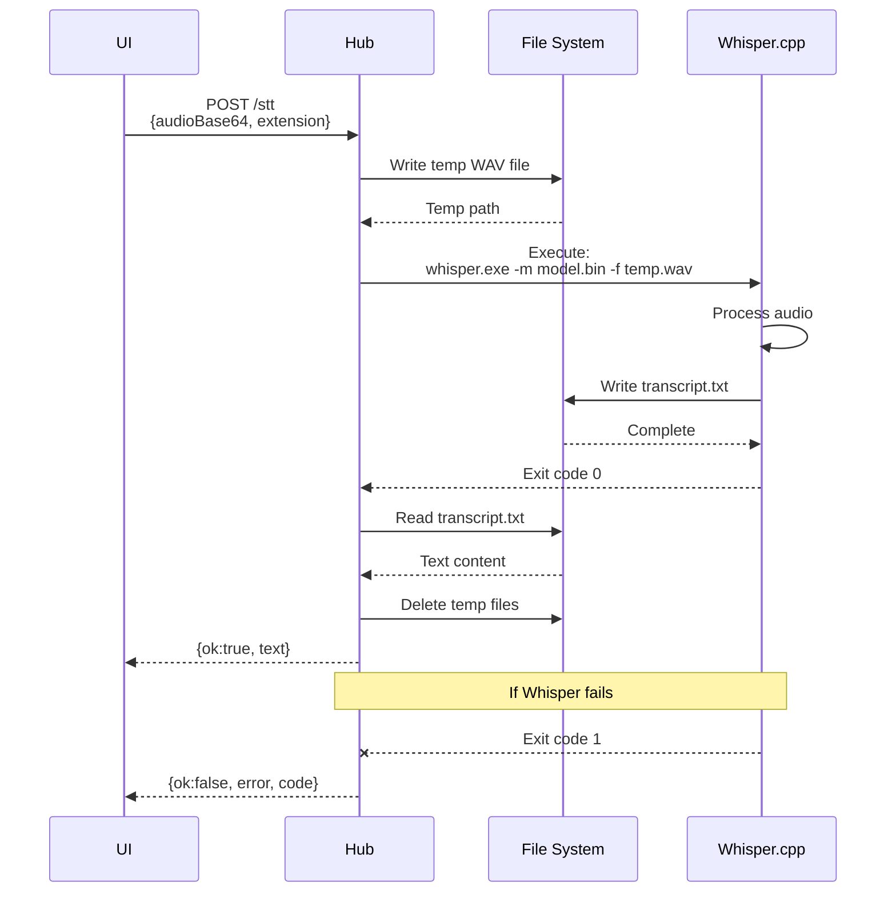
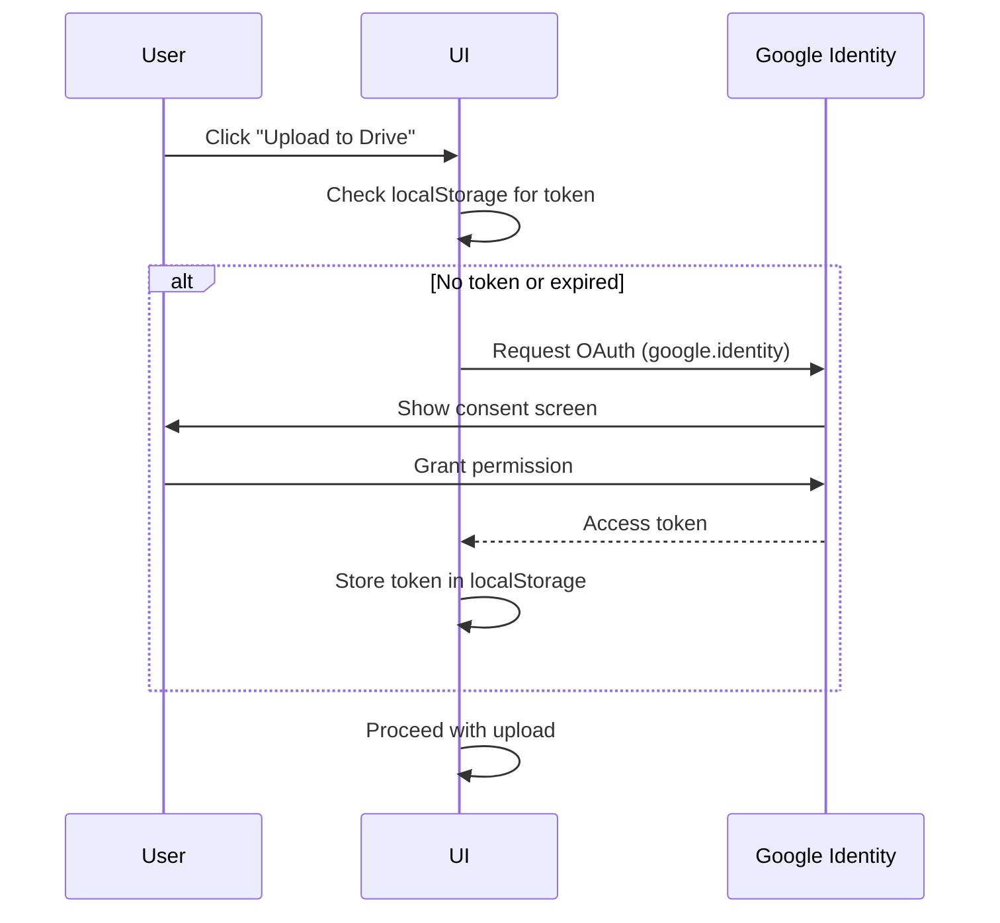

# API Contracts and Data Flows

## Complete API Reference

### Hub Station Endpoints (127.0.0.1:9099)

---

#### **POST /chat**
Chat with Ollama LLM

**Request:**
```json
{
  "model": "qwen3:latest",
  "temperature": 0.7,
  "messages": [
    {
      "role": "user" | "system" | "assistant",
      "content": "string"
    }
  ],
  "options": {
    "num_ctx": 2048,
    "num_predict": 512
  }
}
```

**Response (Success):**
```json
{
  "ok": true,
  "response": "LLM generated text response"
}
```

**Response (Error):**
```json
{
  "ok": false,
  "error": "Error message",
  "code": "OLLAMA_UNAVAILABLE"
}
```

**Data Flow:**


**Error Codes:**
- `OLLAMA_UNAVAILABLE`: Ollama not running or unreachable
- `MODEL_NOT_FOUND`: Requested model not pulled
- `TIMEOUT`: Request exceeded timeout
- `INVALID_REQUEST`: Malformed JSON or missing fields

---

#### **POST /stt**
Speech-to-text transcription via Whisper.cpp

**Request:**
```json
{
  "audioBase64": "base64_encoded_audio_data",
  "audioPath": "/path/to/audio.wav",
  "extension": "wav" | "mp3",
  "language": "en"
}
```
*Provide either `audioBase64` OR `audioPath`, not both.*

**Response (Success):**
```json
{
  "ok": true,
  "text": "Transcribed text from audio"
}
```

**Response (Error):**
```json
{
  "ok": false,
  "error": "Error message",
  "code": "WHISPER_NOT_FOUND"
}
```

**Data Flow:**


**Error Codes:**
- `WHISPER_NOT_FOUND`: WhisperCppExe not found at configured path
- `MODEL_NOT_FOUND`: WhisperModelPath not found
- `INVALID_AUDIO`: Audio format not supported or corrupted
- `TRANSCRIPTION_FAILED`: Whisper returned non-zero exit code

---

#### **POST /queue/push**
Add message to queue

**Request:**
```json
{
  "text": "string (plain text or stringified JSON)",
  "target": "tyler" | "board" | "custom_target",
  "priority": "low" | "normal" | "high",
  "release": "immediate" | "heartbeat" | "end"
}
```

**Response:**
```json
{
  "ok": true,
  "queued": 1,
  "position": 5,
  "id": "msg_1731200000_abc123"
}
```

**Behavior:**
- `target`: Routes message to specific consumer
- `priority`: Higher priority messages returned first (within same release)
- `release`:
  - `immediate`: Available to pop immediately
  - `heartbeat`: Available after next heartbeat tick
  - `end`: Held until session end signal

---

#### **GET /queue/list**
List queue contents and counts

**Request (Query Params):**
```
GET /queue/list?target=board&release=heartbeat&ready=true
```

**Response:**
```json
{
  "ok": true,
  "items": [
    {
      "id": "msg_1731200000_abc123",
      "text": "{...}",
      "target": "board",
      "priority": "normal",
      "release": "heartbeat",
      "ready": true,
      "timestamp": 1731200000,
      "size_bytes": 1024
    }
  ],
  "counts": {
    "immediate": 2,
    "heartbeat": 3,
    "end": 1,
    "ready": 5,
    "total": 6
  },
  "total_size_bytes": 6144
}
```

**Filters:**
- `target`: Filter by target field
- `release`: Filter by release condition
- `ready`: If true, only show ready-to-pop messages

---

#### **POST /queue/pop**
Remove and retrieve messages from queue

**Request:**
```json
{
  "release": "heartbeat",
  "max": 5,
  "target": "board"
}
```

**Response:**
```json
{
  "ok": true,
  "items": [
    {
      "text": "{...}",
      "target": "board",
      "priority": "normal",
      "release": "heartbeat",
      "timestamp": 1731200000
    }
  ],
  "popped": 3,
  "remaining": 2
}
```

**Behavior:**
- Returns up to `max` items matching filters
- Items are **removed** from queue
- Orders by: priority (desc), then timestamp (asc)
- Only returns messages where `ready === true`

---

#### **POST /heartbeat/enable**
Enable or disable heartbeat

**Request:**
```json
{
  "enabled": true
}
```

**Response:**
```json
{
  "ok": true,
  "heartbeat": {
    "enabled": true,
    "last": 1731200000,
    "count": 42,
    "interval_sec": 120
  }
}
```

---

#### **POST /heartbeat/tick**
Signal heartbeat tick (marks heartbeat messages as ready)

**Request:**
```json
{}
```

**Response:**
```json
{
  "ok": true,
  "heartbeat": {
    "enabled": true,
    "last": 1731200150,
    "count": 43,
    "interval_sec": 120
  },
  "released": 3
}
```

**Side Effect:**
- All queue messages with `release: "heartbeat"` are marked `ready: true`
- Increments heartbeat count
- Updates last heartbeat timestamp

---

#### **GET /heartbeat/state**
Get current heartbeat state

**Request:**
```
GET /heartbeat/state
```

**Response:**
```json
{
  "ok": true,
  "heartbeat": {
    "enabled": true,
    "last": 1731200150,
    "count": 43,
    "interval_sec": 120,
    "next_expected": 1731200270
  }
}
```

---

#### **GET /logs**
Retrieve system logs

**Request:**
```
GET /logs?n=200&level=info
```

**Query Params:**
- `n`: Number of recent lines (default: 100, max: 1000)
- `level`: Filter by log level (debug, info, warn, error)

**Response:**
```json
{
  "ok": true,
  "lines": [
    "[2024-11-10 14:30:00] [INFO] HubStation started",
    "[2024-11-10 14:30:05] [INFO] Ollama health check: OK",
    "[2024-11-10 14:30:10] [WARN] Whisper model not found"
  ],
  "total": 200,
  "filtered": 180
}
```

---

#### **GET /ollama/list**
List available Ollama models

**Request:**
```
GET /ollama/list
```

**Response:**
```json
{
  "ok": true,
  "models": [
    {
      "name": "qwen3:latest",
      "size": "4.7 GB",
      "modified": "2024-11-01T10:00:00Z"
    }
  ]
}
```

**Proxies to:** `GET http://127.0.0.1:11434/api/tags`

---

#### **GET /ollama/ps**
List running Ollama models

**Request:**
```
GET /ollama/ps
```

**Response:**
```json
{
  "ok": true,
  "running": [
    {
      "name": "qwen3:latest",
      "size": "4.7 GB",
      "processor": "gpu"
    }
  ]
}
```

**Proxies to:** `GET http://127.0.0.1:11434/api/ps`

---

#### **POST /ollama/pull**
Pull (download) an Ollama model

**Request:**
```json
{
  "model": "qwen3:latest"
}
```

**Response:**
```json
{
  "ok": true,
  "message": "Model pulled successfully"
}
```

**Note:** This is a blocking operation that may take minutes

---

#### **POST /ollama/stop**
Stop a running Ollama model

**Request:**
```json
{
  "model": "qwen3:latest"
}
```

**Response:**
```json
{
  "ok": true,
  "message": "Model stopped"
}
```

---

#### **GET /web[/path]**
Serve static files

**Request:**
```
GET /web/index.html
GET /web/styles/main.css
GET /web/scripts/app.js
```

**Response:**
- HTML, CSS, JS, images served directly
- MIME type auto-detected from extension
- Maps to `StaticRoot` from hub_config.json

**Behavior:**
- `/web` → redirects to `/web/index.html`
- `/web/...` → serves file from `StaticRoot/...`
- 404 if file not found

---

### Gemini API (External - NOT YET WIRED)

#### **POST /api/gemini/analyze**
Auto-fill Evidence Card fields using Gemini

**Expected Request:**
```json
{
  "model": "gemini-2.5-pro",
  "contents": [
    {
      "parts": [
        {
          "text": "Combined prompt from 2_PROMPT_SUMMARY.txt + user fields"
        }
      ]
    }
  ]
}
```

**Expected Response (Success):**
```json
{
  "candidates": [
    {
      "content": {
        "parts": [
          {
            "text": "{\"significance\":\"...\",\"caselaw1\":\"...\",\"caselaw2\":\"...\",\"notes\":\"...\"}"
          }
        ]
      }
    }
  ]
}
```

**UI Parsing:**
1. Extract `candidates[0].content.parts[0].text`
2. Try `JSON.parse(text)`
3. If valid and has keys `significance`, `caselaw1`, `caselaw2`, `notes` → fill form
4. Else → dump text into `notes` field

**Current Status:** ❌ NOT IMPLEMENTED
- UI calls this endpoint but Hub doesn't have the route
- Returns 404
- Blocks "Auto-Fill with Gemini" feature

**Wiring Options:**
1. **Add to HubStation.ps1:**
   - Implement `/api/gemini/analyze` route
   - Read `GEMINI_API_KEY` from environment
   - Load prompt template from `2_PROMPT_SUMMARY.txt`
   - Construct full prompt with user fields
   - POST to Gemini REST API
   - Return response as-is

2. **Separate Node Server:**
   - Run Express server on port 3000
   - Implement same endpoint
   - Update UI to call `http://localhost:3000/api/gemini/analyze`
   - Requires CORS configuration

---

### Google APIs (Browser Direct)

#### **OAuth Flow**

**Triggered By:** User clicks "Upload to Drive" without valid token

**Flow:**


**Token Storage:**
- Stored in `localStorage.getItem('google_access_token')`
- Expires after 1 hour
- Refreshed automatically by google.identity library

---

#### **Google Drive Upload**

**Request (from browser):**
```http
POST https://www.googleapis.com/upload/drive/v3/files?uploadType=multipart
Authorization: Bearer {access_token}
Content-Type: multipart/related; boundary=boundary_string

--boundary_string
Content-Type: application/json; charset=UTF-8

{
  "name": "evidence_card_EC-2024-001.json",
  "mimeType": "application/json",
  "parents": ["folder_id"]
}

--boundary_string
Content-Type: application/json

{
  "uid": "EC-2024-001",
  ...evidence card JSON...
}

--boundary_string--
```

**Response:**
```json
{
  "id": "1a2b3c4d5e6f",
  "name": "evidence_card_EC-2024-001.json",
  "mimeType": "application/json",
  "createdTime": "2024-11-10T14:30:00Z"
}
```

**Error Response:**
```json
{
  "error": {
    "code": 401,
    "message": "Invalid Credentials"
  }
}
```

---

## Data Flow Diagrams

### Complete Request Flow: Chat

```mermaid
flowchart TD
    User[User types message] -->|sendMiniChat| UI[UI: Mini Chat]
    UI -->|POST /chat| Hub[Hub Station]
    Hub -->|Read config| Config[hub_config.json]
    Config -->|OllamaBaseUrl| Hub
    Hub -->|Clamp limits| Limits{Apply Limits}
    Limits -->|num_ctx <= MaxNumCtx| Valid
    Limits -->|num_predict <= MaxNumPredict| Valid[Valid Request]
    Valid -->|POST /api/chat| Ollama[Ollama Server]
    Ollama -->|LLM inference| Model[qwen3:latest]
    Model -->|Generate| Response[Response text]
    Response -->|Return| Ollama
    Ollama -->|{message:{content}}| Hub
    Hub -->|Extract content| Parse[Parse Response]
    Parse -->|{ok:true, response}| UI
    UI -->|First 200 chars| Toast[Show Toast]
    Toast -->|Full text| Display[Display in chat]

    Hub -->|If target=board| Queue[Also push to queue]
    Queue -->|Prepend label| Format["[BOARD] message"]

    Ollama -.->|Connection refused| Error[Error Handler]
    Error -.->|{ok:false, error}| UI
    UI -.->|Show error toast| User

    style Hub fill:#9f9,stroke:#333,stroke-width:2px
    style Ollama fill:#99f,stroke:#333,stroke-width:2px
    style Error fill:#f99,stroke:#333,stroke-width:2px
```

### Complete Request Flow: STT (Speech-to-Text)

```mermaid
flowchart TD
    User[User clicks mic] -->|Start recording| Capture[Capture Audio]
    Capture -->|PCM samples| Encode[Encode to WAV]
    Encode -->|Base64| Payload[Build Payload]
    Payload -->|POST /stt| Hub[Hub Station]

    Hub -->|Check config| Config[hub_config.json]
    Config -->|WhisperCppExe| ExeCheck{Exe exists?}
    Config -->|WhisperModelPath| ModelCheck{Model exists?}

    ExeCheck -->|No| Error1[Error: WHISPER_NOT_FOUND]
    ModelCheck -->|No| Error2[Error: MODEL_NOT_FOUND]
    ExeCheck -->|Yes| ModelCheck
    ModelCheck -->|Yes| Proceed[Proceed]

    Proceed -->|Decode base64| Decode[Decode Audio]
    Decode -->|Write to disk| TempFile[temp_audio_12345.wav]
    TempFile -->|Execute| Whisper[Whisper.cpp]
    Whisper -->|Args| Args["-m model.bin -f temp_audio.wav -l en"]
    Args -->|Process| Inference[STT Inference]
    Inference -->|Write output| TxtFile[temp_audio_12345.txt]
    TxtFile -->|Read| Hub
    Hub -->|Parse text| Text[Transcript Text]
    Text -->|Cleanup| Delete[Delete temp files]
    Delete -->|Return| Response["{ok:true, text}"]
    Response -->|Send| UI[Browser UI]
    UI -->|Fill composer| Display[Display in text field]

    Error1 -.->|{ok:false, error, code}| UI
    Error2 -.->|{ok:false, error, code}| UI
    Inference -.->|Exit code != 0| Error3[Error: TRANSCRIPTION_FAILED]
    Error3 -.->|{ok:false, error}| UI

    style Hub fill:#9f9,stroke:#333,stroke-width:2px
    style Whisper fill:#c9f,stroke:#333,stroke-width:2px
    style Error1 fill:#f99,stroke:#333,stroke-width:2px
    style Error2 fill:#f99,stroke:#333,stroke-width:2px
    style Error3 fill:#f99,stroke:#333,stroke-width:2px
```

### Complete Request Flow: Evidence Card with Gemini

```mermaid
flowchart TD
    User[User: "Create Evidence Card"] -->|Click button| Form[Show Form]
    Form -->|Enter fields| Fields[description, quote, claimId]
    Fields -->|Click Auto-Fill| Trigger[autoFillWithGemini]

    Trigger -->|Build payload| Payload[{description, quote, claimId, model}]
    Payload -->|POST /api/gemini/analyze| Check{Endpoint<br/>exists?}

    Check -->|No 404| Error[Show error toast]
    Error -->|Fall back| Manual[User fills manually]

    Check -->|Yes| Hub[Hub or Node Server]
    Hub -->|Load template| Template[2_PROMPT_SUMMARY.txt]
    Template -->|Inject user fields| FullPrompt[Construct Full Prompt]
    FullPrompt -->|Append| Instruction["Output JSON: {significance, caselaw1, caselaw2, notes}"]

    Instruction -->|POST to Gemini API| GeminiAPI[Gemini REST API]
    GeminiAPI -->|API Key from env| Auth[Authorization]
    Auth -->|Call model| Model[gemini-2.5-pro]
    Model -->|Generate| Response[Response Text]
    Response -->|Return| Hub
    Hub -->|Forward| UI[Browser UI]

    UI -->|Parse| TryParse{Valid<br/>JSON?}
    TryParse -->|No| TextToNotes[Put text in notes field]
    TryParse -->|Yes| CheckKeys{Has all<br/>keys?}
    CheckKeys -->|No| TextToNotes
    CheckKeys -->|Yes| FillForm[Fill form fields]

    FillForm -->|User reviews| Review[Review & Edit]
    TextToNotes -->|User reviews| Review
    Manual -->|User reviews| Review

    Review -->|Click Save| SaveIDB[Save to IndexedDB]
    SaveIDB -->|Success| Toast[Show success toast]
    Toast -->|Optional| Upload{Upload to<br/>Drive?}

    Upload -->|Yes| OAuth{OAuth<br/>token?}
    OAuth -->|No| DoOAuth[Google OAuth Flow]
    DoOAuth -->|Get token| OAuth
    OAuth -->|Yes| DriveUpload[POST to Drive API]
    DriveUpload -->|Multipart| DriveAPI[Google Drive]
    DriveAPI -->|Success| DriveToast[Show upload success]
    DriveAPI -->|Error| DriveError[Show upload error]

    Upload -->|No| Done([Done])
    DriveToast --> Done
    DriveError --> Done

    style Check fill:#ff9,stroke:#333,stroke-width:2px
    style Error fill:#f99,stroke:#333,stroke-width:2px
    style SaveIDB fill:#9f9,stroke:#333,stroke-width:2px
    style DriveAPI fill:#9cf,stroke:#333,stroke-width:2px
```

## Configuration Reference

### hub_config.json

```json
{
  "StaticRoot": "..\\scripts",
  "OllamaBaseUrl": "http://127.0.0.1:11434",
  "WhisperCppExe": "C:\\Tools\\whisper.cpp\\main.exe",
  "WhisperModelPath": "C:\\Tools\\whisper.cpp\\models\\ggml-base.en.bin",
  "MaxNumCtx": 4096,
  "MaxNumPredict": 1024,
  "Port": 9099,
  "Host": "127.0.0.1",
  "LogLevel": "info",
  "EnableCORS": true
}
```

**Field Descriptions:**
- `StaticRoot`: Path to web files directory (relative or absolute)
- `OllamaBaseUrl`: Ollama server endpoint
- `WhisperCppExe`: Path to whisper.cpp executable
- `WhisperModelPath`: Path to whisper model file (.bin)
- `MaxNumCtx`: Max context window for LLM (clamped)
- `MaxNumPredict`: Max tokens to generate (clamped)
- `Port`: Hub server port
- `Host`: Hub server bind address (127.0.0.1 = localhost only)
- `LogLevel`: Logging verbosity (debug, info, warn, error)
- `EnableCORS`: Allow cross-origin requests (needed for dev)

### Config.yaml (Node Server Alternative)

```yaml
server:
  port: 3000
  host: "0.0.0.0"

gemini:
  api_key_env: "GEMINI_API_KEY"
  model: "gemini-2.5-pro"
  prompt_template_path: "../scripts/2_PROMPT_SUMMARY.txt"

ollama:
  base_url: "http://127.0.0.1:11434"
  default_model: "qwen3:latest"

cors:
  enabled: true
  origins: ["http://127.0.0.1:9099", "http://localhost:9099"]
```

## Environment Variables

| Variable | Purpose | Required By |
|----------|---------|-------------|
| `GEMINI_API_KEY` | Gemini API authentication | Node server or Hub Gemini route |
| `GOOGLE_CLIENT_ID` | Google OAuth (browser) | index.html |

**Setup:**
```bash
# PowerShell
$env:GEMINI_API_KEY = "your_api_key_here"

# Bash
export GEMINI_API_KEY="your_api_key_here"
```

## Error Response Standards

All Hub endpoints return errors in this format:

```json
{
  "ok": false,
  "error": "Human-readable error message",
  "code": "ERROR_CODE",
  "details": {
    "additional": "context"
  }
}
```

**Common Error Codes:**
- `INVALID_REQUEST`: Malformed JSON or missing required fields
- `NOT_FOUND`: Resource not found (file, model, etc.)
- `UNAUTHORIZED`: Missing or invalid credentials
- `TIMEOUT`: Operation exceeded time limit
- `SERVICE_UNAVAILABLE`: Dependent service not reachable
- `INTERNAL_ERROR`: Unexpected server error

## Rate Limits

| Endpoint | Limit | Window |
|----------|-------|--------|
| POST /chat | 10 requests | 1 minute |
| POST /stt | 5 requests | 1 minute |
| POST /queue/push | 100 requests | 1 minute |
| POST /queue/pop | 60 requests | 1 minute |
| GET /logs | 10 requests | 1 minute |

**Behavior:**
- Returns `429 Too Many Requests` if exceeded
- Response includes `Retry-After` header (seconds)

## Health Check

**Endpoint:** `GET /health`

**Response:**
```json
{
  "ok": true,
  "services": {
    "ollama": "healthy",
    "whisper": "not_configured",
    "queue": "healthy",
    "heartbeat": "enabled"
  },
  "uptime_seconds": 3600,
  "version": "1.0.0"
}
```

## WebSocket Support (Future)

Not currently implemented, but planned for real-time updates:

```javascript
const ws = new WebSocket('ws://127.0.0.1:9099/ws');

ws.onmessage = (event) => {
  const data = JSON.parse(event.data);
  if (data.type === 'queue_update') {
    // Queue item added/removed
  } else if (data.type === 'heartbeat_tick') {
    // Heartbeat occurred
  }
};
```
