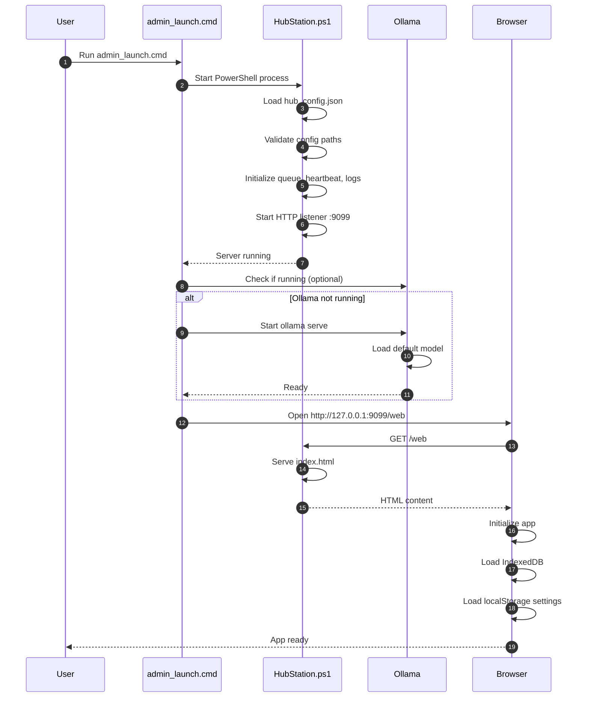
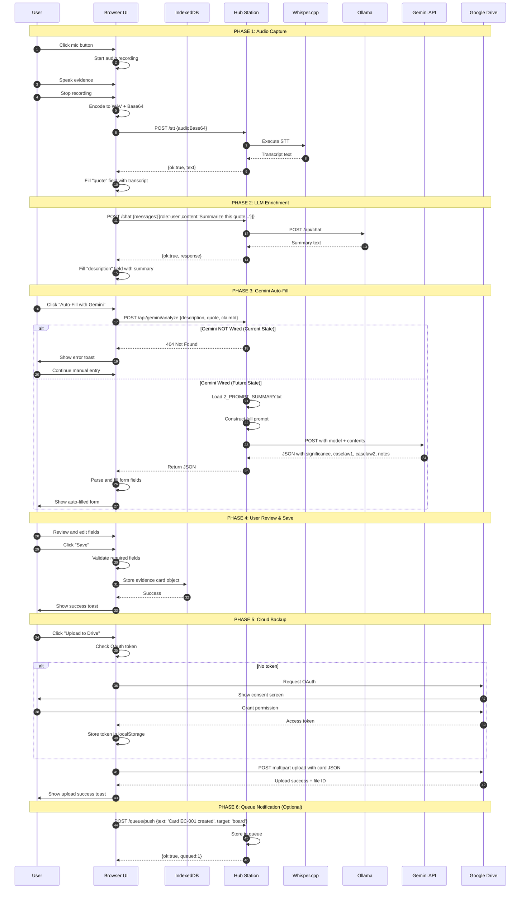
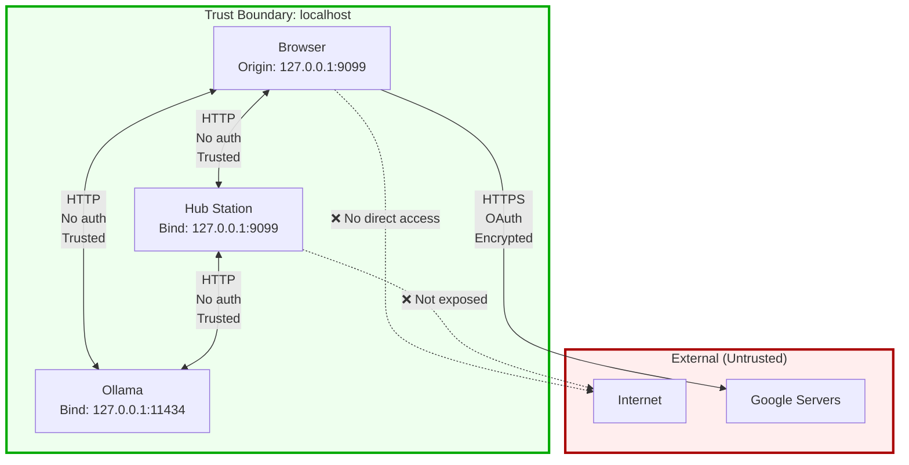
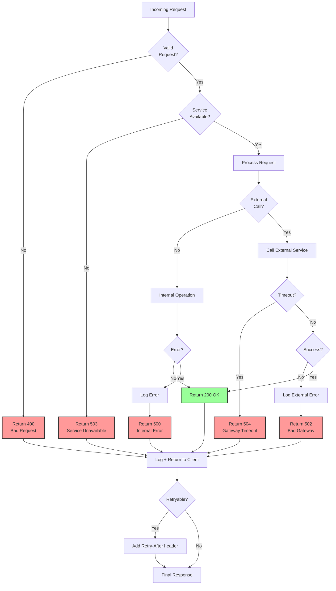
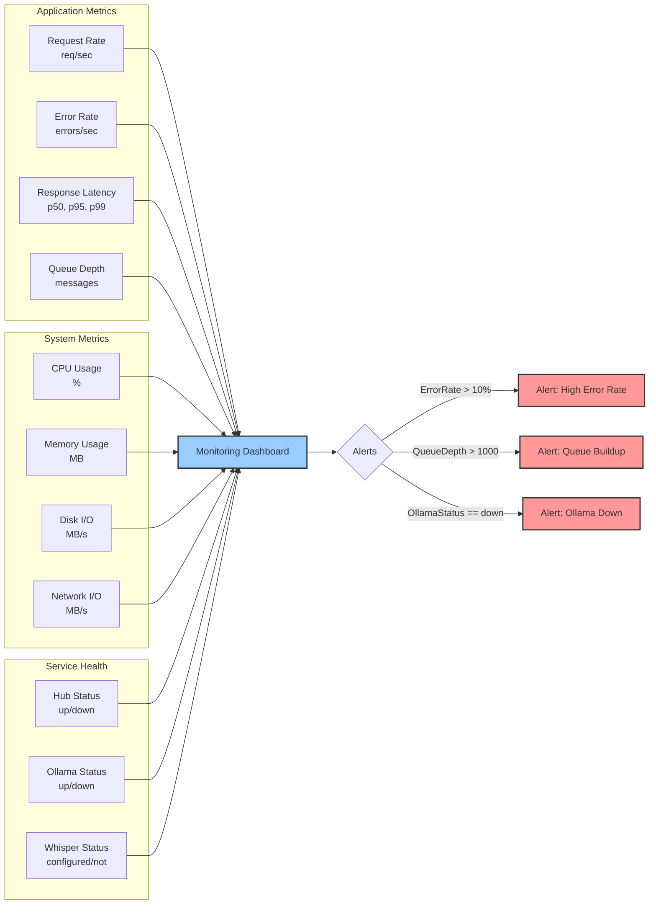

# Comprehensive System Schematic

## Full System Integration Map

```mermaid
graph TB
    subgraph Client["CLIENT LAYER (Browser)"]
        subgraph UI["index.html - Main Application"]
            EvidenceUI[Evidence Card UI]
            PDFViewer[PDF Viewer]
            Timeline[Timeline/Menu]
            ChatUI[Mini Chat Interface]
            MicButton[Audio Recorder]
            DriveUI[Drive Upload UI]
        end

        subgraph Storage["Client Storage"]
            IDB[(IndexedDB<br/>evidence_cards)]
            LocalStore[(localStorage<br/>OAuth tokens<br/>HB settings)]
        end

        subgraph GoogleClient["Google Client Libraries"]
            OAuth2[google.identity<br/>OAuth Client]
        end
    end

    subgraph Server["SERVER LAYER (Local)"]
        subgraph Hub["Hub Station<br/>PowerShell Server<br/>127.0.0.1:9099"]
            Router{Request Router}
            StaticHandler[Static File Handler]
            ChatHandler[Chat Handler]
            STTHandler[STT Handler]
            QueueHandler[Queue Handler]
            HBHandler[Heartbeat Handler]
            LogHandler[Log Handler]
            OllamaProxy[Ollama Proxy]
        end

        subgraph HubData["Hub Data Stores"]
            QueueDB[(Queue<br/>In-Memory)]
            HBState[(Heartbeat State<br/>In-Memory)]
            LogBuffer[(Log Buffer<br/>In-Memory)]
            HubConfig[hub_config.json]
        end

        subgraph Gemini["Gemini Integration<br/>❌ NOT WIRED"]
            GeminiRoute[/api/gemini/analyze]
            GeminiHandler[Gemini Handler<br/>TO BE IMPLEMENTED]
        end
    end

    subgraph Local["LOCAL SERVICES"]
        Ollama[Ollama LLM Server<br/>127.0.0.1:11434]
        WhisperExe[Whisper.cpp<br/>Local Binary]
        WhisperModel[Whisper Model<br/>ggml-base.en.bin]
    end

    subgraph Cloud["CLOUD SERVICES"]
        DriveAPI[Google Drive API<br/>googleapis.com/drive/v3]
        GeminiAPI[Gemini API<br/>generativeai.googleapis.com<br/>❌ NOT WIRED]
    end

    subgraph Files["FILE SYSTEM"]
        WebFiles[Web Files<br/>../scripts/web/]
        PromptFiles[Prompt Assets<br/>2_PROMPT_SUMMARY.txt<br/>self_prompt_schema.json<br/>self_prompt_template.json<br/>gemini_responses.txt]
        AudioTemp[Temp Audio Files<br/>*.wav]
        Transcripts[Transcript Files<br/>*.txt]
    end

    %% Client to Server
    UI -->|HTTP GET/POST| Router
    EvidenceUI -->|Save/Load| IDB
    EvidenceUI -->|Settings| LocalStore
    ChatUI -->|POST /chat| ChatHandler
    MicButton -->|POST /stt| STTHandler
    ChatUI -->|POST /queue/push| QueueHandler
    UI -->|POST /heartbeat/*| HBHandler
    UI -->|GET /logs| LogHandler
    DriveUI -->|OAuth Flow| OAuth2
    DriveUI -->|Upload| DriveAPI
    UI -.->|POST /api/gemini/analyze<br/>404| GeminiRoute

    %% Router to Handlers
    Router -->|/chat| ChatHandler
    Router -->|/stt| STTHandler
    Router -->|/queue/*| QueueHandler
    Router -->|/heartbeat/*| HBHandler
    Router -->|/logs| LogHandler
    Router -->|/ollama/*| OllamaProxy
    Router -->|/web/*| StaticHandler
    Router -.->|/api/gemini/analyze<br/>NOT IMPLEMENTED| GeminiHandler

    %% Handlers to Data
    ChatHandler -->|Forward| Ollama
    STTHandler -->|Execute| WhisperExe
    WhisperExe -->|Load| WhisperModel
    QueueHandler -->|Store/Retrieve| QueueDB
    HBHandler -->|Update| HBState
    HBHandler -->|Release messages| QueueDB
    LogHandler -->|Read| LogBuffer
    StaticHandler -->|Serve| WebFiles
    OllamaProxy -->|Proxy| Ollama

    %% Hub to Config
    Hub -->|Read Config| HubConfig

    %% Whisper to Files
    STTHandler -->|Write temp| AudioTemp
    WhisperExe -->|Read| AudioTemp
    WhisperExe -->|Write| Transcripts
    STTHandler -->|Read| Transcripts
    STTHandler -->|Delete| AudioTemp
    STTHandler -->|Delete| Transcripts

    %% Gemini (future)
    GeminiHandler -.->|Read Template| PromptFiles
    GeminiHandler -.->|POST Request| GeminiAPI
    GeminiAPI -.->|JSON Response| GeminiHandler
    GeminiHandler -.->|Return| UI

    %% OAuth to Drive
    OAuth2 -->|Token| DriveAPI
    DriveAPI -->|Upload Success| DriveUI

    %% Styling
    style UI fill:#9cf,stroke:#333,stroke-width:3px
    style Hub fill:#9f9,stroke:#333,stroke-width:3px
    style Ollama fill:#99f,stroke:#333,stroke-width:2px
    style WhisperExe fill:#c9f,stroke:#333,stroke-width:2px
    style GeminiRoute fill:#f99,stroke:#333,stroke-width:4px,stroke-dasharray: 5 5
    style GeminiHandler fill:#f99,stroke:#333,stroke-width:4px,stroke-dasharray: 5 5
    style GeminiAPI fill:#f99,stroke:#333,stroke-width:4px,stroke-dasharray: 5 5
    style IDB fill:#fcf,stroke:#333,stroke-width:2px
    style QueueDB fill:#fcf,stroke:#333,stroke-width:2px
    style DriveAPI fill:#9cf,stroke:#333,stroke-width:2px
```

## Component Interaction Matrix

| Component | Talks To | Protocol | Data Format | Purpose |
|-----------|----------|----------|-------------|---------|
| **index.html** | Hub Station | HTTP | JSON | API calls for chat, STT, queue, logs |
| **index.html** | IndexedDB | IndexedDB API | Evidence Card objects | Persist evidence cards locally |
| **index.html** | localStorage | Web Storage API | Key-value pairs | Store OAuth tokens, settings |
| **index.html** | Google Identity | OAuth 2.0 | Token | Authenticate for Drive |
| **index.html** | Google Drive | HTTPS REST | JSON/Multipart | Upload evidence cards |
| **Hub Station** | Ollama | HTTP | JSON | Forward chat requests |
| **Hub Station** | Whisper.cpp | Process exec | Binary/Text | Execute STT |
| **Hub Station** | File System | File I/O | Text/Binary | Serve static files, temp audio |
| **Hub Station** | Queue (in-memory) | Direct | Objects | Manage message queue |
| **Hub Station** | Heartbeat (in-memory) | Direct | Objects | Track heartbeat state |
| **Hub Station** | Log Buffer (in-memory) | Direct | Strings | Aggregate logs |
| **Ollama** | LLM Models | Internal | Binary | Run inference |
| **Whisper.cpp** | Whisper Model | File read | Binary | Load model weights |
| **Gemini Handler** | Gemini API | HTTPS REST | JSON | Generate evidence cards |
| **OAuth Client** | Google Auth | HTTPS OAuth | Token | Get access token |

## Deployment Architecture

### Development Environment

```mermaid
graph TD
    subgraph DevMachine["Developer Machine"]
        subgraph Processes["Running Processes"]
            HubProc[HubStation.ps1<br/>Port 9099]
            OllamaProc[Ollama Server<br/>Port 11434]
        end

        subgraph Filesystem["File System"]
            Scripts[/scripts<br/>Web files<br/>Prompts<br/>Config]
            Whisper[/Tools/whisper.cpp<br/>Executable<br/>Model]
            OllamaModels[~/.ollama/models<br/>qwen3:latest]
        end

        subgraph Browser["Browser"]
            Tab[Localhost Tab<br/>http://127.0.0.1:9099/web]
        end
    end

    subgraph External["External Services"]
        GoogleAuth[Google OAuth<br/>accounts.google.com]
        GoogleDrive[Google Drive<br/>drive.google.com]
        GeminiCloud[Gemini API<br/>generativeai.googleapis.com<br/>❌ NOT CONNECTED]
    end

    HubProc -->|Read Config| Scripts
    HubProc -->|Serve Static| Scripts
    HubProc -->|Execute| Whisper
    HubProc -->|HTTP| OllamaProc
    OllamaProc -->|Load Models| OllamaModels
    Tab -->|HTTP| HubProc
    Tab -->|HTTPS| GoogleAuth
    Tab -->|HTTPS| GoogleDrive
    Tab -.->|HTTPS<br/>404| GeminiCloud

    style HubProc fill:#9f9,stroke:#333,stroke-width:2px
    style OllamaProc fill:#99f,stroke:#333,stroke-width:2px
    style Tab fill:#9cf,stroke:#333,stroke-width:2px
    style GeminiCloud fill:#f99,stroke:#333,stroke-width:4px,stroke-dasharray: 5 5
```

### Startup Sequence



## Data Flow: End-to-End Evidence Card Creation



## Security Architecture



**Security Properties:**

1. **Network Isolation**
   - Hub binds only to 127.0.0.1 (loopback)
   - Not accessible from network
   - No firewall rules needed

2. **Authentication**
   - Hub: None (assumes trusted local environment)
   - Ollama: None (local only)
   - Google: OAuth 2.0 in browser
   - Gemini: API key required (server-side only)

3. **Data Protection**
   - Local data: IndexedDB (browser encrypted storage)
   - Transit to Google: HTTPS with TLS 1.3
   - API keys: Environment variables only, never in code

4. **Threat Model**
   - ✅ Protected from: External network attacks
   - ✅ Protected from: XSS (CSP headers)
   - ⚠️ Vulnerable to: Malicious local processes
   - ⚠️ Vulnerable to: Physical access to machine

## Performance Characteristics

### Request Latency (Typical)

| Operation | Latency | Blocking | Notes |
|-----------|---------|----------|-------|
| Serve static file | 1-5ms | No | Hub reads from disk |
| POST /chat (Ollama) | 500ms - 5s | Yes | Depends on model size, prompt length |
| POST /stt (Whisper) | 1-10s | Yes | Depends on audio length, model |
| POST /queue/push | <1ms | No | In-memory operation |
| GET /queue/list | <1ms | No | In-memory operation |
| POST /queue/pop | <1ms | No | In-memory operation |
| Google Drive upload | 200ms - 2s | No (async) | Depends on file size, network |
| Gemini API call | 1-5s | Yes | Depends on prompt complexity |

### Resource Usage

| Component | CPU | RAM | Disk | Network |
|-----------|-----|-----|------|---------|
| Hub Station | Low (1-5%) | 50-100 MB | Minimal | Low |
| Ollama (idle) | Low (1-5%) | 2-4 GB | 0 | 0 |
| Ollama (inference) | High (50-100%) | 4-8 GB | 0 | 0 |
| Whisper.cpp | High (50-100%) | 500 MB - 2 GB | Temp files | 0 |
| Browser | Medium (10-30%) | 200-500 MB | IndexedDB | Low |

### Scalability Limits

| Resource | Limit | Impact | Mitigation |
|----------|-------|--------|------------|
| Queue size | ~10,000 messages | Memory exhaustion | Implement persistence or TTL |
| IndexedDB | ~50-100 MB | Browser quota | Archive old cards to Drive |
| Ollama concurrent | 1 request | Queuing delay | Run multiple Ollama instances |
| Whisper concurrent | 1 request | Queuing delay | Pre-process audio in batches |
| Log buffer | 10,000 lines | Memory leak | Implement rotation |

## Error Handling Strategy



## Monitoring & Observability

### Key Metrics to Track



### Log Aggregation

```
[2024-11-10 14:30:00] [INFO] HubStation started on 127.0.0.1:9099
[2024-11-10 14:30:01] [INFO] Ollama health check: OK
[2024-11-10 14:30:01] [WARN] Whisper not configured
[2024-11-10 14:30:05] [INFO] GET /web - 200 - 3ms
[2024-11-10 14:30:10] [INFO] POST /chat - 200 - 1823ms
[2024-11-10 14:30:15] [ERROR] POST /api/gemini/analyze - 404 - 1ms
[2024-11-10 14:30:20] [INFO] POST /queue/push - 200 - 0ms
[2024-11-10 14:30:22] [INFO] POST /heartbeat/tick - 200 - 0ms (released 3 messages)
```

## Testing Strategy

### Unit Tests

- Hub route handlers (mock Ollama/Whisper)
- Queue operations (push/pop/list)
- Heartbeat state management
- Evidence card validation

### Integration Tests

- UI → Hub → Ollama → UI (chat flow)
- UI → Hub → Whisper → UI (STT flow)
- UI → Hub → Queue → UI (9-path flow)
- UI → Google APIs (OAuth + upload)

### End-to-End Tests

1. **Create Evidence Card (Manual)**
   - Open app → Create new → Fill fields → Save → Verify in IndexedDB

2. **Create Evidence Card (Gemini)**
   - Open app → Create new → Auto-fill → Verify fields populated

3. **Upload to Drive**
   - Create card → Upload → Verify in Google Drive

4. **Transcribe Audio**
   - Record audio → Transcribe → Verify text in field

5. **Queue Workflow**
   - Push 9-path message → Pop → Process → Verify result

### Performance Tests

- Load test: 100 concurrent /chat requests
- Stress test: 10,000 queue messages
- Endurance test: 24h continuous operation

## Deployment Checklist

### Prerequisites
- [ ] Windows machine with PowerShell 5.1+
- [ ] Ollama installed and running
- [ ] Whisper.cpp downloaded and models present
- [ ] Google Cloud project with Drive API enabled
- [ ] Google OAuth client ID configured
- [ ] Gemini API key obtained (optional, for future)

### Configuration
- [ ] hub_config.json created with correct paths
- [ ] StaticRoot points to web files directory
- [ ] WhisperCppExe path is valid
- [ ] WhisperModelPath points to .bin file
- [ ] Environment variable GEMINI_API_KEY set (future)

### Startup
- [ ] Run admin_launch.cmd
- [ ] Verify Hub starts on :9099
- [ ] Open browser to http://127.0.0.1:9099/web
- [ ] Verify UI loads
- [ ] Check browser console for errors

### Verification
- [ ] Click "Chat" → Send message → Verify Ollama response
- [ ] Click Mic → Record → Verify transcription (if Whisper configured)
- [ ] Create evidence card → Save → Verify in IndexedDB
- [ ] Upload to Drive → Verify OAuth flow → Verify upload
- [ ] Check logs: GET /logs?n=100
- [ ] Check queue: GET /queue/list

### Known Issues
- ⚠️ Gemini auto-fill returns 404 (expected until wired)
- ⚠️ Whisper requires manual configuration
- ⚠️ OAuth token expires after 1 hour
- ⚠️ Queue not persisted (clears on restart)

## Future Enhancements Roadmap

### Phase 1: Core Stability
- ✅ Implement Hub Station
- ✅ Integrate Ollama
- ✅ Implement queue system
- ⏳ Wire Gemini API (IN PROGRESS)
- ⏳ Add error recovery
- ⏳ Implement request retries

### Phase 2: Persistence
- ⬜ Persist queue to SQLite
- ⬜ Add evidence card versioning
- ⬜ Implement undo/redo
- ⬜ Add full-text search across cards

### Phase 3: Collaboration
- ⬜ Multi-user support
- ⬜ Real-time sync via WebSockets
- ⬜ Shared workspaces
- ⬜ Commenting and annotations

### Phase 4: Advanced AI
- ⬜ Batch evidence card generation
- ⬜ Automated case law research
- ⬜ Claim-evidence mapping visualization
- ⬜ Timeline auto-generation

### Phase 5: Enterprise
- ⬜ Deploy as Windows Service
- ⬜ Add authentication/authorization
- ⬜ Implement audit logging
- ⬜ Add encryption at rest
- ⬜ Compliance reporting

## Support & Troubleshooting

### Common Issues

**Issue:** Hub won't start
- Check if port 9099 is already in use: `netstat -ano | findstr 9099`
- Verify PowerShell execution policy: `Get-ExecutionPolicy`
- Check hub_config.json for syntax errors

**Issue:** Ollama not responding
- Verify Ollama is running: `ollama list`
- Check Ollama logs: `ollama serve` (in separate terminal)
- Restart Ollama service

**Issue:** Whisper transcription fails
- Verify WhisperCppExe path exists
- Verify WhisperModelPath exists
- Check audio format (only WAV/MP3 supported)
- Run Whisper manually to test: `whisper.exe -m model.bin -f test.wav`

**Issue:** Google upload fails
- Check OAuth token in localStorage
- Re-authenticate: Clear token and try again
- Verify Drive API is enabled in Google Console
- Check network connectivity

**Issue:** Queue messages not popping
- Check release condition: `GET /queue/list`
- If release=heartbeat, ensure heartbeat is enabled and ticking
- Verify messages are marked ready
- Check consumer is calling correct `/queue/pop` endpoint

### Debug Mode

Enable verbose logging:
```json
{
  "LogLevel": "debug"
}
```

Then check logs:
```bash
curl http://127.0.0.1:9099/logs?n=1000&level=debug
```

### Contact & Resources

- Documentation: `README.md` in project root
- Issues: Check Hub logs first, then file GitHub issue
- Config reference: `hub_config.json.example`
- API documentation: This file (COMPREHENSIVE_SCHEMATIC.md)
