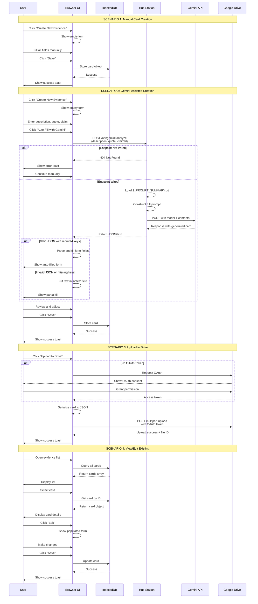
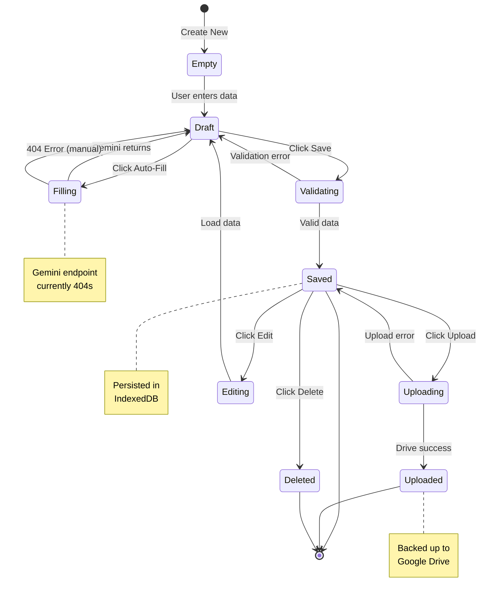

# Evidence Card Workflow

## Complete Evidence Card Lifecycle

```mermaid
flowchart TD
    Start([User Opens App]) --> LoadUI[Load index.html from Hub]
    LoadUI --> InitIDB[Initialize IndexedDB<br/>'evidence_cards' store]
    InitIDB --> MainMenu{User Action}

    %% Create New Card Path
    MainMenu -->|Create New| ShowForm[Display Evidence Card Form]
    ShowForm --> FormFields[Enter Fields:<br/>UID, Location, Parties,<br/>Description, Quote, etc.]
    FormFields --> UserChoice{Fill Method}

    %% Manual Entry
    UserChoice -->|Manual| ManualFill[User types all fields]
    ManualFill --> SaveLocal

    %% Gemini Auto-Fill
    UserChoice -->|Auto-Fill with Gemini| BuildPayload[Build Gemini Payload:<br/>description, quote, claimId]
    BuildPayload --> CallGemini[POST /api/gemini/analyze]
    CallGemini --> GeminiExists{Endpoint<br/>Wired?}

    GeminiExists -->|No| Error404[❌ 404 Error<br/>Show Error Toast]
    Error404 --> ManualFill

    GeminiExists -->|Yes| GeminiProcess[Gemini API Processing]
    GeminiProcess --> ConstructPrompt[Server constructs prompt:<br/>2_PROMPT_SUMMARY.txt +<br/>user fields]
    ConstructPrompt --> CallGeminiAPI[Call Gemini REST API:<br/>POST with model + contents]
    CallGeminiAPI --> GetResponse[Get Response Text]
    GetResponse --> ParseCheck{Is Valid<br/>JSON?}

    ParseCheck -->|Yes| CheckKeys{Has Keys:<br/>significance,<br/>caselaw1,<br/>caselaw2,<br/>notes?}
    CheckKeys -->|Yes| FillFields[Auto-fill form fields]
    CheckKeys -->|No| TextToNotes[Put text in 'notes' field]
    ParseCheck -->|No| TextToNotes

    FillFields --> ReviewFields[User reviews/edits]
    TextToNotes --> ReviewFields
    ReviewFields --> SaveLocal

    %% Save to IndexedDB
    SaveLocal[Save to IndexedDB] --> SaveSuccess{Save OK?}
    SaveSuccess -->|Yes| ShowToast[✅ Show Success Toast]
    SaveSuccess -->|No| ShowError[❌ Show Error]
    ShowToast --> NextAction{Next Action}
    ShowError --> NextAction

    %% Upload to Drive
    NextAction -->|Upload to Drive| CheckOAuth{OAuth<br/>Token<br/>Valid?}
    CheckOAuth -->|No| DoOAuth[Google OAuth Flow]
    DoOAuth --> GetToken[Get Access Token]
    GetToken --> PrepUpload
    CheckOAuth -->|Yes| PrepUpload[Prepare Multipart Upload]
    PrepUpload --> UploadDrive[POST to Google Drive API<br/>with card JSON]
    UploadDrive --> DriveSuccess{Upload<br/>Success?}
    DriveSuccess -->|Yes| DriveToast[✅ Upload Success Toast]
    DriveSuccess -->|No| DriveError[❌ Upload Error Toast]
    DriveToast --> MainMenu
    DriveError --> MainMenu

    %% View/Edit Existing
    NextAction -->|View Existing| MainMenu
    MainMenu -->|View/Edit Card| QueryIDB[Query IndexedDB]
    QueryIDB --> DisplayCard[Display Card Details]
    DisplayCard --> EditOption{Edit?}
    EditOption -->|Yes| FormFields
    EditOption -->|No| MainMenu

    %% Delete Card
    MainMenu -->|Delete Card| ConfirmDelete{Confirm<br/>Delete?}
    ConfirmDelete -->|Yes| DeleteIDB[Delete from IndexedDB]
    ConfirmDelete -->|No| MainMenu
    DeleteIDB --> MainMenu

    style Error404 fill:#f99,stroke:#333,stroke-width:2px
    style GeminiExists fill:#ff9,stroke:#333,stroke-width:2px
    style SaveLocal fill:#9f9,stroke:#333,stroke-width:2px
    style DriveToast fill:#9f9,stroke:#333,stroke-width:2px
```



## Evidence Card Data Flow



## Evidence Card Object Structure

Based on `2_PROMPT_SUMMARY.txt` and `gemini_responses.txt`:

```json
{
  "uid": "EC-2024-001",
  "timestamp": "2024-11-10T14:30:00Z",
  "location": "Transcript p.45, ln.12-18",
  "parties": ["Plaintiff", "Witness A"],
  "claim_ids": [100, 200, 300],
  "description": "Brief factual description of the evidence",
  "quote": "Exact verbatim quote from source material",
  "significance": "Why this evidence matters to the claim(s)",
  "caselaw_support": [
    {
      "id": "caselaw1",
      "citation": "Case Name v. Other, 123 F.3d 456 (9th Cir. 2020)",
      "relevance": "How this case supports the evidence/claim"
    },
    {
      "id": "caselaw2",
      "citation": "Another Case, 789 F.2d 101 (2019)",
      "relevance": "Additional legal support"
    }
  ],
  "notes": "Additional context, procedural notes, tags",
  "attachments": ["pdf_file_id", "audio_transcript_id"],
  "created_by": "user_id",
  "modified_date": "2024-11-10T15:00:00Z"
}
```

## Field Generation Logic

### Gemini Auto-Fill Process

**Input (from user):**
- `description`: Brief description of evidence
- `quote`: Exact quote from source
- `claimId`: Claim number(s) this relates to

**Server-side process:**
1. Load template from `2_PROMPT_SUMMARY.txt`
2. Inject user fields into prompt
3. Add instruction: "Output valid JSON with keys: significance, caselaw1, caselaw2, notes"
4. Send to Gemini API with model: `gemini-2.5-pro`
5. Parse response

**Output (to UI):**
```json
{
  "significance": "AI-generated analysis of why evidence matters",
  "caselaw1": "Relevant case citation with explanation",
  "caselaw2": "Second relevant case citation with explanation",
  "notes": "Additional AI-generated context or tags"
}
```

**UI behavior:**
- If all 4 keys present: populate respective form fields
- If missing keys OR invalid JSON: dump entire response into `notes` field
- User always reviews and can edit before saving

## State Diagram



## Error Handling

| Error Condition | Detection | Response |
|----------------|-----------|----------|
| Gemini 404 | `POST /api/gemini/analyze` returns 404 | Show toast, fall back to manual |
| Gemini timeout | No response after 30s | Show timeout toast, fall back to manual |
| Invalid JSON | `JSON.parse()` fails | Put raw text in notes field |
| Missing required fields | Form validation | Highlight fields, prevent save |
| IndexedDB error | Store/retrieve fails | Show error toast, retry |
| OAuth failure | Token request rejected | Show error, prompt re-auth |
| Drive upload failure | Network error or API error | Show error toast, keep local copy |

## Integration Points

### Required for Full Functionality

1. **Gemini API Wiring** (CRITICAL - currently missing)
   - Implement `POST /api/gemini/analyze`
   - Options:
     - Add route to HubStation.ps1 (recommended)
     - Run separate Node Express server
   - Must return Gemini response format

2. **Ollama** (for mini-chat)
   - Must be running at 127.0.0.1:11434
   - Model downloaded: `qwen3:latest`

3. **Google Cloud Console** (for Drive)
   - OAuth Client ID configured
   - Drive API enabled

4. **Whisper.cpp** (for audio transcription)
   - Binary at path in `hub_config.json`
   - Model file present

## Testing Checklist

- [ ] Create new card manually → saves to IndexedDB
- [ ] Auto-fill with Gemini → returns 404 (expected until wired)
- [ ] Save card → success toast appears
- [ ] View saved card → loads from IndexedDB
- [ ] Edit existing card → updates IndexedDB
- [ ] Delete card → removes from IndexedDB
- [ ] Upload to Drive (with valid OAuth) → succeeds
- [ ] Upload to Drive (no OAuth) → triggers OAuth flow
- [ ] Invalid form data → validation prevents save
- [ ] Browser refresh → cards persist (IndexedDB)
