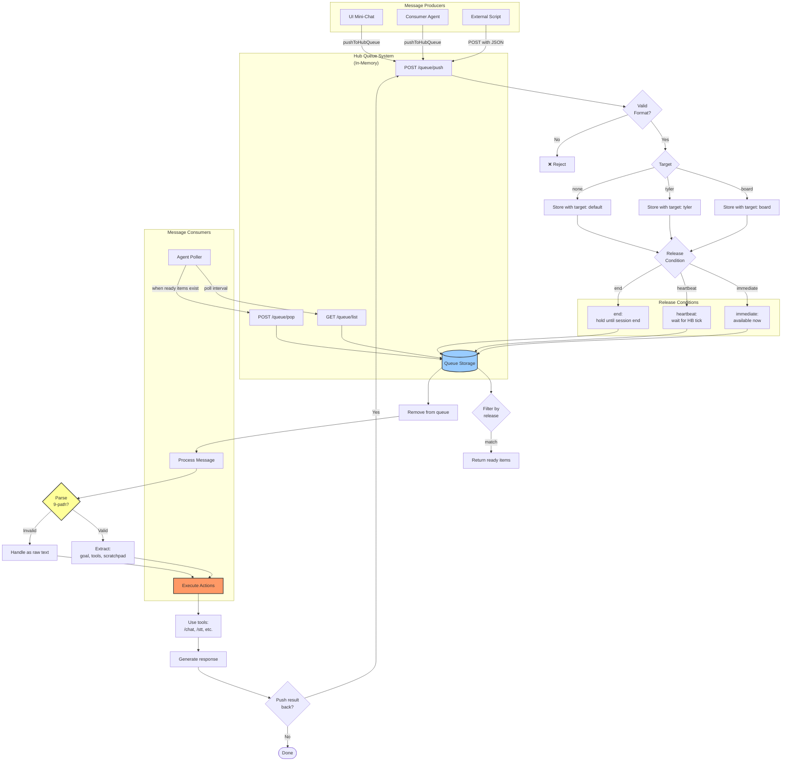
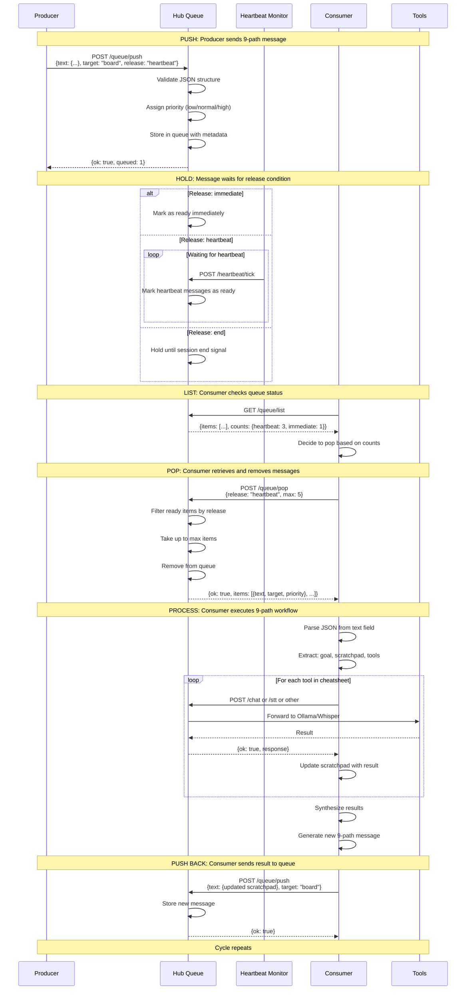
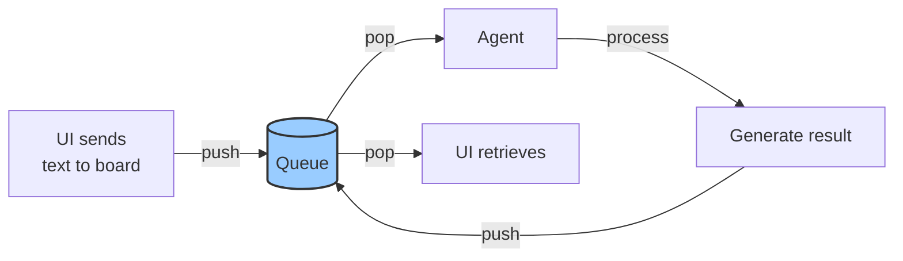
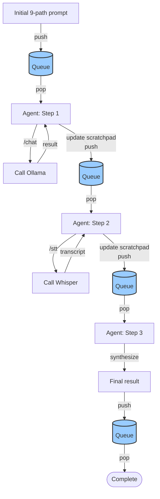
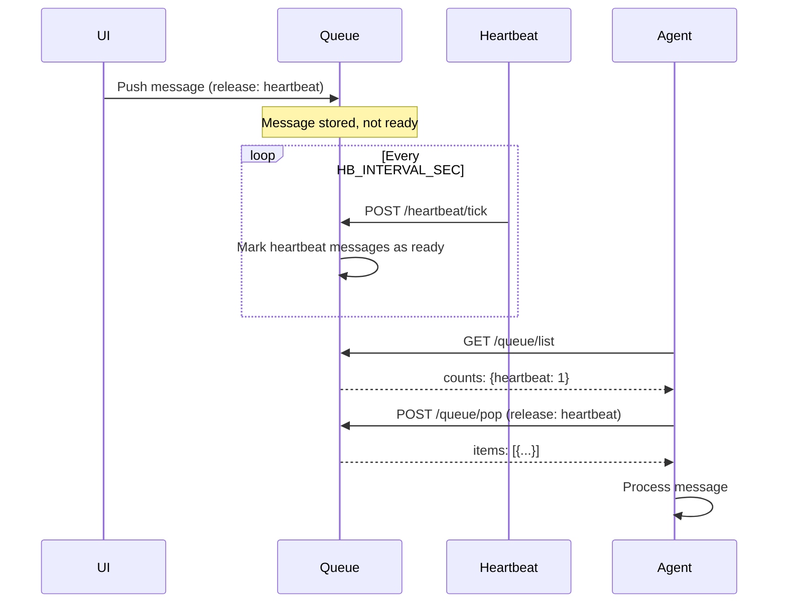
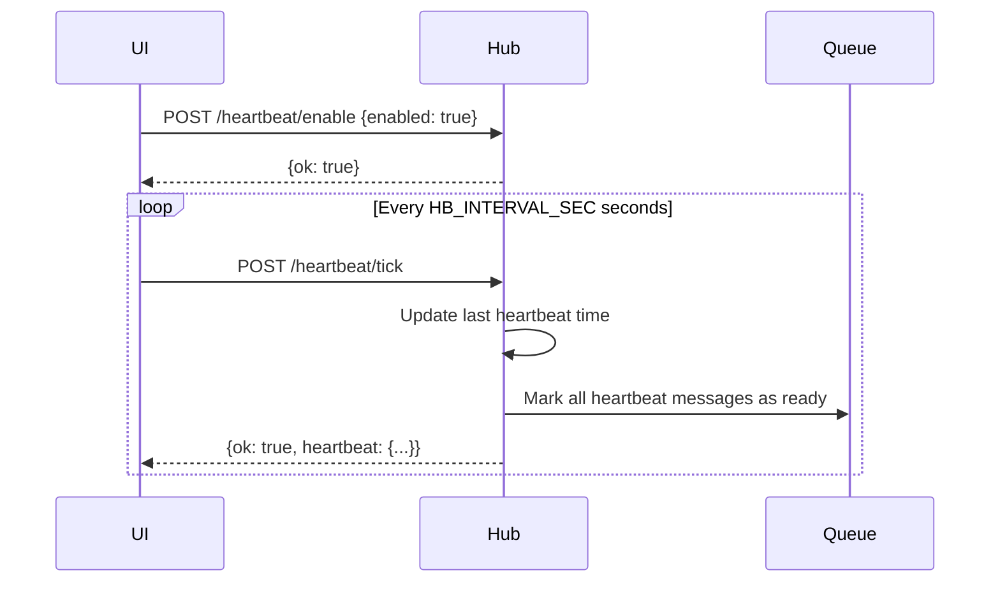

# 9-Path Prompt System

## Overview

The 9-path prompt system is a structured messaging queue that enables complex, multi-step agent workflows. Messages conform to `self_prompt_schema.json` and flow through the Hub's queue system.

## 9-Path Prompt Structure

### Schema Keys (from self_prompt_schema.json)

```json
{
  "time": 1731200000,
  "heartbeat": 300,
  "goal": "Current task objective",
  "model_long_term_goal": "Overarching mission",
  "notes": "Contextual information",
  "scratchpad": "Working memory / step tracker",
  "tools": {
    "cheatsheet": ["/chat", "/stt", "/queue/pop"],
    "classes": {
      "drafting": ["Outline", "Summarize"],
      "scripting": [],
      "research": []
    }
  },
  "files_cheatsheet": ["scripts/2_PROMPT_SUMMARY.txt"],
  "board": "Shared message to all agents",
  "tyler": "Direct message to specific agent"
}
```

## Queue System Flow



## Message Lifecycle Sequence



## Message Flow Patterns

### Pattern 1: Simple Request-Response



### Pattern 2: Multi-Step Workflow



### Pattern 3: Heartbeat-Gated Execution



## 9-Path Message Examples

### Example 1: Evidence Card Generation

```json
{
  "time": 1731200000,
  "heartbeat": 300,
  "goal": "Generate 1–3 Evidence Cards from transcript excerpt",
  "model_long_term_goal": "Build comprehensive evidence database for claims 100-400",
  "notes": "Focus on claims 200, 300 if applicable; use claim 100 as fallback",
  "scratchpad": "Steps: 1) Extract facts from transcript; 2) Map to claim IDs; 3) Draft significance; 4) Find 2 relevant cases; 5) Format as JSON",
  "tools": {
    "cheatsheet": ["/chat", "/queue/push", "/queue/pop"],
    "classes": {
      "drafting": ["Outline", "Summarize", "Cite"],
      "scripting": [],
      "research": ["FindCaselaw", "MatchClaim"]
    }
  },
  "files_cheatsheet": [
    "scripts/2_PROMPT_SUMMARY.txt",
    "transcripts/depo_witness_a.txt",
    "claims/claim_200_elements.json"
  ],
  "board": "Maintain consistent card structure. Output valid JSON only.",
  "tyler": "Ready to process next batch after heartbeat."
}
```

### Example 2: Transcript Analysis

```json
{
  "time": 1731201500,
  "heartbeat": 120,
  "goal": "Transcribe audio clip and extract key admissions",
  "model_long_term_goal": "Complete timeline of all witness statements",
  "notes": "Audio file: depo_2024_11_10_clip_03.wav; focus on questions 15-22",
  "scratchpad": "Step 1: POST /stt to transcribe; Step 2: Parse for admissions; Step 3: Timestamp each admission; Step 4: Link to claims",
  "tools": {
    "cheatsheet": ["/stt", "/chat", "/queue/push"],
    "classes": {
      "drafting": ["Summarize"],
      "scripting": ["ParseTimestamp"],
      "research": ["LinkToClaim"]
    }
  },
  "files_cheatsheet": ["audio/depo_2024_11_10_clip_03.wav"],
  "board": "Use Whisper for STT, then Ollama for analysis.",
  "tyler": "Include timestamps in HH:MM:SS format."
}
```

### Example 3: Iterative Refinement

```json
{
  "time": 1731203000,
  "heartbeat": 180,
  "goal": "Refine Evidence Card EC-2024-067 based on feedback",
  "model_long_term_goal": "Maintain high-quality evidence cards",
  "notes": "Feedback: 'caselaw1 not on point; find better cite for hearsay exception'",
  "scratchpad": "Step 1: Load EC-2024-067 from IndexedDB; Step 2: Research hearsay exceptions (803, 804); Step 3: Find better case; Step 4: Update caselaw1; Step 5: Save",
  "tools": {
    "cheatsheet": ["/chat"],
    "classes": {
      "drafting": [],
      "scripting": [],
      "research": ["FindCaselaw", "HearsayExceptions"]
    }
  },
  "files_cheatsheet": ["cards/EC-2024-067.json", "scripts/hearsay_research.txt"],
  "board": "Prioritize Federal Rules of Evidence 803/804 cases.",
  "tyler": "Update complete; ready for review."
}
```

## Queue API Contracts

### POST /queue/push

**Request:**
```json
{
  "text": "string (plain text or JSON stringified)",
  "target": "tyler | board | <custom>",
  "priority": "low | normal | high",
  "release": "immediate | heartbeat | end"
}
```

**Response:**
```json
{
  "ok": true,
  "queued": 1,
  "position": 5
}
```

### GET /queue/list

**Request:** (query params optional)
```
GET /queue/list?target=board&release=heartbeat
```

**Response:**
```json
{
  "ok": true,
  "items": [
    {
      "id": "msg_001",
      "text": "{...}",
      "target": "board",
      "priority": "normal",
      "release": "heartbeat",
      "ready": true,
      "timestamp": 1731200000
    }
  ],
  "counts": {
    "immediate": 2,
    "heartbeat": 3,
    "end": 1
  }
}
```

### POST /queue/pop

**Request:**
```json
{
  "release": "heartbeat",
  "max": 5,
  "target": "board"
}
```

**Response:**
```json
{
  "ok": true,
  "items": [
    {
      "text": "{...}",
      "target": "board",
      "priority": "normal",
      "release": "heartbeat"
    }
  ],
  "remaining": 0
}
```

## Consumer Agent Implementation

### Minimal Consumer Loop (Pseudocode)

```javascript
// Consumer agent that processes 9-path messages

const POLL_INTERVAL_MS = 5000;
const HUB_URL = "http://127.0.0.1:9099";

async function consumerLoop() {
  while (true) {
    // 1. Check queue status
    const listResp = await fetch(`${HUB_URL}/queue/list`);
    const { counts } = await listResp.json();

    if (counts.immediate > 0 || counts.heartbeat > 0) {
      // 2. Pop ready messages
      const popResp = await fetch(`${HUB_URL}/queue/pop`, {
        method: "POST",
        headers: { "Content-Type": "application/json" },
        body: JSON.stringify({ release: "heartbeat", max: 5 })
      });

      const { items } = await popResp.json();

      for (const item of items) {
        // 3. Process each message
        await processMessage(item);
      }
    }

    // 4. Wait before next poll
    await sleep(POLL_INTERVAL_MS);
  }
}

async function processMessage(item) {
  try {
    // Parse 9-path JSON
    const prompt = JSON.parse(item.text);

    console.log(`[GOAL] ${prompt.goal}`);
    console.log(`[SCRATCHPAD] ${prompt.scratchpad}`);

    // Execute tools from cheatsheet
    for (const tool of prompt.tools.cheatsheet) {
      if (tool === "/chat") {
        const result = await callChat(prompt.goal);
        prompt.scratchpad += `\n✓ Chat: ${result.slice(0, 100)}`;
      } else if (tool === "/stt") {
        // Handle STT
      }
    }

    // Generate result
    const resultPrompt = {
      ...prompt,
      time: Date.now(),
      scratchpad: prompt.scratchpad + "\n✓ Completed",
      tyler: "Task complete"
    };

    // Push result back to queue
    await fetch(`${HUB_URL}/queue/push`, {
      method: "POST",
      headers: { "Content-Type": "application/json" },
      body: JSON.stringify({
        text: JSON.stringify(resultPrompt),
        target: "board",
        release: "immediate"
      })
    });

  } catch (err) {
    console.error("Failed to process message:", err);
  }
}

async function callChat(message) {
  const resp = await fetch(`${HUB_URL}/chat`, {
    method: "POST",
    headers: { "Content-Type": "application/json" },
    body: JSON.stringify({
      model: "qwen3:latest",
      messages: [{ role: "user", content: message }]
    })
  });
  const { response } = await resp.json();
  return response;
}

function sleep(ms) {
  return new Promise(resolve => setTimeout(resolve, ms));
}

// Start the loop
consumerLoop();
```

## Integration with Evidence Cards

### Using 9-Path to Generate Evidence Cards

```mermaid
flowchart LR
    User[User: "Analyze transcript"] -->|Push| Queue[(Queue)]
    Queue -->|Pop| Agent[Consumer Agent]
    Agent -->|Read| Transcript[transcript.txt]
    Agent -->|POST /chat| Ollama[Ollama LLM]
    Ollama -->|Extract facts| Agent
    Agent -->|POST /api/gemini/analyze| Gemini[Gemini API]
    Gemini -->|Format cards| Agent
    Agent -->|Generate| Cards[Evidence Cards JSON]
    Cards -->|Push result| Queue
    Queue -->|Pop| UI[UI]
    UI -->|Save| IDB[(IndexedDB)]

    style Queue fill:#9cf,stroke:#333,stroke-width:2px
    style Cards fill:#9f9,stroke:#333,stroke-width:2px
```

**Workflow:**
1. User pushes 9-path message: "Generate evidence cards from transcript X"
2. Consumer pops message, reads `goal` and `files_cheatsheet`
3. Consumer loads transcript file
4. Consumer calls `/chat` to extract facts
5. Consumer calls `/api/gemini/analyze` for each fact to generate structured card
6. Consumer assembles array of Evidence Card JSONs
7. Consumer pushes result back to queue with `target: "board"`
8. UI pops result and saves to IndexedDB

## Heartbeat Integration

The heartbeat system controls when `release: "heartbeat"` messages become ready to pop.

**Heartbeat Settings (localStorage):**
- `HB_ENABLED`: boolean
- `HB_INTERVAL_SEC`: number (e.g., 120)

**Flow:**


**Why use heartbeat release?**
- **Pacing**: Prevents agents from processing too fast
- **Batching**: Groups related messages together
- **Coordination**: Synchronizes multiple consumers

## Best Practices

### For Producers
1. **Use structured JSON**: Always conform to `self_prompt_schema.json`
2. **Set clear goals**: Single, actionable objective per message
3. **Track progress in scratchpad**: Update with each step
4. **Choose correct release**: `immediate` for urgent, `heartbeat` for paced
5. **Target appropriately**: `board` for shared, `tyler` for specific agent

### For Consumers
1. **Poll efficiently**: Don't hammer the queue; use reasonable intervals
2. **Handle errors gracefully**: Catch parse errors, log failures
3. **Update scratchpad**: Document each step taken
4. **Push results back**: Complete the loop so UI can see progress
5. **Respect release conditions**: Only pop messages that are ready

### For System Designers
1. **Define message contracts**: Clear schema for all message types
2. **Monitor queue depth**: Alert if queue grows unbounded
3. **Implement priorities**: High-priority messages should jump queue
4. **Add message TTL**: Expire old messages to prevent buildup
5. **Log all operations**: Track push/pop/process for debugging

## Troubleshooting

| Issue | Symptoms | Solution |
|-------|----------|----------|
| Messages not popping | `counts` shows items but pop returns empty | Check `release` condition; messages may be waiting for heartbeat |
| Invalid JSON errors | Consumer crashes on parse | Validate JSON structure before pushing; catch parse errors |
| Queue growing unbounded | Memory usage increases | Add consumer capacity or message TTL; investigate slow processing |
| Heartbeat not triggering | Messages stuck in heartbeat release | Verify UI is sending `/heartbeat/tick` at interval |
| Duplicate processing | Same message processed twice | Ensure pop removes items from queue; check for race conditions |

## Future Enhancements

- **Persistent queue**: Store in SQLite/PostgreSQL instead of in-memory
- **Message acknowledgment**: Require consumer ack before removing from queue
- **Dead letter queue**: Move failed messages to separate queue for review
- **Priority scheduling**: Process high-priority before low-priority
- **Message routing**: Auto-route based on content or target patterns
- **Queue metrics**: Dashboard showing throughput, depth, processing time
