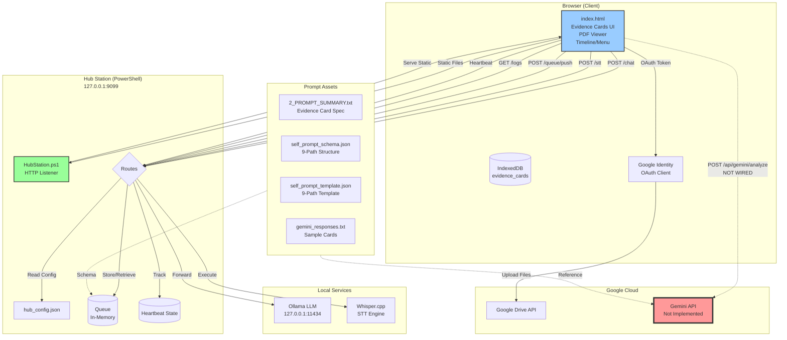
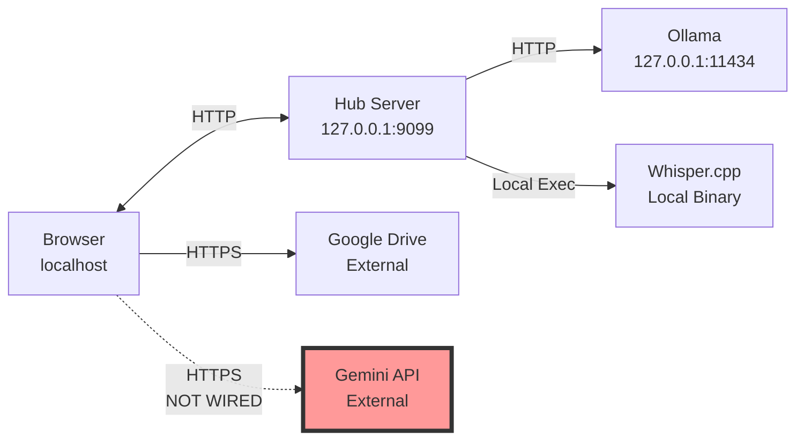
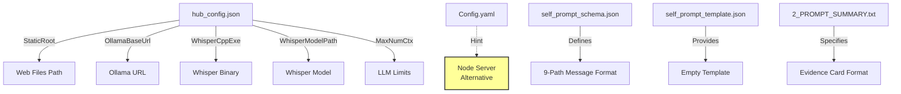

# System Architecture Overview

## High-Level Component Architecture

## Component Responsibilities

### Browser UI (index.html)
- **Evidence Card Management**: Create, edit, save cards to IndexedDB
- **PDF Viewer**: Display and annotate documents
- **Timeline & Navigation**: Organize evidence chronologically
- **Audio Input**: Record and transcribe via STT
- **Google Integration**: OAuth and Drive uploads
- **Chat Interface**: Mini-chat with LLM

### Hub Station (PowerShell Server)
- **Static File Server**: Serves web assets from `StaticRoot`
- **API Gateway**: Routes requests to local services
- **Queue Manager**: Manages message queue for 9-path prompts
- **Heartbeat Monitor**: Tracks system health/cadence
- **Log Aggregator**: Collects and serves system logs
- **Bridge**: Connects UI to Ollama, Whisper, and local tools

### Local Services
- **Ollama**: LLM inference engine (qwen3:latest default)
- **Whisper.cpp**: Speech-to-text transcription

### Google Services
- **Drive API**: File storage and retrieval
- **Gemini API**: ⚠️ NOT IMPLEMENTED - Evidence card auto-fill

## Data Stores

| Store | Type | Location | Purpose |
|-------|------|----------|---------|
| IndexedDB | Browser | Client | Evidence cards persistence |
| Queue | In-Memory | Hub Server | 9-path prompt messages |
| Heartbeat State | In-Memory | Hub Server | Health monitoring |
| Log Buffer | In-Memory | Hub Server | System logs |

## Network Topology

## Port Map

| Service | Address | Protocol | Status |
|---------|---------|----------|--------|
| Hub Station | 127.0.0.1:9099 | HTTP | ✅ Ready |
| Ollama | 127.0.0.1:11434 | HTTP | ⚠️ Needs Running |
| Whisper.cpp | Local Exec | File | ⚠️ Needs Binary |
| Google Drive | External | HTTPS | ✅ Ready |
| Gemini API | External | HTTPS | ❌ Not Wired |

## Security Model

- **Local-First**: Hub only binds to 127.0.0.1 (localhost)
- **No Authentication**: Hub assumes trusted local environment
- **Google OAuth**: Browser-based OAuth flow for Drive access
- **No API Keys in Frontend**: Gemini requires server-side proxy
- **CORS**: Hub allows all origins for local dev

## Configuration Files

## Critical Gaps

⚠️ **Missing Gemini Integration**
- UI expects `POST /api/gemini/analyze`
- Returns 404 currently
- Blocks "Auto-Fill with Gemini" feature

**Two Options to Fix:**
1. **Add to Hub**: Implement `/api/gemini/analyze` in HubStation.ps1
2. **Separate Service**: Run Node Express server on port 3000

See detailed wiring instructions in GEMINI_INTEGRATION.md
