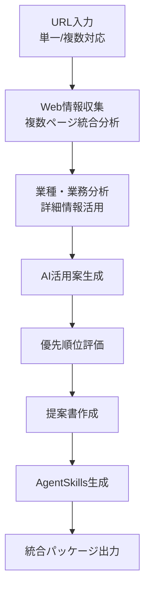

# AI Advisor Workflow

## 概要
クライアントのWebサイトから情報を自動収集し、業種特性を分析した上で、最適なAI活用提案書を生成し、さらにAgentSkillsの実装コードまで自動生成する統合ワークフローシステムです。

## 主な機能

### 1. HP情報収集・解析
- Webサイトの自動クロール
- 会社概要・業務内容の抽出
- 業種・業態の自動判定

### 2. AI活用提案生成
- 業種別AIユースケースマッチング
- 優先順位付けとROI試算
- 実装ロードマップ作成

### 3. 提案書自動作成
- エグゼクティブサマリー
- 現状分析と課題抽出
- AI活用提案（カテゴリ別）
- 期待効果とKPI設定

### 4. AgentSkills自動実装
- 提案内容に基づくスキル設計
- 実装コードの自動生成
- テストコードの生成

## 使用方法

### 単一URLの場合
```python
from ai_advisor_workflow import AIAdvisorWorkflow

# ワークフローの初期化
workflow = AIAdvisorWorkflow()

# クライアントのHP URLを指定して実行
result = workflow.execute(
    client_urls="https://example.com",
    output_dir="./proposals/client_name",
    generate_skills=True
)
```

### 複数URL（リンク集）の場合
```python
# より詳細な分析のため、複数のURLを指定
urls = [
    "https://example.com",                    # メインサイト
    "https://example.com/services",           # サービス詳細
    "https://example.com/products",           # 製品情報
    "https://example.com/case-studies",       # 導入事例
    "https://example.com/about"               # 会社概要
]

result = workflow.execute(
    client_urls=urls,
    output_dir="./proposals/client_name",
    generate_skills=True
)

# 結果の確認
print(f"分析したURL数: {len(result['client_urls'])}")
print(f"提案書: {result['documents']}")
print(f"生成されたスキル: {result['generated_skills']}")
```

### コマンドライン使用
```bash
# 単一URL
python -m ai_advisor_workflow https://example.com

# 複数URL
python -m ai_advisor_workflow https://example.com https://example.com/services https://example.com/about

# オプション指定
python -m ai_advisor_workflow https://example.com https://example.com/services \
  --output ./output/company_name \
  --no-skills  # スキル生成をスキップ
```

## ワークフロー構成



### 複数URL分析の利点
1. **包括的な企業理解**: メインサイトだけでなく、サービス詳細や事例から深い洞察を獲得
2. **正確な業種判定**: 複数の情報源から業種・業態をより正確に特定
3. **詳細なサービス把握**: 各サービスページから具体的な提供価値を抽出
4. **実績ベースの提案**: 事例ページから実際の課題解決パターンを学習
5. **組織文化の理解**: 採用ページ等から企業文化を把握し、提案をカスタマイズ

## 出力ファイル構成

```
output/
├── proposal/
│   ├── executive_summary.md
│   ├── ai_proposal.pdf
│   ├── ai_proposal.pptx
│   └── implementation_roadmap.xlsx
├── generated_skills/
│   ├── customer_support_ai/
│   ├── data_analysis_automation/
│   └── process_optimization/
└── reports/
    ├── website_analysis.json
    ├── industry_insights.md
    └── roi_calculation.xlsx
```

## カスタマイズ

### 業種別テンプレート追加
`references/industry_templates/`に新しい業種テンプレートを追加できます。

### AI提案カテゴリ拡張
`scripts/ai_proposal_engine.py`の`PROPOSAL_CATEGORIES`を編集します。

## 注意事項
- 大規模なWebサイトの場合、スクレイピングに時間がかかる場合があります
- 生成されたAgentSkillsは必ず動作確認を行ってください
- APIキー（OpenAI/Claude）の設定が必要です