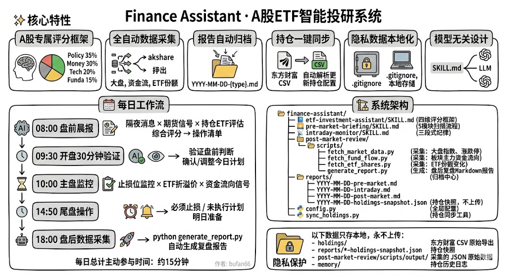

# A-Pilot · A股ETF智能副驾驶

<div align="center">

**我用 AI 帮自己从被割变成不被割**

[快速开始](#快速开始) · [每日工作流](#每日工作流) · [系统架构](#系统架构) · [路线图](#路线图)

</div>

---

## 为什么做这个？

作为接近两坤年的职场打工人，接触了FIRE思想，我深刻意识到固定时间换取财富的方式无法真正带来自由，于是开始接触投资理财。美股做定期长投，A股做中短线ETF，随着国内产业转型和升级，虽然散户多、情绪市，但我认为长期还是有赚钱效应的，并且其实更适合做波动。于是最开始是写提示词做咨询面分析，发现**信息搜集效率、市场数据结合、个人持仓结合**无法很好统一，并且**缺少专业的复盘**，尤其亏钱的时候复盘发现规律都是那几个：追高了、没设止损、早上看新闻冲动买、下午主力跑了我还拿着。

问题不是不懂道理，而是**每天盯盘太累，情绪一来纪律就没了**。

所以我搭了这套系统，让 AI 当我的副驾驶——它不替我做决策，但它帮我在每个关键节点做完该做的功课，提醒我该提醒的事。

变化不是一夜暴富，而是**理性分析，纪律执行，少犯低级错误**。

---

## A-Pilot 是什么？

一套为 **A股ETF散户** 设计的 AI 投研工作流，驱动任意大模型（Claude / GPT / Gemini）完成：

- **每日 08:00**：扫描隔夜消息 → 期货信号 → 持仓ETF评分 → 今日操作清单
- **每日 09:30–15:00**：三段式纪律监控，止损提醒，不让情绪替你做决定
- **每日 18:00**：自动采集大盘/资金流/ETF机构行为 → 生成复盘报告，含逐笔操作质量评分
- **长期积累**：所有报告按日归档，形成可回溯的个人投研知识库

> 盘前做决策，盘中做执行，盘后做复盘。用纪律代替情绪，用数据代替直觉。

---

## 它能做什么？

| 功能 | 说明 |
|------|------|
| **A股专属评分框架** | 政策35% / 资金30% / 技术20% / 基本面15%，不套用美股逻辑 |
| **全自动数据采集** | 基于 akshare，大盘/资金流/ETF份额一键采集，不用手动查行情 |
| **差异化ETF份额评分** | 按变化幅度分7档打分（+5到+20），+273%的机构建仓和+5%不该一个分 |
| **资金背离识别** | 自动检测"ETF申购但二级出货"等背离信号，这种矛盾藏着真正的机会和风险 |
| **逐笔操作复盘** | 导入东方财富交易CSV，AI帮你拆解每笔成交质量，今天哪笔买得好一目了然 |
| **报告自动归档** | 按日期落盘，累积下来就是自己的投研日志 |
| **持仓一键同步** | 东方财富持仓CSV → 自动解析成本/市值/盈亏 |
| **数据全本地** | 持仓、资产数据只存本地，.gitignore 保护，不上传 |
| **模型无关** | 核心是纯文本 SKILL.md，Claude / GPT / Gemini 都能跑 |



---

## 快速开始

### 前置要求
- Python 3.9+
- 任意大模型访问权限（Claude / GPT-4o / Gemini 均可）
- 东方财富证券账户（用于导出持仓 CSV）

### 安装

```bash
git clone https://github.com/yourname/finance-assistant.git
cd finance-assistant/post-market-review/scripts
pip install -r requirements.txt
```

> Windows 用户注意：PowerShell 执行脚本前请先设置编码：
> ```powershell
> $env:PYTHONIOENCODING="utf-8"
> ```

### 第一步：同步你的持仓

在东方财富客户端导出持仓 CSV（交易 → 持仓 → 右键导出），然后：

```bash
cd finance-assistant
python sync_holdings.py --file "holdings/YYYYMMDD持仓.csv"
```

输出示例：
```
✅ 识别为：【账户持仓表（CSV）】，共 24 只 ETF
  证券市值: ¥46,122.40   可用资金: ¥2,934.08   持仓盈亏: +¥1,592.72

  代码     名称              持仓数量    成本价    现价      市值           盈亏%
  159715  稀土ETF            400       1.301    1.520    608.00       +16.83%
  562800  稀有金属ETF        1,200     1.104    1.217    1,460.40     +10.24%
  512710  军工龙头ETF        1,800     0.869    0.924    1,663.20     +6.33%
  ...
```

### 第二步：盘后数据采集 + 复盘

在 AI 对话窗口发送：

```
帮我今日复盘
```

AI 会自动：
1. **交互式预检**：询问你今日有无操作、持仓快照、特别关注点
2. **采集市场数据**：运行 `python generate_report.py`
3. **生成专业报告**：大盘 + 资金流 + ETF机构行为 + 背离信号 + 明日计划
4. **导入操作记录**（如有）：将东方财富CSV的每笔成交逐笔拆解评分

或直接运行脚本：

```bash
cd post-market-review/scripts

# 今日复盘
python generate_report.py

# 强制重新采集（覆盖已有数据）
python generate_report.py --force

# 历史某天复盘
python generate_report.py --date 2026-03-02
```

### 第三步：导入操作记录（可选）

将东方财富导出的当日交易记录CSV发给AI，发送：

```
导入今日操作记录
```

AI 自动解析并生成逐笔评分，例如：

```
① 军工龙头 · 今日最佳操作 ⭐
   买入300股@0.912，当日涨+4.29%，收盘0.924
   成交价低于收盘价1.3%，日内低点提前埋伏
   ETF份额+273.8%（全市场申购冠军），逻辑清晰，执行优秀

② 传媒ETF · 逆向加仓，需纪律 ⚠️
   两笔500股均价1.118，板块跌-3.69%
   主力ETF净流入+0.42亿，降均价逻辑自洽
   建议设止损线¥1.07，避免"越跌越补"
```

---

## 每日工作流

```
08:00  盘前晨报（AI生成，约5分钟阅读）
  ↓    隔夜消息 × 期货信号 × 持仓ETF评估 → 综合评分 → 操作清单
09:30  开盘30分钟验证（AI二次确认，约2分钟）
  ↓    验证盘前判断是否成立 → 确认/调整今日计划
10:00  主盘监控（每小时一次快速检查）
  ↓    止损位监控 × ETF折溢价 × 资金流向信号
14:50  尾盘操作（AI提醒，约3分钟）
  ↓    必须止损 / 未执行计划 → 明日准备
18:00  盘后数据采集（自动，约1分钟）
  ↓    python generate_report.py → 复盘报告自动生成
18:10  AI 深度解读（约10分钟）
  ↓    背离识别 + 操作复盘 + 明日计划
```

**每日总计主动参与时间：约15分钟**

---

## 系统架构

```
finance-assistant/
│
├── etf-investment-assistant/SKILL.md   # 主决策引擎（四维评分框架）
├── pre-market-briefing/SKILL.md        # 盘前晨报（5模块扫描流程）
├── intraday-monitor/SKILL.md           # 盘中监控（三段式纪律）
│
├── post-market-review/
│   ├── SKILL.md                        # 复盘SOP（含交互式预检流程）
│   └── scripts/
│       ├── fetch_market_data.py        # 采集：大盘指数、涨跌停、情绪
│       ├── fetch_fund_flow.py          # 采集：全市场/行业/ETF主力资金流
│       ├── fetch_etf_shares.py         # 采集：ETF份额变化（机构行为）
│       ├── generate_report.py          # 生成：盘后复盘 Markdown 报告
│       └── config.py                   # 脚本级配置（watchlist等）
│       └── output/YYYY-MM-DD/          # 原始JSON缓存（不上传）
│           ├── market_data.json
│           ├── fund_flow.json
│           ├── etf_shares.json
│           └── operations.json         # 导入的操作记录
│
├── reports/                            # 归档中心（按日期索引）
│   ├── YYYY-MM-DD-pre-market.md        #   盘前晨报
│   ├── YYYY-MM-DD-post-market.md       #   盘后复盘（含操作分析）
│   └── YYYY-MM-DD-holdings-snapshot.json  # 持仓快照（本地，不上传）
│
├── holdings/                           # 东方财富CSV原始导出（本地，不上传）
│
├── config.py                           # 全局配置（持仓列表、阈值、路径）
└── sync_holdings.py                    # 持仓同步工具（东方财富CSV解析）
```

### 数据流

```
东方财富 CSV 导出（持仓）
        │
        ▼
  sync_holdings.py  ──→  config.py（持仓代码自动更新）
        │
        ▼
  holdings-snapshot.json（含成本/市值/盈亏）
        │
    ┌───┴─────────────────┐
    │                     │
    ▼                     ▼
 盘前分析              盘后报告 ←─── akshare 实时数据
（AI读取）               │
                         ↑
              操作记录CSV（东方财富交易记录）
```

---

## 复盘报告示例

```markdown
## 六、今日操作记录
> 7笔成交，全部买入，合计投入¥2,254.60

| 标的 | 代码 | 成交价 | 收盘价 | 即时浮动 |
|------|------|--------|--------|---------|
| 军工龙头 | 512710 | 0.912 | 0.924 | +1.32% ✅ |
| 稀有金属 | 562800 | 1.180 | 1.217 | +3.14% ✅ |
| 传媒ETF  | 512980 | ~1.118均 | 1.123 | +0.45% ⚠️ |

### 今日最佳操作 ⭐ 军工龙头
买入300股@0.912，当日大涨+4.29%，成交价低于收盘价1.3%
ETF份额+273.8%（全市场申购冠军），在正确的时机买了正确的标的

### 需反思 ⚠️ 传媒ETF逆向加仓
板块跌-3.69%时逆向补仓500股，虽有主力ETF净流入支撑
但需同步设定严格止损线¥1.07，避免"越跌越补"
```

---

## 配置

编辑 `config.py` 即可更新全部配置，所有脚本自动生效：

```python
# 持仓 ETF 列表（用 sync_holdings.py 自动更新，也可手动编辑）
WATCHLIST_ETFS = [
    "159715",   # 稀土ETF
    "562800",   # 稀有金属ETF
    "512710",   # 军工龙头ETF
    # ...
]

# 预警阈值
THRESHOLDS = {
    "etf_shares_change_pct": 5.0,   # ETF份额日变化 > ±5% 发出预警
    "fund_flow_billion":     5.0,   # 主力净流入/出 > 50亿 发出预警
    "index_drop_pct":        2.0,   # 指数单日跌超 2% 发出预警
}
```

---

## 隐私保护

以下数据**只存本地，永不上传**：

```
holdings/                              ← 东方财富 CSV 原始导出
reports/*-holdings-snapshot.json       ← 持仓快照（含总资产/盈亏）
post-market-review/scripts/output/     ← 采集的 JSON 原始数据
```

---

## 路线图

### P0 · 基础管道（已完成）
- [x] 四维评分框架 + 三段式工作流 SKILL 设计
- [x] 持仓 CSV 自动解析同步（东方财富格式）
- [x] 盘后数据自动采集（大盘/资金流/ETF份额）+ 报告生成管道
- [x] 报告归档系统（按日期索引，Markdown格式）
- [x] 差异化ETF份额评分（7档打分，精准识别机构建仓力度）
- [x] 资金背离信号识别（份额申购 vs 二级出货）
- [x] 操作记录CSV导入 + 逐笔成交质量复盘
- [x] 历史日期回溯（`--date YYYY-MM-DD` 参数支持）
- [x] 交互式复盘预检（AI引导用户补充操作/快照/关注点）

### P0 · 进行中
- [ ] Windows 定时调度（18:00 全自动无人值守，Task Scheduler 配置）
- [ ] 价格核验层（CSV市值 vs akshare 实时价格交叉校验，识别数据偏差）

### P1 · 规划中
- [ ] 持仓历史记忆（portfolio-log.jsonl）+ 盘前读取历史趋势
- [ ] 盘前预判 vs 实际对比（记录每日预判分数，每周统计准确率）
- [ ] 操作记录回溯（按标的汇总历史买卖，计算实际盈亏）
- [ ] 止损纪律追踪（记录设定的止损位，统计执行率）

### P2 · 规划中
- [ ] 历史持仓回测（沙盒模式，不影响真实记录）
- [ ] 强制反驳假设（评分≥60时先写空方理由，防止确认偏误）
- [ ] 周/月复盘模板（自动聚合本周所有日报，生成周度总结）

---

## 依赖

```
akshare      # A股数据采集（大盘/资金流/ETF）
requests     # HTTP 请求
pandas       # 数据处理
```

```bash
pip install akshare requests pandas
```

---

## License

MIT — 自由使用，风险自负。本项目输出内容不构成投资建议。

---

<div align="center">

**如果你也在 A股被割过，欢迎 Star**

*不是让你变股神，是让你少犯低级错误。*

</div>
