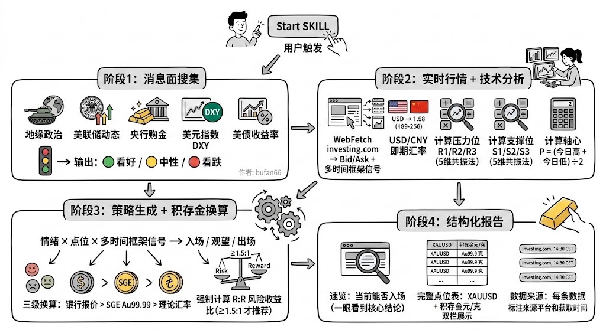

<div align="center">

# ⚡ Gold Accumulation Trading AI · 黄金积存金短线交易 AI

**让 AI 帮你盯盘 · 实时分析 · 精准点位 · 一键生成交易策略**

[](https://opensource.org/licenses/MIT)
[](https://cursor.sh)
[](.)
[](https://www.investing.com/currencies/xau-usd)
[](.)

[功能演示](#-效果展示) · [快速开始](#-快速开始) · [工作原理](#-工作原理) · [配置指南](#-配置指南) · [示例报告](#-示例报告)

</div>

---

## 🤔 你是否有这些困惑？

- 银行 APP 里的积存金价格，**到底该在哪个点位买入？**
- 看了一堆财经新闻，**消息到底是利多还是利空？**
- XAUUSD 涨了 $50，**我的积存金应该值多少钱？**
- 刷手机看到金价在动，**现在能不能入场？**

**这个 AI Skill 专门解决这些问题。** 一句话触发，30秒内生成完整分析报告。

---

## ✨ 核心功能

| 功能 | 说明 |
|------|------|
| 🔴🟡🟢 **实时情绪判断** | 自动搜集最近1-4小时消息面，判定看好/看跌/中性，每条消息标注来源和影响 |
| 📐 **精准点位计算** | 基于实时 OHLC 计算 R1/R2/R3 压力位、S1/S2/S3 支撑位、自定义轴心位 P |
| ⏱️ **多时间框架信号** | 直取 Investing.com 30min/1H/5H/日线/周线 5档信号，判断**当前能不能入场** |
| 💱 **积存金精准换算** | XAUUSD → 元/克，三级换算策略（银行实时报价 > SGE > 理论汇率），自动标注溢价 |
| 📊 **R:R 风险收益比** | 每笔交易强制计算止损/止盈，R:R ≥ 1.5:1 才推荐入场 |
| 🚨 **经济日历整合** | 自动读取当日已发布数据（ISM、非农、CPI 等），分析对金价的短期影响 |

---




## 📸 效果展示

<details>
<summary>📄 点击展开完整报告示例</summary>

```
⚡ 黄金积存金实时短线分析
📅 2026-03-03 04:30 北京时间 | 数据时效: 实时（Investing.com 直取）

┌─────────────────────────────────────────┐
│  XAUUSD 现价  $5,336.34  (+1.11%)       │
│  Bid / Ask    $5,336.27 / $5,337.02     │
│  今日区间     $5,261.23 → $5,419.32     │
└─────────────────────────────────────────┘

⏱️ 多时间框架信号
  30分钟  🟢 买入      ← 短线动能转正！
  1小时   🟡 中性
  5小时   🟢 强烈买入
  日线    🟢 强烈买入
  周线    🟢 强烈买入

📐 关键点位（积存金换算）
  R2  $5,420  →  ~1,212 元/克  今日实际高点
  R1  $5,393  →  ~1,206 元/克  盘中阻力区
  ──────────────────────────────
  P   $5,340  →  ~1,194 元/克  轴心 (高+低)÷2
  ▶   $5,336  →  ~1,193 元/克  ← 当前价格
  ──────────────────────────────
  S1  $5,310  →  ~1,187 元/克  反弹起点支撑
  S2  $5,261  →  ~1,177 元/克  今日最低点

⚡ 能否入场？
  30min: 🟢 买入 → ✅ 可以准备入场（等轴心突破确认）

  方案A  轴心突破做多
  ├── 入场: $5,345-5,355  积存金 ≈ 1,196 元/克
  ├── 止损: $5,295        R:R = 1.5:1 ✅
  └── T1:   $5,419        积存金 ≈ 1,212 元/克
  
  方案B  回调低吸（更稳健）
  ├── 等待: 回调至 $5,305-5,315
  ├── 止损: $5,265        R:R = 2.2:1 ✅
  └── T1:   $5,393        积存金 ≈ 1,206 元/克
```

</details>

---

## 🚀 快速开始

### 前提条件

- [Cursor IDE](https://cursor.sh) （支持 Agent 模式的版本）
- Cursor 已开启 Web 搜索 / WebFetch 工具权限

### 安装

**方式一：克隆到 Cursor Skills 目录（推荐）**

```bash
# 克隆到 Cursor 全局 Skills 目录
git clone https://github.com/yourusername/gold-accumulation-trading \
  ~/.cursor/skills/gold-accumulation-trading
```

**方式二：克隆到项目目录**

```bash
git clone https://github.com/yourusername/gold-accumulation-trading
```

### 使用

在 Cursor Chat 中，直接输入以下任意触发词：

```
@gold-accumulation-trading/SKILL.md 当前积存金点位分析

@gold-accumulation-trading/SKILL.md 现在能买吗？

@gold-accumulation-trading/SKILL.md 帮我分析黄金行情
```

> AI 会自动执行4个阶段：搜集消息面 → 抓取实时行情 → 计算点位 → 生成策略报告，全程约 30-60 秒。

---

## 🔧 工作原理

```
用户触发
   │
   ▼
┌──────────────────────────────────────────────────────────┐
│  阶段1：消息面搜集                                        │
│  ├── 地缘政治 / 美联储动态 / 央行购金                    │
│  ├── 美元指数 DXY / 美债收益率                           │
│  └── → 输出：🟢看好 / 🟡中性 / 🔴看跌                  │
└────────────────────┬─────────────────────────────────────┘
                     │
                     ▼
┌──────────────────────────────────────────────────────────┐
│  阶段2：实时行情 + 技术分析                              │
│  ├── WebFetch investing.com → Bid/Ask + 多时间框架信号   │
│  ├── USD/CNY 即期汇率                                    │
│  ├── 计算压力位 R1/R2/R3（5维共振法）                   │
│  ├── 计算支撑位 S1/S2/S3（5维共振法）                   │
│  └── 计算轴心 P = (今日高 + 今日低) ÷ 2                 │
└────────────────────┬─────────────────────────────────────┘
                     │
                     ▼
┌──────────────────────────────────────────────────────────┐
│  阶段3：策略生成 + 积存金换算                            │
│  ├── 情绪 × 点位 × 多时间框架信号 → 入场/观望/出场      │
│  ├── 三级换算：银行报价 > SGE Au99.99 > 理论汇率         │
│  └── 强制计算 R:R 风险收益比（≥1.5:1 才推荐）           │
└────────────────────┬─────────────────────────────────────┘
                     │
                     ▼
┌──────────────────────────────────────────────────────────┐
│  阶段4：结构化报告                                       │
│  ├── 速览：当前能否入场（一眼看到核心结论）              │
│  ├── 完整点位表：XAUUSD + 积存金元/克 双栏展示           │
│  └── 数据来源：每条数据标注来源平台和获取时间            │
└──────────────────────────────────────────────────────────┘
```

---

## 💡 设计亮点

### 1. 实时优先，拒绝延时

传统分析工具往往使用小时前甚至天前的数据。本工具将 `WebFetch investing.com/currencies/xau-usd` 作为**第一步必须执行**的动作，单次请求同时获得：
- 实时 Bid/Ask 报价（精确到秒）
- 30min/1H/5H/日线/周线 全套技术信号
- 当日经济日历（已发布数据 vs 预期值）

### 2. 多时间框架信号驱动入场决策

短线交易最容易犯的错误是：**趋势看对，时机踩错**。本工具强制要求 30min 信号不为卖出才推荐入场，避免在回调过程中抢反弹。

| 信号组合 | 行动 |
|----------|------|
| 30min 强烈卖出 | ⛔ 不入场，无论基本面多好 |
| 30min 卖出，5H 强烈买入 | 📊 等回调到支撑区再看 |
| 30min/1H 买入，5H/日线 强烈买入 | ✅ 信号共振，可以入场 |

### 3. 积存金换算的 SGE 时间错位警告

上海黄金交易所 15:30 收盘，中国夜盘和美盘期间 SGE 数据已经"过期"。本工具会自动检测时间错位，若 XAUUSD 较 SGE 收盘后波动超过 $20，自动降级为理论换算并标注警告。

### 4. USD/CNY 大幅波动时的特殊处理

当美元指数 DXY 单日波动超过 0.5% 时（如美伊冲突导致美元和黄金同时上涨），工具会专门计算并说明：**国内积存金的实际涨幅可能显著不同于 XAUUSD 涨幅**。例如 2026-03-03：XAUUSD +1.11%，但 USD/CNY 同时涨 +1.37%，导致积存金实际涨幅达 **+2.48%**，远大于国际金价涨幅。

---

## 📁 文件结构

```
gold-accumulation-trading/
├── SKILL.md                      # AI Agent 核心指令文件（入口）
├── README.md                     # 本文档
├── report_20260302.md            # 示例输出报告
└── references/
    ├── technical-analysis.md     # 技术分析指标详解（MA/BOLL/MACD/KDJ/RSI）
    └── accumulation-gold.md      # 积存金产品知识与换算规则详解
```

---

## 📖 示例报告

完整示例报告见 [report_20260302.md](report_20260302.md)。

报告包含：2026-03-02 美伊战争升级当日的完整分析，包含：
- 🟢 强力看好情绪判断（利多信号占 78%）
- ISM 制造业价格指数 70.50（大幅超预期 60.60）分析
- 日内 $5,261 → $5,419 → $5,336 走势的实时跟踪
- 两套入场方案（R:R 分别为 1.5:1 和 2.2:1）

---

## 🛠️ 配置指南

### 自定义银行（默认：浙商 + 民生）

编辑 `SKILL.md` 中的 `搜索B` 部分，替换为你使用的银行积存金产品名称：

```
优先搜索: "工商银行积存金 建设银行积存金 今日金价"
```

### 调整交易节奏

`SKILL.md` 顶部的核心定位部分可调整：

```markdown
- **交易节奏**: 小时/天级别短线，快进快出    ← 改为"日/周级别"可切换到中线分析
- **收益目标**: 通过多次高胜率操作复利积累    ← 可根据自身目标调整
```

### 调整 R:R 门槛

默认 R:R ≥ 1.5:1，可在 `阶段3` 中修改：

```
R:R = (目标收益) ÷ (止损距离) ≥ 1.5:1    ← 改为 2:1 更保守
```

---

## 🗺️ 路线图

- [x] 基础四阶段分析流程
- [x] 多时间框架信号集成
- [x] 三级换算策略（银行/SGE/理论）
- [x] R:R 风险收益比强制计算
- [x] SGE 时间错位警告
- [ ] 支持更多银行积存金产品（工行/建行/交行）
- [ ] 历史报告回测对比（验证胜率）
- [ ] 自动生成 Markdown 报告文件
- [ ] 微信/钉钉推送集成
- [ ] 黄金期货 (Au9999) 适配版本

---

## 🤝 Contributing

欢迎 PR 和 Issue！特别欢迎：

1. **更多银行的积存金报价获取方式** — 添加到 `references/accumulation-gold.md`
2. **技术指标优化** — 在 `references/technical-analysis.md` 中补充
3. **实战案例** — 分享你用本工具做出的成功/失败交易案例
4. **Bug 反馈** — 如遇到换算错误或点位明显偏差，欢迎提 Issue

---

## ⚠️ 免责声明

本工具及相关分析报告**仅供学习和参考目的**，不构成任何投资建议。黄金市场波动剧烈，积存金交易存在亏损风险。请在充分了解相关风险的前提下，结合自身财务状况和风险承受能力自主决策。

**作者不对任何因使用本工具导致的投资损失承担责任。**

---

## 📄 License

MIT License — 自由使用、修改、分发，保留原始版权声明即可。

---

<div align="center">

**如果这个工具对你有帮助，请给一个 ⭐ Star！**

你的 Star 是持续更新和优化的最大动力 🙏

</div>
