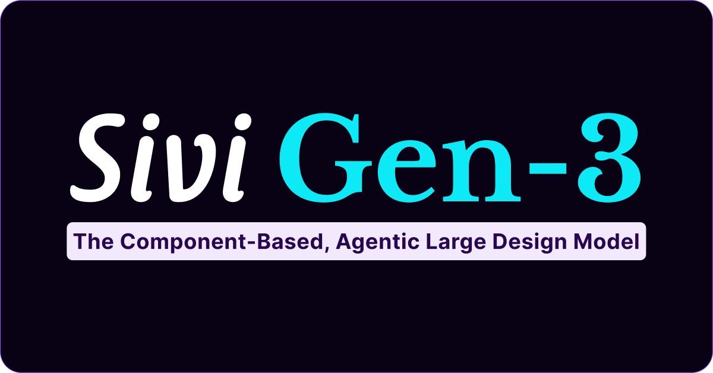
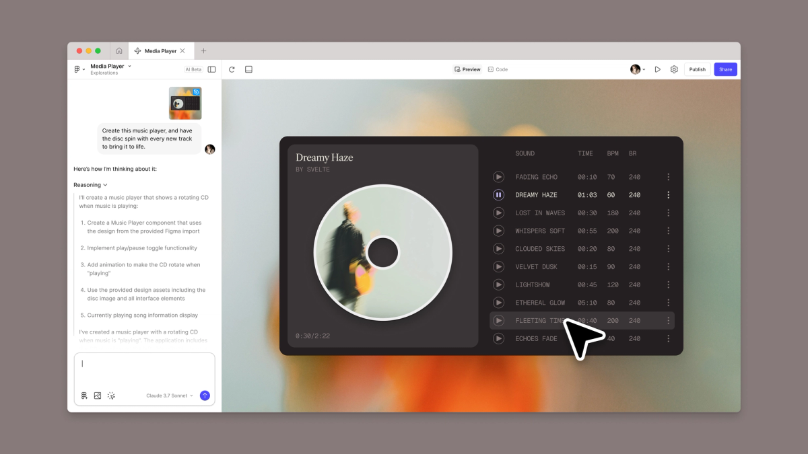
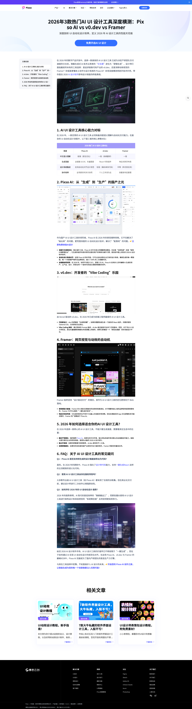
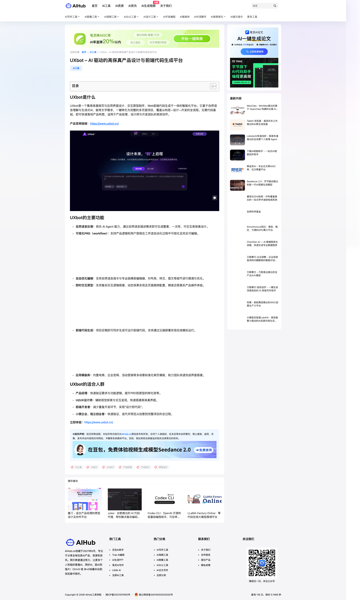

# AI for Design 行业前沿洞察（2026年3月）月刊

> 🤖 AI 初稿：基于公开信源检索与核查，配图经脚本拉取至本地 `./images/2026-03-ai-for-design/`，Markdown 内直接渲染可见。

**本月动态总览**：
3 月窗口内，**产品应用侧**延续 2 月底热点：Adobe Firefly 在 2 月 25 日推出 Quick Cut，用自然语言将原始素材自动组接为「初剪稿」，并配合 3 月 16 日前无限生成优惠；Figma 与 OpenAI Codex 的集成（2 月 26 日）使设计—代码双向工作流进入可用阶段。**企业级能力**：Adobe Firefly Design Intelligence 以 StyleIDs 实现机器可读品牌规范，支持全球团队在合规前提下生成内容；Sivi Gen-3 以 Agentic 大设计模型产出可编辑组件化设计，面向 2026 年设计运维规模化。**行业选型**：Pixso、v0.dev、Framer 等 2026 年横测与 Figma Make 全量可用构成当前主流选项。本月最值得关注的效能突破点：**视频初剪自动化**（Quick Cut）、**设计—代码双向同步**（Figma + Codex）、以及**品牌一致的可规模化生成**（StyleIDs / Sivi Gen-3）。

---

### 动态 1：Adobe Firefly 推出 Quick Cut，用自然语言将素材自动组接为初剪稿

- **【最新动态】**：Adobe 于 2026 年 2 月 25 日在 Firefly 视频编辑器中推出 Quick Cut：用户上传自有素材或使用 AI 生成片段后，用自然语言描述视频类型（访谈、产品演示、播客、旅行 vlog 等），即可得到结构化初剪；支持可选 B-roll 轨道、时长与画幅设置，以及脚本/镜头表输入以提升精度。官方明确产出为「first draft」供创作者在此基础上精修。[1](#ref-1)
- **【行业风向】**：营销、播客、报道与产品评测等场景中，从原始素材到可编辑时间轴的时间大幅缩短，设计/视频团队可将精力集中在叙事与创意决策而非手动组接。
- **【设计启发点】**：Leader 可将 Quick Cut 纳入活动回顾、播客与 B-roll 产出的标准流程；一线设计师在动效与视频类交付中先用 Quick Cut 出初剪再在时间轴上微调，注意人物与敏感内容仍建议人工校验。
- **【配图/视频】**： [1](#ref-1)（演示视频见来源页）

### 动态 2：Figma 与 OpenAI Codex 深度集成，设计—代码双向工作流进入可用阶段

- **【最新动态】**：Figma 与 OpenAI 合作将 Codex 集成进设计—开发流程：通过 Figma MCP server，开发者可在 Codex 中基于 Figma 选区获取设计上下文并用量然语言生成实现，并将运行中的 UI 回写到 Figma 画布，实现设计↔代码往返。TechCrunch 报道日期为 2026 年 2 月 26 日；3 月起设计—开发协作可系统性评估该能力。[2](#ref-2)
- **【行业风向】**：Handoff 从「静态稿+标注」向「设计上下文直连 LLM、画布与代码双向同步」演进，产研协作的中间损耗与返工有望下降。
- **【设计启发点】**：Leader 可评估在设计—开发流程中试点 MCP + Codex，明确设计文件命名、选区与组件规范；一线设计师在交付时提供选区链接并保持组件/变量一致，便于 get_design_context 准确。
- **【配图/视频】**： [2](#ref-2)

### 动态 3：Adobe Firefly 无限生成与 3 月 16 日前优惠，多模型统一入口

- **【最新动态】**：Adobe 在 2026 年 2 月 2 日博客中宣布 Firefly 订阅用户可在应用内享受无限图像与视频生成；2 月 25 日博客再次强调，在 3 月 16 日前注册可在 Firefly 应用内获得最高 2K 分辨率的无限图像与 Firefly 视频生成，支持 Adobe、Google Nano Banana Pro、GPT Image Generation、Runway Gen-4 等模型，适用于 Firefly Pro/Premium 及多档 credit 计划。[3](#ref-3)
- **【行业风向】**：创意团队在统一入口内可连续探索多方向、多风格，减少因额度中断导致的流程打断，有利于从概念到成片的连贯迭代。
- **【设计启发点】**：Leader 可借 3 月窗口评估 Firefly 多模型与无限生成对品牌视觉、动效与视频产出的 ROI；一线设计师可在 firefly.adobe.com 试用并纳入日常探索与初稿流程。
- **【配图/视频】**： [3](#ref-3)

### 动态 4：Adobe Firefly Design Intelligence 与 StyleIDs，企业级品牌一致生成

- **【最新动态】**：Adobe 推出 Firefly Design Intelligence 企业方案，通过机器可读的「StyleIDs」承载品牌整体美学与具体设计规则；创意总监可在 Illustrator 等应用内用内置训练面板训练 StyleIDs，内外部团队随后可基于 StyleIDs 生成符合品牌、情境适配的设计，并自动选用已审批资产与版式约束。与可口可乐（Project Fizzion）等合作验证。[4](#ref-4)
- **【行业风向】**：全球多触点内容规模化时，品牌一致性从人工规范向「AI 增强且不替代设计师决策」的可执行规则演进，设计系统与 AI 的协作形态更清晰。
- **【设计启发点】**：Leader 可评估 StyleIDs 与现有设计系统、品牌手册的映射关系及合规流程；一线设计师在参与品牌训练时明确色彩、字体与版式等必检维度，便于生成结果可直接进入审批流。
- **【配图/视频】**： [4](#ref-4)

### 动态 5：Sivi Gen-3 Agentic 大设计模型，可编辑组件化设计与 2026 设计运维

- **【最新动态】**：Sivi Gen-3 定位为「Agentic Large Design Model」：采用感知—推理（含自检）—原子构建的三段式循环，产出可编辑、符合设计系统与组件库的广告、横幅、社媒与缩略图等多层矢量设计，而非静态位图；支持 72+ 语言、约 11.6 万品牌，官方称 2026 年可支撑设计运维规模化，将大量个性化素材生成从「数天」压缩到「数分钟」。[5](#ref-5)
- **【行业风向】**：营销与运营侧高 volume、多尺寸、多语言的资产生产从「设计师主产」向「AI 初稿 + 人工策略与质检」倾斜，设计团队需明确可交付标准与品牌边界。
- **【设计启发点】**：Leader 可将 Gen-3 纳入营销与运营设计工具选型，并设定品牌组件库与审批节点；一线设计师可参与 Prompt/维度规范设计，提升生成结果可用率与一致性。
- **【配图/视频】**： [5](#ref-5)

### 动态 6：Figma Make 全量可用，提示到应用与设计库导入（2025 年 7 月 GA，3 月生态延续）

- **【最新动态】**：Figma Make 于 2025 年 7 月 24 日全面开放（GA），支持用自然语言从创意或现有设计生成高保真可交互原型与 Web 应用；支持从 Figma Design 导入设计库以保持风格一致、连接 Supabase 做后端与鉴权，当前使用 Claude 3.5 Sonnet，全席位均含 AI 额度，Full seat 可发布或私密分享 Figma Make 文件。2026 年 3 月仍为设计团队主流「提示到应用」选项之一。[6](#ref-6)
- **【行业风向】**：产品、设计与研究角色均可产出可体验原型，缩短从想法到可讨论制品的时间，设计—工程协作的共识前移。
- **【设计启发点】**：Leader 可将 Figma Make 与设计库导入、Supabase 纳入原型与内部工具流程；一线设计师在探索复杂交互与数据驱动界面时优先用 Make 出可点击原型再交开发。
- **【配图/视频】**： [6](#ref-6)

### 动态 7：Konva 生成式 UI/UX 引擎，从草图或 Figma 到像素级 React 代码

- **【最新动态】**：Konva 提供自修复 IDE 与生成式 UI/UX 引擎：可从自然语言或导入草图/Figma 文件分析布局意图，生成像素级 React 代码并宣称 100% 类型安全；项目可自动容器化并部署到 Kubernetes。面向从设计到可运行前端的自动化链路。[7](#ref-7)
- **【行业风向】**：设计稿到代码的转换从「标注+手写」向「结构化生成+工程化部署」延伸，适合有明确设计系统与前端规范的企业。
- **【设计启发点】**：Leader 可评估 Konva 在设计—前端流水线中的定位及与现有 CI/CD 的集成；一线设计师在交付 Figma 时保持清晰层级与命名，便于布局意图被准确解析。
- **【配图/视频】**： [7](#ref-7)

### 动态 8：2026 年 AI UI 设计工具横测（Pixso AI、v0.dev、Framer）

- **【最新动态】**：中文设计社区 2026 年对主流 AI UI 设计工具进行横测：Pixso AI 强调中文语境与设计系统对齐、多人实时协作及设计—代码流程；v0.dev（Vercel）侧重 React 组件生成，面向前端；Framer 侧重网页视觉与动效、响应式与营销落地页。行业共识包括语义化生成、智能设计系统、跨端自适应与研发交付对齐（如 React 19/Vue 4）等能力维度。[8](#ref-8)
- **【行业风向】**：选型从单点工具向「语义生成+设计系统+交付标准」组合能力倾斜，企业设计团队可据此做采购与培训优先级排序。
- **【设计启发点】**：Leader 可按业务场景（产研原型、营销页、设计系统合规）对照横测维度做 shortlist；一线设计师可针对 PRD→原型、视觉探索与设计审查等环节试用对应工具并反馈落地效果。
- **【配图/视频】**： [8](#ref-8)

### 动态 9：UXbot、UX Pilot 等 AI 驱动高保真设计与前端代码生成（2026 年生态）

- **【最新动态】**：UXbot 与 UX Pilot 等平台在 2026 年提供自然语言驱动的高保真产品设计与前端代码生成能力，与 Figma 等生态集成，面向快速原型与可交付界面。具体发布日期以各产品官网为准。[9](#ref-9)
- **【行业风向】**：设计—代码类工具呈多源并存，设计团队在选型时需结合现有 Figma/设计系统与前端技术栈评估兼容性与可维护性。
- **【设计启发点】**：Leader 可将其纳入「快速验证与交付」工具矩阵做小范围试点；一线设计师在评估时关注输出是否可编辑、是否支持设计系统变量与组件映射。
- **【配图/视频】**： [9](#ref-9)

---

### 总结与展望

3 月动态集中在**视频初剪自动化**（Adobe Quick Cut）、**设计—代码双向工作流**（Figma + Codex）、**企业级品牌一致生成**（Firefly Design Intelligence / StyleIDs、Sivi Gen-3）以及**提示到应用与横测选型**（Figma Make、Konva、Pixso/v0/Framer）。建议企业设计管理：将 Quick Cut 与 Firefly 无限生成纳入 3 月视频/动效与多模型试点；将 Figma MCP + Codex 与 Figma Make 纳入设计—开发流程评估；在品牌与营销侧评估 StyleIDs 与 Sivi Gen-3 的规模化边界与人工校验节点。展望后续，可继续跟踪 Codex 与 Claude Code to Figma 等双向能力的落地案例、Firefly 视频与多模型在 3 月 16 日后的政策变化、以及 Agentic 设计模型在企业设计运维中的采纳率与 ROI 数据。

---

### 来源链接索引

- [1](#ref-1) Putting ideas in motion: redefining AI video with Adobe Firefly - Adobe Blog (2026年2月25日)：[打开](https://blog.adobe.com/en/publish/2026/02/25/putting-ideas-in-motion-redefining-ai-video-with-adobe-firefly)
- [2](#ref-2) Figma partners with OpenAI to bake in support for Codex - TechCrunch (2026年2月26日)：[打开](https://techcrunch.com/2026/02/26/figma-partners-with-openai-to-bake-in-support-for-codex/)
- [3](#ref-3) Create with unlimited generations in Adobe Firefly - Adobe Blog (2026年2月2日；3月16日前优惠见 2月25日博客)：[打开](https://blog.adobe.com/en/publish/2026/02/02/create-unlimited-generations-adobe-firefly-all-in-one-creative-ai-studio)
- [4](#ref-4) Adobe Firefly Design Intelligence — build brand value through consistent creative expression - Adobe Business (日期见官网)：[打开](https://business.adobe.com/blog/firefly-design-intelligence-build-brand-value-through-creative-expression)
- [5](#ref-5) Try Sivi Gen-3: The Agentic Large Design Model - Sivi (2026)：[打开](https://sivi.ai/gen3)
- [6](#ref-6) Figma Make Is Now Available to All Users - Figma Blog (2025年7月24日)：[打开](https://www.figma.com/blog/figma-make-general-availability)
- [7](#ref-7) Konva – AI-Powered Wireframe & UI Design Tool - Konva：[打开](https://konva.app/)
- [8](#ref-8) 2026年3款热门AI UI 设计工具深度横测：Pixso AI vs v0.dev vs Framer - Pixso (2026)：[打开](https://pixso.cn/designskills/top-ai-ui-design-tools-2026/)
- [9](#ref-9) UXbot – AI 驱动的高保真产品设计与前端代码生成平台 / Figma AI设计生成器 - UX Pilot - AIhub / UXPilot (2026)：[打开](https://www.aihub.cn/tools/uxbot/)

