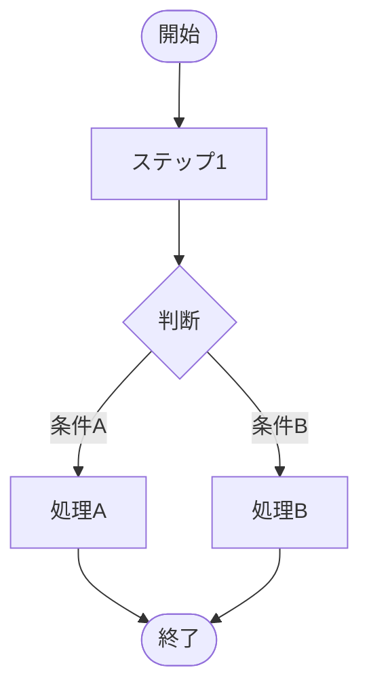

# Mermaid Flow Generator

Mermaid記法を使用したフロー図・ダイアグラム自動生成スキル。

## 概要

テキストでの業務説明や手順から、プロフェッショナルなフロー図を自動生成します。

### 対応図表タイプ

| タイプ | Mermaid種別 | 用途 |
|--------|------------|------|
| **flowchart** | flowchart TD/LR | 業務フロー、処理手順、意思決定 |
| **sequence** | sequenceDiagram | システム間連携、API呼び出し、時系列処理 |
| **swimlane** | flowchart（subgraph） | 部門横断フロー、責任分担 |
| **state** | stateDiagram-v2 | 状態遷移、ステータス管理 |
| **er** | erDiagram | データモデル、テーブル関係 |
| **gantt** | gantt | スケジュール、タイムライン |

### 出力形式

- **PNG** - 画像ファイル（Word/PowerPoint埋め込み用）
- **SVG** - ベクター画像（Web/高品質印刷用）
- **Mermaid構文** - テキスト（編集・再利用用）

## トリガーワード

以下のキーワードでこのスキルを起動：
- 「フロー図を作成」「フローチャートを描いて」
- 「業務フローを図にして」「プロセスを可視化」
- 「この手順を図表化」「ダイアグラムを生成」
- 「シーケンス図」「状態遷移図」「ER図」
- 「Mermaidで描いて」

## ワークフロー

### Phase 1: 入力解析

ユーザーからの入力パターン：

1. **テキスト説明** → Mermaid構文を自動生成
2. **箇条書き手順** → フローチャートに変換
3. **Mermaid構文** → そのまま画像化

### Phase 2: 図表タイプ選択

入力内容から自動判定、または明示的に指定：

```
「申請→承認→完了の流れを図にして」 → flowchart
「AシステムとBシステムの連携を図にして」 → sequence
「営業部と経理部の業務分担を図にして」 → swimlane
「注文ステータスの遷移を図にして」 → state
```

### Phase 3: 生成実行

```bash
# テキストからMermaid生成 + PNG出力
node /mnt/skills/user/mermaid-flow-generator/scripts/generate_diagram.js \
  --type flowchart \
  --input "申請を受付→内容確認→承認判断→完了通知" \
  --output /mnt/user-data/outputs/flow.png

# Mermaidファイルから直接PNG生成
node /mnt/skills/user/mermaid-flow-generator/scripts/mermaid_to_image.js \
  --input /path/to/diagram.mmd \
  --output /mnt/user-data/outputs/diagram.png \
  --format png
```

### Phase 4: 出力

```markdown
[フロー図を見る](computer:///mnt/user-data/outputs/flow.png)
```

## Mermaid構文リファレンス

### フローチャート（flowchart）


**ノード形状:**
- `[テキスト]` - 四角形（処理）
- `{テキスト}` - ひし形（判断）
- `([テキスト])` - 角丸（開始/終了）
- `[[テキスト]]` - サブルーチン
- `((テキスト))` - 円形
- `>テキスト]` - フラグ

**方向:**
- `TD` / `TB` - 上から下
- `LR` - 左から右
- `RL` - 右から左
- `BT` - 下から上

### シーケンス図（sequence）


**矢印タイプ:**
- `->` - 実線（同期）
- `-->` - 点線（非同期/応答）
- `->>` - 実線＋矢印
- `-->>` - 点線＋矢印

### スイムレーン（部門横断フロー）


### 状態遷移図（state）


### ER図（er）


## スタイリング

### Jony Iveデザインシステム準拠

```javascript
const MERMAID_THEME = {
  theme: 'base',
  themeVariables: {
    // グレースケール基調
    primaryColor: '#F5F5F5',
    primaryTextColor: '#333333',
    primaryBorderColor: '#CCCCCC',
    
    // アクセントカラー（1色のみ）
    secondaryColor: '#5B7B94',
    
    // 線・矢印
    lineColor: '#666666',
    
    // フォント
    fontFamily: 'Meiryo, sans-serif',
    fontSize: '14px'
  }
};
```

### カスタムスタイル適用


## スクリプト

### generate_diagram.js

テキスト説明からMermaid構文を生成し、画像出力まで一括実行。

```bash
node scripts/generate_diagram.js \
  --type <flowchart|sequence|swimlane|state|er> \
  --input "テキスト説明または手順" \
  --output /path/to/output.png \
  --format <png|svg> \
  --direction <TD|LR|RL|BT>
```

**オプション:**

| オプション | 説明 | デフォルト |
|-----------|------|----------|
| `--type` | 図表タイプ | flowchart |
| `--input` | テキスト説明またはファイルパス | - |
| `--output` | 出力ファイルパス | diagram.png |
| `--format` | 出力形式（png/svg） | png |
| `--direction` | フロー方向（TD/LR等） | TD |
| `--theme` | テーマ（default/jony-ive） | jony-ive |

### mermaid_to_image.js

Mermaid構文ファイルを画像に変換。

```bash
node scripts/mermaid_to_image.js \
  --input /path/to/diagram.mmd \
  --output /path/to/diagram.png
```

## 使用例

### 例1: テキストからフローチャート

```
User: 「経費申請の流れを図にして。申請→上長承認→経理確認→振込」

Claude: [解析してMermaid生成]
```

生成されるMermaid:


### 例2: 部門横断フロー

```
User: 「営業が見積作成、経理が与信確認、物流が出荷する流れを図にして」

Claude: [スイムレーン図を生成]
```

### 例3: システム連携シーケンス

```
User: 「ユーザーがログインボタンを押すと、フロントエンドがAPIを呼び、
        APIがDBを確認して結果を返す流れを図にして」

Claude: [シーケンス図を生成]
```

### 例4: 注文ステータス遷移

```
User: 「注文のステータス遷移を図にして。
        下書き→注文確定→出荷準備中→配送中→配達完了、
        途中でキャンセルも可能」

Claude: [状態遷移図を生成]
```

## 他スキルとの連携

### manual-generator連携

```bash
# 1. フロー図を生成
node mermaid-flow-generator/scripts/generate_diagram.js \
  --type flowchart \
  --input "申請→承認→完了" \
  --output /home/claude/flow.png

# 2. マニュアルのsteps.jsonに画像パスを含める
# 3. manual_generator.jsで画像付きマニュアル生成
```

### meeting-to-tasksheet連携

会議の文字起こしから決定事項を抽出し、業務フローを自動図表化。

### hearing-sheet-generator連携

ヒアリング結果から現状業務フロー（As-Is）を自動生成。

## テンプレート

### templates/flowchart_basic.mmd



### templates/sequence_api.mmd


### templates/swimlane_approval.mmd


## エラーハンドリング

| エラー | 原因 | 対処 |
|--------|------|------|
| 構文エラー | Mermaid記法の誤り | 構文チェック・自動修正 |
| レンダリング失敗 | 複雑すぎる図 | 分割を提案 |
| 日本語文字化け | フォント未設定 | Meiryoフォント指定 |
| 矢印ラベル文字化け（■表示） | `-->\|ラベル\|` 記法が環境依存 | 独立ノードに変更（下記参照） |

### 矢印ラベル文字化け対策

Claude.aiのMermaidレンダラーでは、矢印ラベル記法 `-->|Yes|` や `-->|はい|` が「■」と表示される場合がある。

**NG（文字化けする）:**
```mermaid
A4{判断} -->|はい| A5[次へ]
A4 -->|いいえ| A3[戻る]
```

**OK（独立ノードに変更）:**
```mermaid
A4{判断} --> A4YES[はい] --> A5[次へ]
A4 --> A4NO[いいえ] --> A3[戻る]

style A4YES fill:#FFFFFF,stroke:#999999,color:#666666
style A4NO fill:#FFFFFF,stroke:#999999,color:#666666
```

分岐ラベルを小さな独立ノードとして表示することで、文字化けを回避できる。

## 依存関係

```bash
# Mermaid CLI（必須）
npm install -g @mermaid-js/mermaid-cli

# Puppeteer依存（mermaid-cliが使用）
# 自動インストールされる
```

## 注意事項

- 複雑なフローは20〜30ノード程度を上限とし、それ以上は分割を推奨
- 日本語を使用する場合はフォント指定が必要
- SVG出力はWeb表示に最適、PNG出力はWord/PowerPoint埋め込みに最適
