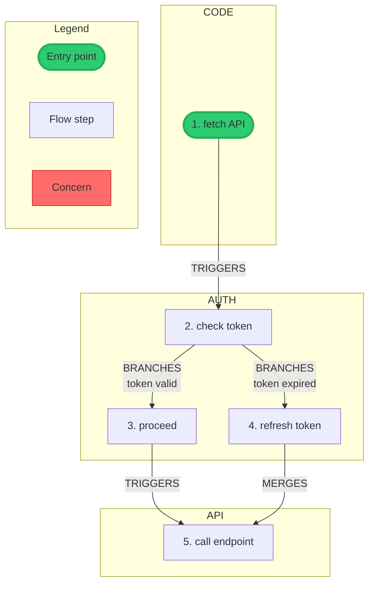

# Audit Flow Commands

Detailed SQL commands for the audit-flow skill.

**CRITICAL: Read `schema.sql` before running ANY SQLite command.** Understand tables, columns, constraints, CHECK values, and views FIRST. Never assume schema from context.

## Database Setup

```bash
python .claude/skills/audit-flow/scripts/audit.py init
# Or manually:
mkdir -p .audit && sqlite3 .audit/audit.db < .claude/skills/audit-flow/schema.sql
```

## Session Management

### Create Session

First capture git context:
```bash
git_commit=$(git rev-parse HEAD 2>/dev/null || echo "")
git_branch=$(git branch --show-current 2>/dev/null || echo "")
git_dirty=$(test -n "$(git status --porcelain 2>/dev/null)" && echo 1 || echo 0)
```

Then create session:
```sql
INSERT INTO sessions (id, name, purpose, description, granularity, git_commit, git_branch, git_dirty)
VALUES (
    lower(hex(randomblob(8))),
    '{name}',
    '{purpose}',  -- security-audit | documentation | compliance | ideation | brainstorming | debugging | architecture-review | incident-review
    '{description}',
    '{granularity}',  -- fine | coarse
    '{git_commit}',
    '{git_branch}',
    {git_dirty}  -- 0 or 1
);
```

### List Sessions

```sql
SELECT * FROM v_session_summary ORDER BY created_at DESC;
```

## Flow Management

### Create Flow

```sql
INSERT INTO flows (session_id, name, entry_point, description)
VALUES (
    '{session_id}',
    '{flow-name}',
    '{entry point description}',
    '{optional description}'
);
```

### List Flows in Session

```sql
SELECT * FROM v_flow_summary WHERE session_id = '{session_id}';
```

## Tuple Operations

### Add Tuple

```sql
INSERT INTO tuples (flow_id, layer, action, subject, file_ref, props, notes, status)
VALUES (
    {flow_id},
    '{layer}',      -- CODE | API | NETWORK | AUTH | DATA
    '{action}',     -- e.g., "onClick handler"
    '{subject}',    -- e.g., "LoginButton"
    '{file_ref}',   -- e.g., "src/components/LoginButton.tsx:24"
    '{}',           -- JSON props
    '{notes}',
    'traced'        -- traced | verified | concern | deleted
);
```

### View Tuples

```sql
-- All tuples in flow
SELECT id, layer, action, subject, file_ref, status
FROM tuples WHERE flow_id = {flow_id} AND status != 'deleted'
ORDER BY timestamp;

-- Filter by layer
SELECT * FROM tuples WHERE flow_id = {flow_id} AND layer = 'AUTH';

-- View concerns
SELECT * FROM v_concerns WHERE flow_name = '{flow_name}';
```

### Update Tuple Status

```sql
UPDATE tuples SET status = 'concern' WHERE id = {id};
UPDATE tuples SET status = 'deleted' WHERE id = {id};  -- Soft delete
```

## Edge Operations

### Linear Edge

```sql
INSERT INTO edges (from_tuple, to_tuple, relation)
VALUES ({from_id}, {to_id}, '{relation}');
-- Relations: TRIGGERS | READS | WRITES | VALIDATES | TRANSFORMS
```

### Branching Edge (with condition)

```sql
INSERT INTO edges (from_tuple, to_tuple, relation, condition)
VALUES
    ({branch_point}, {path_a}, 'BRANCHES', 'condition A'),
    ({branch_point}, {path_b}, 'BRANCHES', 'condition B');
```

### Merging Edge

```sql
INSERT INTO edges (from_tuple, to_tuple, relation)
VALUES ({converging_tuple}, {merge_point}, 'MERGES');
```

### View Edges

```sql
SELECT e.*, t1.action as from_action, t2.action as to_action
FROM edges e
JOIN tuples t1 ON e.from_tuple = t1.id
JOIN tuples t2 ON e.to_tuple = t2.id
WHERE t1.flow_id = {flow_id};
```

### Detect Non-Linear Points

```sql
SELECT * FROM v_branch_merge_points WHERE flow_name = '{flow_name}';
```

## Findings

### Add Finding

```sql
INSERT INTO findings (session_id, flow_id, severity, category, description, tuple_refs)
VALUES (
    '{session_id}',
    {flow_id},      -- Optional: NULL for session-level finding
    '{severity}',   -- critical | high | medium | low | info
    '{category}',   -- e.g., "token-storage", "auth-bypass"
    '{description}',
    '[1, 2, 3]'     -- JSON array of tuple IDs
);
```

### View Findings

```sql
-- By severity
SELECT * FROM findings WHERE session_id = '{session_id}'
ORDER BY CASE severity
    WHEN 'critical' THEN 1 WHEN 'high' THEN 2
    WHEN 'medium' THEN 3 WHEN 'low' THEN 4 ELSE 5
END;

-- Flow-specific findings
SELECT * FROM findings WHERE flow_id = {flow_id};
```

## Export

### Using CLI

```bash
# Export all flows in session
python .claude/skills/audit-flow/scripts/audit.py export {session}

# Export specific flow
python .claude/skills/audit-flow/scripts/audit.py export {session} -f {flow}

# Export specific format
python .claude/skills/audit-flow/scripts/audit.py export {session} -F mermaid
```

## Validation

### Validate Flow Data

```bash
python .claude/skills/audit-flow/scripts/audit.py validate {session}
```

Checks for common issues before export:

| Check | Level | Description |
|-------|-------|-------------|
| Branch conditions | ERROR | BRANCHES edges must have condition labels |
| Orphan nodes | WARN | Nodes with no edges (disconnected from flow) |
| Duplicate labels | WARN | Multiple nodes with same action text |
| Node count > 40 | WARN | Diagram readability threshold |
| Node count > 60 | ERROR | Diagram must be split into sub-flows |
| No entry point | WARN | No node with zero in-degree |

### Output Structure

```
docs/audits/{session-name}/
├── README.md           # Session summary
├── session.json        # Full session data
├── session.yaml        # Full session data (YAML)
├── {flow-name}.md      # Flow report
└── {flow-name}.mermaid # Flow diagram
```

### Mermaid Output Features

- **Step numbering**: Topological BFS order from entry point
- **Entry point marker**: Green stadium-shape node (`([label]):::entryPoint`)
- **Layer subgraphs**: Nodes sorted by step number within each layer
- **Relation-specific arrows**:
  - `-->` solid: TRIGGERS, VALIDATES, TRANSFORMS, BRANCHES, MERGES
  - `-.->` dotted: READS (data consumption, no mutation)
  - `==>` thick: WRITES (data mutation)
- **Observation separation**: Pure concern chains in OBSERVATIONS subgraph
- **Branch conditions**: Always shown on edge labels
- **Label deduplication**: Duplicate actions auto-suffixed with subject
- **Legend**: Style key at bottom of diagram
- **Direction**: Default TD, override with `--direction LR`

### Export with Direction

```bash
# Default top-down
python .claude/skills/audit-flow/scripts/audit.py export {session} -F mermaid

# Horizontal layout for wide decision trees
python .claude/skills/audit-flow/scripts/audit.py export {session} -F mermaid --direction LR
```

Example output:


## Git Merge Driver

### Setup (once per clone)

```bash
python .claude/skills/audit-flow/scripts/audit.py git-setup
```

Configures:
- `merge.sqlite-audit.driver` — auto-merges `audit.db` on `git merge`
- `diff.sqlite.textconv` — shows SQL dump in `git diff`

Requires `.gitattributes` (already in repo):
```
.audit/audit.db diff=sqlite merge=sqlite-audit
```

### How the merge driver works

Git calls: `audit.py db-merge %O %A %B`
- `%O` = common ancestor (unused — full union merge)
- `%A` = ours (result written here)
- `%B` = theirs

The driver:
1. Opens both SQLite DBs directly
2. Merges sessions by `name` (later `updated_at` wins)
3. Flows follow parent session winner
4. Tuples/edges follow parent flow
5. Findings deduped by `(session_name, category, description)`
6. All INTEGER PKs remapped; foreign keys updated
7. Result written to `%A`, exit 0 = success

### Manual merge (if needed)

```bash
# If the auto-driver fails (exit 1), merge manually:
python .claude/skills/audit-flow/scripts/audit.py db-merge ancestor.db ours.db theirs.db
```

## CSV Backup (Optional)

CSV commands still available for backup/portability:

```bash
python .claude/skills/audit-flow/scripts/audit.py csv-export               # DB → .audit/csv/*.csv
python .claude/skills/audit-flow/scripts/audit.py csv-import               # CSV → DB
python .claude/skills/audit-flow/scripts/audit.py csv-merge <theirs_dir>   # Merge CSV sets
```

CSV uses `QUOTE_ALL`, deterministic PK sort, multiline-safe (RFC 4180).

## Views Reference

| View | Purpose |
|------|---------|
| `v_session_summary` | Sessions with flow/tuple/finding counts |
| `v_flow_summary` | Flows with tuple/concern counts |
| `v_layer_distribution` | Layer breakdown per flow |
| `v_concerns` | All tuples marked as concern |
| `v_branch_merge_points` | Non-linear nodes (branches/merges) |
