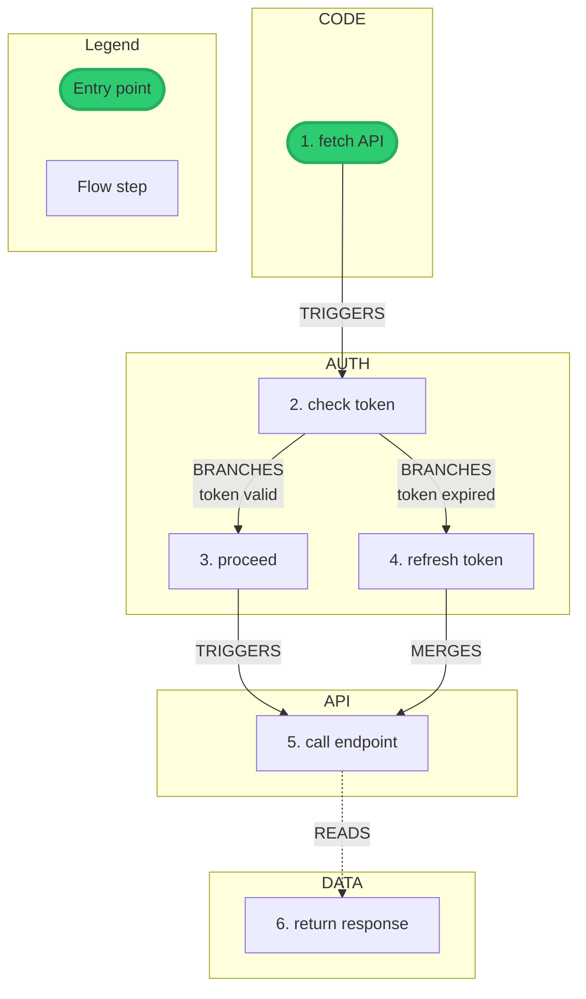
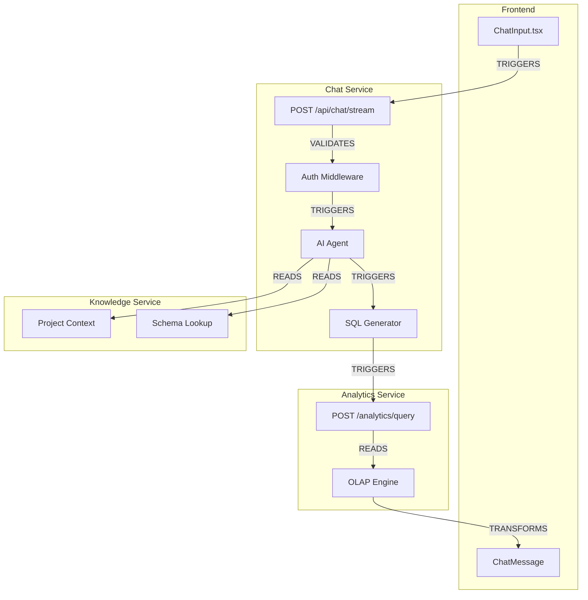

# Audit Flow Examples

## Case 0: Non-Linear API Flow (Branching & Merging)

```
> /audit-flow start
Name: api-auth-audit
Purpose: security-audit
Granularity: fine

> /audit-flow flow api-request
Entry: "Frontend makes authenticated API call"
```

### Flow with Branching

```
[CODE]    fetch API         → apiClient.ts:45
[AUTH]    check token       → authMiddleware.ts:12
  ├─[BRANCHES: token valid]──→ [AUTH] proceed
  └─[BRANCHES: token expired]──→ [AUTH] refresh token
                                      │
[AUTH]    refresh token     → tokenService.ts:88
          │
          └─[MERGES]──→ [API] call endpoint
[API]     call endpoint     → handler.ts:156
[DATA]    return response   → serializer.ts:23
```

### SQL for Branching

```sql
-- Create branch point
INSERT INTO tuples (flow_id, layer, action, subject) VALUES
(1, 'AUTH', 'check token', 'authMiddleware');  -- ID: 2

-- Create branch targets
INSERT INTO tuples (flow_id, layer, action, subject) VALUES
(1, 'AUTH', 'proceed', 'valid path'),          -- ID: 3
(1, 'AUTH', 'refresh token', 'tokenService');  -- ID: 4

-- Branch edges with conditions
INSERT INTO edges (from_tuple, to_tuple, relation, condition) VALUES
(2, 3, 'BRANCHES', 'token valid'),
(2, 4, 'BRANCHES', 'token expired');

-- Merge point
INSERT INTO tuples (flow_id, layer, action, subject) VALUES
(1, 'API', 'call endpoint', 'handler');        -- ID: 5

-- Merge edges
INSERT INTO edges (from_tuple, to_tuple, relation) VALUES
(3, 5, 'TRIGGERS'),
(4, 5, 'MERGES');
```

### Mermaid Output



---

## Case 1: Auth Login Flow (Security Audit)

```
> /audit-flow start
Name: auth-login-security
Purpose: security-audit
Granularity: fine

> /audit-flow flow google-oauth
Entry: "User clicks Sign in with Google"
```

### Expected Trace

```
[CODE]    onClick handler         → src/components/LoginButton.tsx:24
[AUTH]    OAuth redirect          → redirect to identity provider
[NETWORK] GET /oauth/authorize    → IdP authorization endpoint
[AUTH]    authz code received     → callback handler
[NETWORK] POST /oauth/token       → token exchange
[AUTH]    access_token issued     → {scopes, expiry, claims}
[DATA]    JWT decoded             → extract org_id, user_id
[CODE]    setSession()            → store token in memory/cookie
[AUTH]    token in headers        → Authorization: Bearer
[NETWORK] GET /api/me             → validate token backend
[CODE]    middleware validates    → services/auth/middleware.go:56
[DATA]    user context built      → {org, project, permissions}
```

### Security Checks

Mark as `concern` and create findings for:

| Check | What to look for | Severity |
|-------|------------------|----------|
| Token storage | localStorage (bad) vs httpOnly cookie (good) vs memory (ok) | high |
| Token logging | console.log, error handlers leaking tokens | critical |
| PKCE | code_verifier/code_challenge present? | high |
| Refresh flow | Refresh token rotation? Secure storage? | high |
| Token expiry | Short-lived access tokens? Proper refresh? | medium |
| CORS | Proper origin validation? | medium |

### Sample Findings

```sql
INSERT INTO findings (session_id, severity, category, description, tuple_refs)
VALUES
('auth-login-security', 'high', 'token-storage',
 'Access token stored in localStorage instead of httpOnly cookie - vulnerable to XSS', '[7]'),
('auth-login-security', 'medium', 'token-logging',
 'Token visible in Redux DevTools state - disable in production', '[7]');
```

---

## Case 1b: Observations vs Flow Steps (Anti-Pattern)

### Wrong: Chaining Observations as Tuples

When you discover a security concern, do NOT create observation tuples chained with VALIDATES:

```sql
-- WRONG: These are analyst notes, not system actions
INSERT INTO tuples (flow_id, layer, action, subject, status) VALUES
(1, 'CODE', 'NO cross-tab sync', 'TabManager', 'concern'),          -- T10
(1, 'AUTH', 'Replay attack possible', 'tokenService', 'concern');    -- T11

INSERT INTO edges (from_tuple, to_tuple, relation)
VALUES (10, 11, 'VALIDATES');  -- WRONG: creates unreadable concern chain
```

This produces diagrams where analyst notes are indistinguishable from system flow steps.

### Correct: Use Findings

```sql
-- CORRECT: Observation recorded as a finding
INSERT INTO findings (session_id, flow_id, severity, category, description, tuple_refs)
VALUES (
    'my-session', 1, 'medium', 'concurrency',
    'No cross-tab synchronization: replay attack possible when multiple tabs refresh tokens simultaneously',
    '[196, 226, 227]'  -- References the ACTUAL flow tuples where the issue manifests
);
```

Findings appear in the Markdown export report, not cluttering the visual flow diagram.

---

## Case 2: Chat Question Flow (Documentation)

```
> /audit-flow start
Name: chat-documentation
Purpose: documentation
Granularity: coarse

> /audit-flow flow question-to-results
Entry: "User submits question in chat UI"
```

### Expected Trace

```
[CODE]    onSubmit handler        → src/components/ChatInput.tsx
[NETWORK] POST /api/chat/stream   → chat service
[AUTH]    token validated         → middleware extracts org_id, project_id
[API]     chat service receives   → services/chat/main.py
[DATA]    load project context    → knowledge-base service
[API]     agent invoked           → services/chat/agent/
[DATA]    schema lookup           → get relevant tables/columns
[CODE]    SQL generation          → agent node
[NETWORK] POST /analytics/query   → analytics service
[DATA]    query execution         → OLAP engine
[DATA]    results transform       → format for frontend
[NETWORK] SSE stream              → chunked response to frontend
[CODE]    render results          → ChatMessage component
```

### Documentation Output

The export should produce:
- Sequence diagram of service interactions
- Data flow: question → SQL → results
- Auth context propagation across services

### Mermaid Output



---

## Case 3: Flow Ideation (Design New Feature)

```
> /audit-flow start
Name: export-feature-design
Purpose: ideation
Granularity: coarse

> /audit-flow flow csv-export
Entry: "User clicks Export to CSV on results"
```

### Sketched Flow (no code yet)

```
[CODE]    export button click     → ExportButton component (to create)
[API]     POST /api/export        → new endpoint needed
[AUTH]    check export permission → new permission type?
[DATA]    fetch cached results    → from Redis? or re-query?
[CODE]    CSV formatter           → new util function
[NETWORK] stream file download    → chunked response
[CODE]    browser download trigger→ blob URL
```

### Ideation Questions (record as notes)

Add these as `notes` on relevant tuples:

| Tuple | Question |
|-------|----------|
| DATA: fetch cached results | Cache strategy: Redis TTL? Re-query for freshness? |
| API: POST /api/export | Rate limit exports? Per-user? Per-project? |
| AUTH: check export permission | New permission: `project:export`? Or reuse `project:read`? |
| NETWORK: stream file download | Large results: stream or paginate? Memory limits? |
| CODE: CSV formatter | Support other formats? xlsx, json, parquet? |

### Design Decisions to Document

After ideation, convert key decisions to implementation notes:

```sql
UPDATE tuples SET props = json_set(props, '$.decision', 'Use Redis with 15min TTL, re-query if expired')
WHERE id = 4;

UPDATE tuples SET props = json_set(props, '$.decision', 'Stream results, 10MB max per export')
WHERE id = 6;
```

---

## Static Analysis Guidelines

**Code reading only. No runtime instrumentation.**

### What to Follow

- Import statements (module dependencies)
- Function calls (especially cross-service)
- API client invocations (fetch, axios, http clients)
- Auth middleware chains (decorators, middleware arrays)
- Data transformations (serializers, formatters)

### Security Patterns to Flag

| Pattern | Risk | Severity |
|---------|------|----------|
| `console.log(token)` | Token leakage | critical |
| `localStorage.setItem('token',...)` | XSS vulnerability | high |
| String concatenation in SQL | SQL injection | critical |
| `dangerouslySetInnerHTML` | XSS | high |
| Missing auth middleware | Auth bypass | critical |
| Hardcoded secrets | Credential exposure | critical |
| `eval()`, `new Function()` | Code injection | critical |
