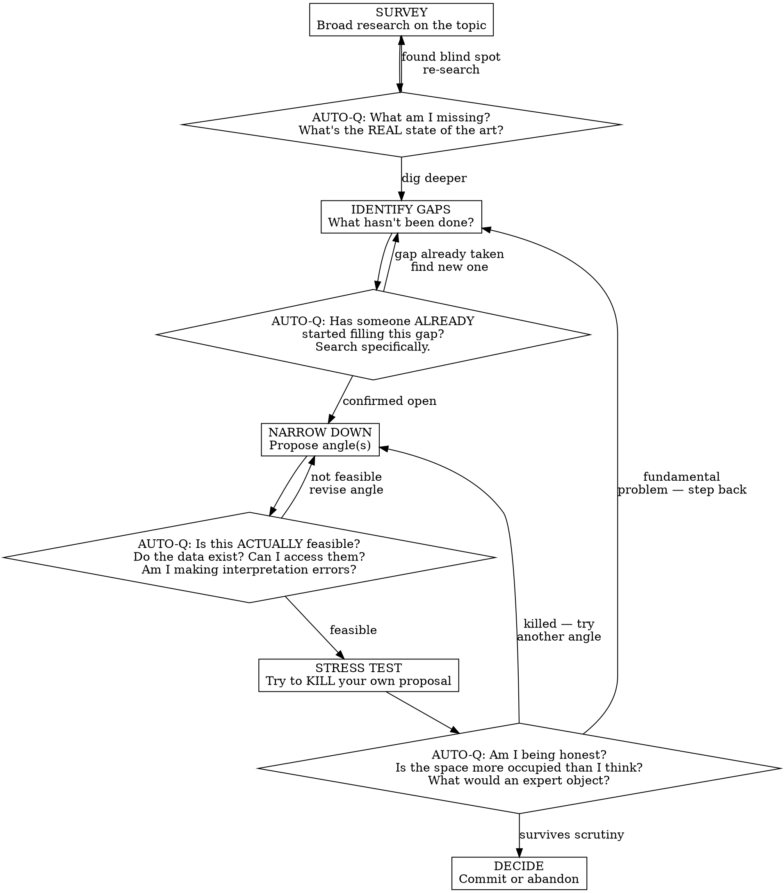

# Deep Research — Self-Challenging Investigation

## Overview

**Core principle:** Never trust your first answer. Every claim you make, challenge it. Every gap you find, verify it's real. Every angle you propose, try to kill it before recommending it.

This skill enforces an **auto-iterative critical thinking loop** where you systematically question your own findings at each stage, adapting your questions to what you just discovered — not following a rigid checklist. It applies whenever you need to find something novel or viable in a space where others have already worked — scientific research, R&D, or opportunity analysis.

## The Anti-Pattern This Skill Prevents

Without this skill, you do ONE pass: research → gaps → recommendation. You sound confident. You miss that someone already did the work. You propose something infeasible. You waste the user's time.

**The user should never have to ask you to verify your own claims. You do it yourself.**

## The Core Loop



## How Auto-Questions Work

Auto-questions are NOT a static list. They are **generated from what you just discovered**. After each research phase, you MUST pause and ask yourself questions that are specific to your findings.

### Generation Rules

After ANY research step, generate 2-4 questions following this pattern:

1. **Contradiction check:** "Does what I just found contradict something I said earlier?"
2. **Novelty check:** "Has someone already done exactly what I'm about to propose? Let me search for [specific terms from my proposal]."
3. **Feasibility check:** "I claimed X is possible — but have I verified X exists/is accessible/works the way I think?"
4. **Honesty check:** "Am I downplaying a problem I found? Am I being charitable to my own idea?"

### Mandatory Self-Corrections

When an auto-question reveals a problem, you MUST:

- **Say it out loud.** Do not silently adjust. Tell the user: "I need to correct myself — [what changed and why]."
- **Show the delta.** What did you think before? What do you know now? What changes?
- **Update your recommendation.** If it invalidates your angle, say so. Do not patch around it.

## Phase Details

### SURVEY — Cast a wide net
- Search broadly (minimum 5 different search queries)
- Cover: current state of the art, recent work, key players/teams, latest publications or releases
- **At the end, ask yourself:** "What topic adjacent to this might I be ignoring? What would someone from a different field search for?"

### IDENTIFY GAPS — Find what's missing
- List what has NOT been done
- For each gap, note WHY it might not have been done (technical barrier? data missing? not interesting?)
- **At the end, ask yourself:** "For each gap I listed — let me search specifically for '[gap description] + [field] + 2025 2026 preprint' to verify nobody filled it recently."

### NARROW DOWN — Propose angles
- For each angle, specify: what you'd do, what data you need, what the output would be, who would use it
- **At the end, ask yourself:** "If I were a reviewer, what would I say is wrong with this? What's the weakest link?"

### STRESS TEST — Try to kill your proposal
This is the critical phase. You MUST actively try to destroy your own idea:

- **Search for your SURVIVING angle specifically.** You killed the weak ones — now try equally hard to kill the winner. Search its exact title, its exact method, its exact dataset combination. If you only stress-test the rejects and go easy on the survivor, you have confirmation bias.
- Check if the data you need ACTUALLY exists (don't assume — verify the portal, the access conditions, the format)
- Identify methodological pitfalls specific to your approach
- Ask: "What would make this useless even if it works technically?"
- Ask: "Is this impactful for the END USER (patient, clinician, engineer...) or just academically interesting?"
- Ask: "Am I being MORE lenient with this angle just because I already invested effort describing it?"

### DECIDE — Commit or abandon
- If the idea survives: state clearly what's novel, what's feasible, what the impact is
- If the idea doesn't survive: say so honestly. Propose a pivot or recommend abandoning the direction entirely
- **Never force a weak idea.** Abandoning is a valid and respectable outcome.
- **Abandoning the ENTIRE research direction is sometimes the right answer.** If every angle you tried died under scrutiny, say "this topic doesn't have a viable computational angle for an independent researcher right now" — that conclusion is MORE valuable than a forced recommendation that wastes months of work.

## Red Flags — You're Skipping Self-Challenge

| Thought | Reality |
|---------|---------|
| "This gap is obviously open" | Search for it. It might have been filled last month. |
| "The data should be available" | Verify. Go to the actual portal. Check access conditions. |
| "This is feasible in principle" | In principle ≠ in practice. What's the actual blocker? |
| "The risk is manageable" | You just minimized a risk. Dig into it instead. |
| "I'll mention the limitation and move on" | If the limitation kills the project, don't move on. |
| "This is a good angle" | Good for whom? The user? A patient? A journal? |
| "Nobody has done this" | Search again with different terms. Preprints. Conference abstracts. |
| "I'm pretty confident" | Confidence without verification is the enemy. |

## Adaptation to Subject

The auto-questions above are TEMPLATES. You must adapt them to the specific domain:

- **Biomedical research:** Check ClinicalTrials.gov for ongoing trials. Check bioRxiv/medRxiv for preprints. Ask "what does this mean for a patient?"
- **Computer science:** Check arXiv, Papers With Code, GitHub. Ask "does a benchmark already exist? Has someone open-sourced this?"
- **Climate/environment:** Check IPCC reports, government datasets. Ask "is this policy-relevant or just academic?"
- **Engineering/R&D:** Check patents, industry whitepapers, GitHub repos. Ask "has industry already solved this commercially? Is there an open-source implementation?"
- **Opportunity/gap analysis:** Check competitors, existing products, market reports. Ask "who else is doing this? Why haven't they solved it? What's my unfair advantage?"

## The Iron Rule

```
NEVER RECOMMEND WITHOUT AT LEAST TWO ROUNDS OF SELF-CHALLENGE.
```

If you haven't corrected yourself at least once during the process, you haven't looked hard enough. Real research always reveals surprises. If you found none, you weren't thorough.

## Autonomous Execution

**Do NOT stop between phases to ask the user for permission or validation.** Run the entire loop — SURVEY through DECIDE — autonomously. The user will intervene if they want to redirect.

### How to execute

- **Use subagents for parallel research.** When you have multiple independent searches (e.g., checking 3 different gaps), dispatch them in parallel via the Agent tool. Each subagent should search and report back. This is faster and prevents you from getting tunnel vision on one thread.
- **Keep the user informed with brief status updates** between phases — one or two sentences max. "Surveyed the field, found 3 main fronts. Now checking if the gaps I identified are real." Not a wall of text.
- **Do NOT ask "should I continue?" between phases.** Just continue. The user can interrupt you.
- **DO stop and present findings at the DECIDE phase.** That's when the user needs to weigh in.

### Adversarial Dialectic — The Core Engine

This is the most important mechanism in this skill. It's not "check your work." It's **become your own opposition.**

**How it works:**

1. **THESIS — Your position.** You've done the research, you have an angle, you believe it's good.

2. **ANTITHESIS — Switch sides completely.** You are now an expert whose career depends on DESTROYING this angle. You're not being polite. You're not "raising concerns." You genuinely want to prove this idea is wrong, naive, or already done. Search for evidence that contradicts your position. Look for papers that undermine your assumptions. Question things that "everyone knows" — foundational assumptions are where the biggest blind spots hide.

3. **CRITIQUE THE CRITIQUE — Switch back.** Now evaluate your attack. Was it a real flaw or just contrarian noise? Did you find actual evidence, or were you just being oppositional for the sake of it? Some attacks will reveal genuine weaknesses. Others will crumble under scrutiny — and THAT strengthens your original position.

4. **SYNTHESIZE.** What survives this dialectic is stronger than what you started with. The real position is neither your original thesis nor your antithesis — it's the refined version that absorbed the valid critiques and discarded the invalid ones.

**This also applies to foundational assumptions.** Don't only question your specific angle — question the premises everyone takes for granted. "We know TDP-43 is the key target" — what if it's a downstream effect? "This dataset is the gold standard" — what if it has a systematic bias nobody talks about? "This method is the right approach" — what if a completely different field has a better tool?

You don't question EVERYTHING (that's paralysis). But when you're at the STRESS TEST phase, pick 1-2 foundational assumptions and run the dialectic on them. If they hold, great — you've verified your foundation. If they crack, you may have found something much more interesting than your original angle.

**The loop:** thesis → antithesis → critique of antithesis → synthesis → (new thesis if needed) → repeat. Two to three rounds is enough. If after 3 rounds your position keeps changing, you don't understand the space well enough yet — go back to SURVEY.

## Checkpoint & Reset

When the research reaches a **decision point** (end of a full loop, or a point where the user wants to reattack from a fresh angle), save a checkpoint:

### How to checkpoint

Write a file to the project's memory directory with:
```markdown
---
name: research-checkpoint-[topic-slug]
description: Research checkpoint for [topic] — current state, angles explored, what survived, what was killed
type: project
---

## Topic
[One-line description]

## State
[Where we are in the process]

## What was explored
[Angles tried and their fate — killed or survived, with reasons]

## Current best angle
[If one survived, describe it. If not, say so.]

## Key data and sources
[Datasets, papers, tools identified — with access status]

## Open questions
[What still needs to be resolved]

## What would make this 100x more impactful?
[The question to ask when reattacking from a fresh perspective]
```

### How to reset

When the user wants to reattack the topic from scratch (new conversation or explicit request):
1. Read the checkpoint file
2. You now have the accumulated knowledge WITHOUT the tunnel vision of the previous session
3. Start the loop again but with a different entry question: **"Given everything we know, what angle would make this 100x more impactful?"**
4. This question forces you to think beyond incremental improvements and look for transformative approaches

### When to suggest a reset

If you've gone through 2+ full loops and:
- Every angle is either taken or incremental
- The user seems unsatisfied with the options
- You feel like you're going in circles

Then say: "I think we should checkpoint and reset. I'll save where we are, and in a fresh conversation we can reattack with the question: what would make this 100x more impactful?"

## Common Mistakes

- **One-pass research:** Survey → recommend. No iteration. This is the #1 failure mode.
- **Cosmetic self-challenge:** Asking a question but not actually searching for the answer.
- **Survivorship bias:** Only presenting the angles that work, hiding the ones you killed. Show your kills — they demonstrate rigor.
- **Scope creep:** The auto-questioning reveals the space is complex, so you keep expanding. Know when to converge.
- **Confirmation search:** Searching for evidence that supports your idea instead of evidence that destroys it.
- **Stopping to ask permission:** Don't ask "should I continue?" — just keep going. The user will redirect if needed.
- **Not checkpointing:** If a session ends without a checkpoint, all the knowledge is lost. Always save state before concluding.
