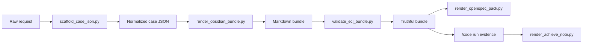

# Implementation Guide

## Repository Shape

At publish time, the repository root is also the Claude Code skill root. That means the installed skill can reference local files with stable relative paths.

```text
evolution-constraint-planner/
  SKILL.md
  scripts/
  templates/
  references/
  schemas/
  docs/
  examples/
  tests/
```

## Tier Architecture `[v1.1]`

ECD v1.1 introduces a 3-tier complexity routing system. The classifier runs before any stage executes.

### Classifier

Three silent questions determine the tier:

1. **Q1 Code impact surface:** ≤3 files=L1, 4-10=L2, >10=L3
2. **Q2 Security/correctness risk:** UI-only=L1, functional=L2, data/auth/payment=L3
3. **Q3 Requirement clarity:** Ambiguous → force L3

`Final tier = max(Q1, Q2, Q3)`. Missing tier in existing bundles defaults to L3 (Full).

### Bundle Layout by Tier

| Tier | Artifacts |
|------|-----------|
| **L1 Lite** | `00-overview.md`, `05-constraint-ledger.md` (lite), `10-a-preprocess.md` (lite), `90-code-handoff.md` (lite), `97-code-preflight.md`, `Runs/` |
| **L2 Standard** | L1 files (non-lite templates) + `20-b-divergence.md`, `30-c-requirements.md`, `50-e-closure.md`, optionally `40-d-critique.md`, `80-h-review.md` |
| **L3 Full** | All 17 files as in v1.0 (unchanged) |

### code_ready Gating by Tier

- **L1:** Handoff freezes 4 surfaces (repo_grounding, frozen_product_decisions, file_plan, implementation_units). Companion docs skipped.
- **L2:** Handoff freezes all required surfaces. Companion docs optional (91/92/95/96).
- **L3:** Full handoff quality bar with all companion docs (unchanged from v1.0).

### Validator Tier Awareness

The validator (`validate_ecl_bundle.py`) currently checks all 17 files for L3. For L1/L2 bundles, only tier-appropriate files are required. This is noted for a future script update.

## Runtime Model

ECL has two layers:

- the skill layer decides how the model should behave
- the script layer renders, validates, and records artifacts

The scripts do not replace reasoning. They make reasoning inspectable and machine-checkable.

## CLI Architecture

### `scripts/ecd.py`

This is the public CLI entrypoint. It exposes:

- `scaffold`
- `pre`
- `plan`
- `code`
- `achieve`

Responsibilities:

- call the right helper script
- enforce stage-entry conditions
- refuse false success
- parse handoff truth from rendered notes

### `scripts/scaffold_case_json.py`

Builds the normalized case shell from a raw request. It is the easiest way to create a correct bundle skeleton with all required stage and artifact keys.

### `scripts/render_obsidian_bundle.py`

Compiles the normalized JSON into markdown notes and companion docs.

### `scripts/validate_ecl_bundle.py`

Acts as the truth gate. It checks:

- required files exist
- required structured blocks exist
- mandatory fields are present
- mandatory multi-agent stages are truthful
- `code_ready=true` obeys the handoff quality bar

### `scripts/render_openspec_pack.py`

Compiles an OpenSpec view from the converged ECL package. This is an export surface, not a second planning system.

### `scripts/render_code_run.py`

Writes `Runs/<run-id>/00-code-run.md` and associated execution evidence.

### `scripts/render_achieve_note.py`

Writes `Runs/<run-id>/03-achieve.md` from achieve payload data.

## Bundle Compilation Flow



## Artifact Surfaces

### Planning truth

- `05-constraint-ledger.md`
- `10-a-preprocess.md`
- `20-b-divergence.md`
- `30-c-requirements.md`
- `40-d-critique.md`
- `50-e-closure.md`
- `60-f-probes.md`
- `70-g-red-blue.md`
- `80-h-review.md`
- `98-j-compile-for-code.md`

### Coding truth

- `90-code-handoff.md`: only truthful execution entrypoint
- `97-code-preflight.md`: execution workboard that must not reinterpret semantics
- `99-code-handoff.md`: final summary surface for the user and coder

### Contract companions

- `91-canonical-contracts.md`
- `92-constraint-crosswalk.md`
- `95-execution-manifest.md`
- `96-code-batches.md`

### Run evidence

- `Runs/<run-id>/00-code-run.md`
- `Runs/<run-id>/01-verification.md`
- `Runs/<run-id>/02-reentry.md` when blocked
- `Runs/<run-id>/03-achieve.md` when closure is judged

## Template System

`templates/` contains the markdown shapes that the renderers fill:

- stage notes for A-H and J
- handoff notes
- companion docs

This keeps the visible bundle stable even when planning content changes.

## Schema Strategy

The schema is intentionally lightweight. ECL does not use an external database or service protocol. Instead, the bundle itself is the persistent truth surface.

Important schema anchors live in:

- `references/ecl-schema.md`
- `schemas/ecl-v2/schema.yaml`

The validator is stricter than the human-readable docs. That is intentional. The markdown is for people; the structured blocks are for truth gating.

## Why `97-code-preflight.md` Exists

Many planning systems leak because execution starts mutating the handoff itself. ECL avoids that by separating:

- frozen implementation meaning in `90-code-handoff.md`
- live execution status in `97-code-preflight.md`

That makes progress updates possible without reopening semantics.

## Why `99-code-handoff.md` Exists

`90-code-handoff.md` is the machine-truth entrypoint. `99-code-handoff.md` is the user-facing final compiled summary. The two are related but not interchangeable.

## OpenSpec Export

When OpenSpec output is wanted, ECL compiles:

- `proposal.md`
- `design.md`
- `tasks.md`
- `specs/...`

This is a projection of converged ECL truth, not an alternate authoring source.

## Example Workspace

The repository ships a valid Stage A sample in:

- `examples/stage-a-sample/case.json`
- `examples/stage-a-sample/bundle/`

It demonstrates:

- normalized case structure
- bundle compilation layout
- placeholder-safe absolute paths
- OpenSpec export generation

## Installation Script

`scripts/install_skill.sh` copies the repository into `${CODEX_HOME:-$HOME/.codex}/skills/evolution-constraint-planner` so the repo remains directly usable as a Codex skill. For Claude Code, manually copy the skill directory to `.claude/skills/`.
