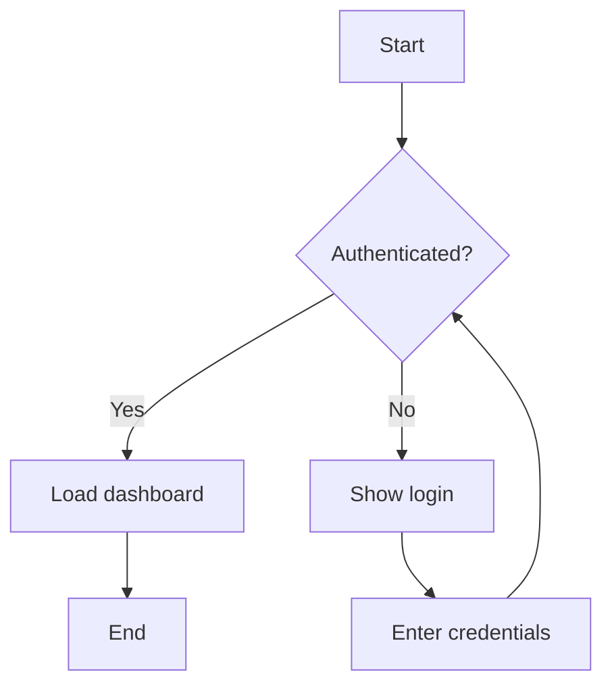
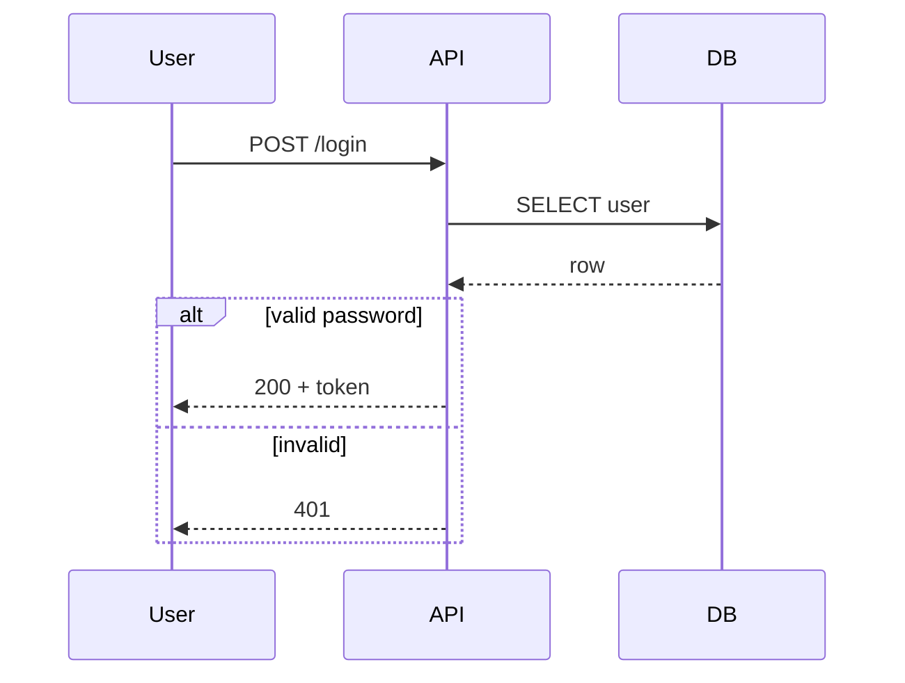
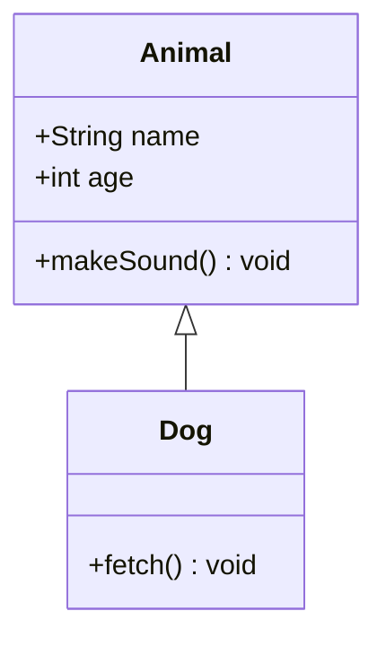
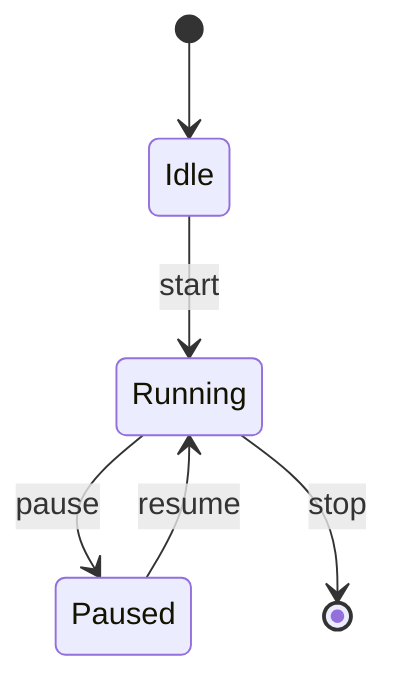
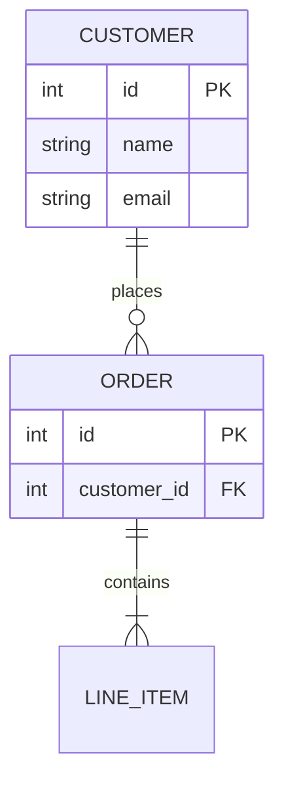
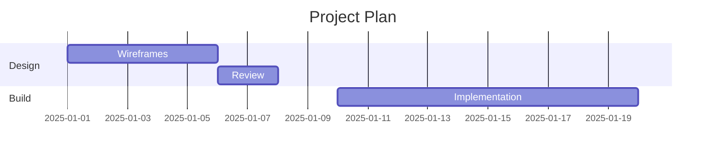
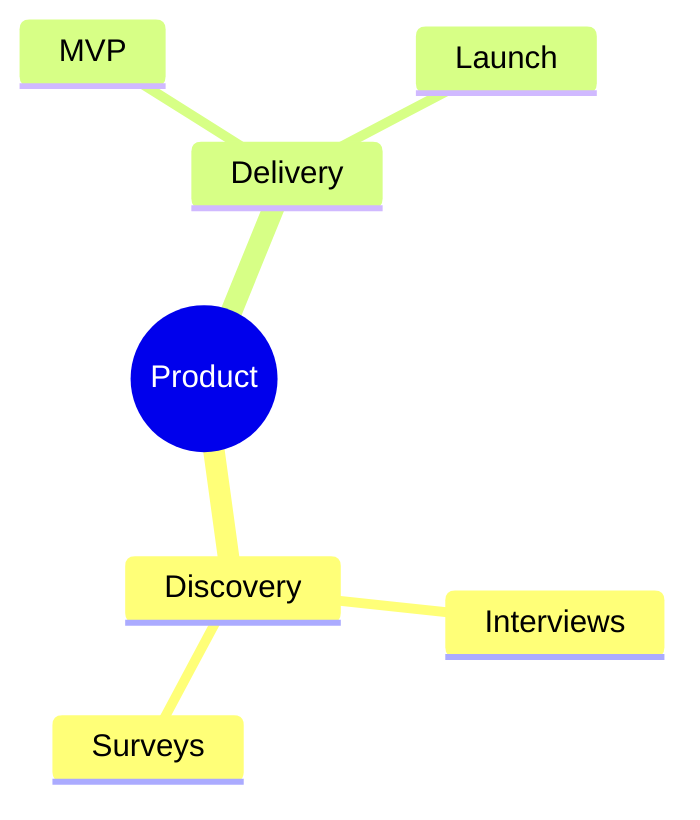
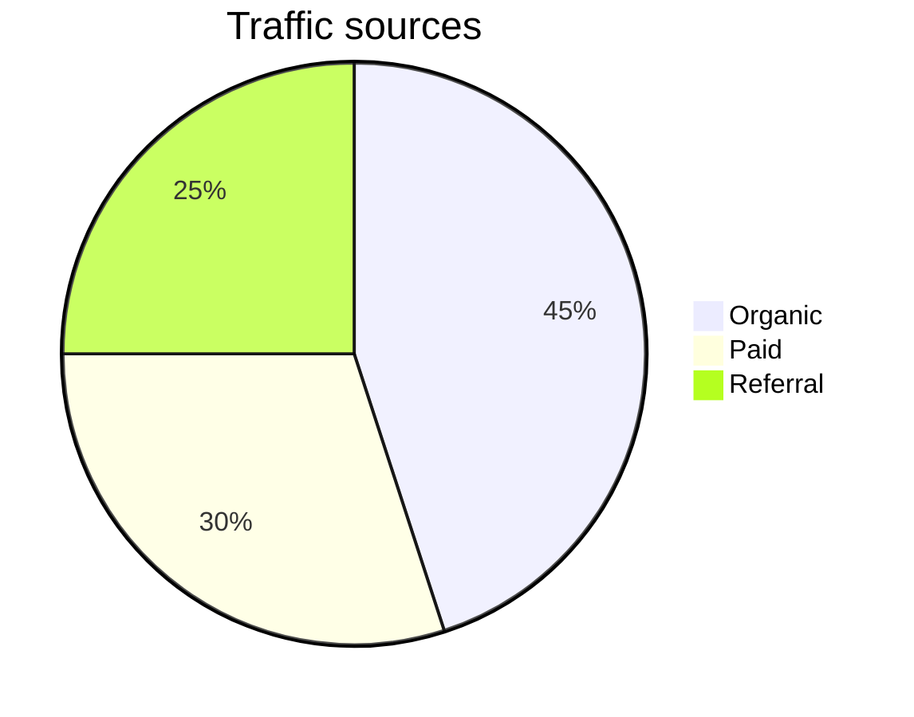

# Mermaid Diagram Types Reference

A quick syntax reference for the most common Mermaid diagram types. For the full
specification see <https://mermaid.js.org>. Each snippet below validates cleanly
with `scripts/validate.py`.

## Flowchart

Best for processes, decision trees, and workflows.

- Directions: `TD`/`TB` (top-down), `BT` (bottom-up), `LR` (left-right), `RL`.
- Node shapes: `A[rect]`, `B(rounded)`, `C([stadium])`, `D{diamond}`,
  `E((circle))`, `F[/parallelogram/]`.
- Edges: `-->` arrow, `---` line, `-.->` dotted, `==>` thick, `-->|label|` labeled.
- Group with `subgraph Name ... end`.

## Sequence Diagram

Best for interactions between participants over time.

- Arrows: `->>` solid, `-->>` dashed (reply), `-x` lost message.
- Blocks: `loop`, `alt`/`else`, `opt`, `par`, `critical`, `rect` — each closed by `end`.
- Lifelines: `activate X` / `deactivate X` (or `+`/`-` shorthand on arrows).

## Class Diagram

Best for object-oriented structure.

- Relationships: `<|--` inheritance, `*--` composition, `o--` aggregation,
  `-->` association, `..>` dependency.
- Visibility: `+` public, `-` private, `#` protected.

## State Diagram

Best for state machines.

- `[*]` marks start and end states.
- Composite states: `state Name { ... }`.

## Entity Relationship Diagram

Best for database schemas.

- Cardinality: `||` exactly one, `o{` zero-or-many, `|{` one-or-many.
- Keys: `PK`, `FK`, `UK` in the attribute block.

## Gantt Chart

Best for project schedules.

## Mindmap

Best for hierarchical brainstorming around one idea.

## Pie Chart

Best for proportions of a whole.

