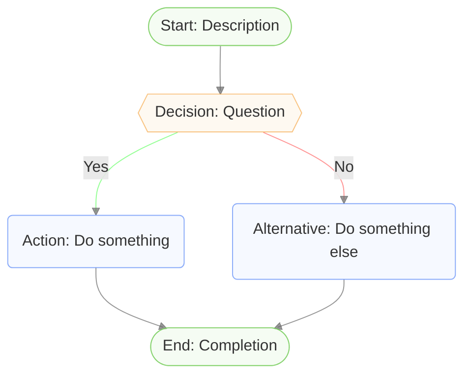
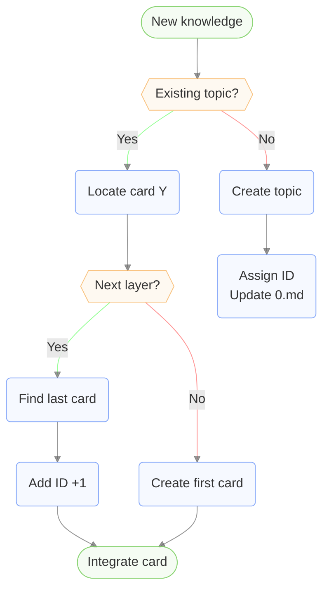

# Mermaid Flowchart Formatter

## Quick Start Template

Copy style lines in this template and replace nodes/connections:



## Styling Rules

### Node Shapes
- **Start/End**: `([Text])` - Capsule
- **Decision**: `{{Text}}` - Hexagon
- **Regular**: `(Text)` - Rounded rectangle

### Classes
- `:::endNode` - Start/End nodes
- `:::decisionNode` - Decision nodes
- Regular nodes use `default` class (no class needed)

### Link Styles
- `linkStyle default stroke:#666666AF` - All links gray by default
- `linkStyle X,Y,Z stroke:#66FF66AF` - "Yes" conditions (X,Y,Z = link indices, comma-separated)
- `linkStyle X,Y,Z stroke:#FF6666AF` - "No" conditions (X,Y,Z = link indices, comma-separated)
- **Tip**: Group same-colored links on one line using commas
- **Tip**: Link indices start from 0 (first link is 0, second is 1, etc.)
- **Tip**: Do NOT use index >= count of links
- **Tip**: Always verify link indices are within range before applying styles
**Example:**
If we have 15 links → index range 0-14, Do NOT use index 15 or higher

### Required Style Definitions

Always include these 4 lines at the bottom of your flowchart:
```
classDef default fill:#E2EAFE4F,stroke:#5A88F6AF
classDef endNode fill:#DDF4D84F,stroke:#7DCF62AF
classDef decisionNode fill:#FCEBD34f,stroke:#F6AA4BAF
linkStyle default stroke:#666666AF
```

**If the flowchart contains decision nodes (conditions), also include:**
```
linkStyle 1 stroke:#66FF66AF
linkStyle 2 stroke:#FF6666AF
```

**Note**: Link indices start from 0. In a typical flowchart with one decision node:
- Link 0: Start → Decision (default gray)
- Link 1: Decision "Yes" → Action (green)
- Link 2: Decision "No" → Alternative (red)
- Link 3+: Other connections (default gray)

### Safe Mode (Recommended)

If you're unsure about link indices:
- Start with only `linkStyle default`
- Add conditional styles one at a time
- Check rendering after each addition

## Optimization Guidelines

### When Optimizing Existing Flowcharts

**Rule 1: Do NOT add or remove nodes**
- Only change styling, not structure
- Keep all nodes and connections intact

**Rule 2: Detect non-flowchart structures**
- If the diagram is clearly NOT a flowchart (e.g., tree structure, mind map, hierarchy)
- Apply only default styling: `linkStyle default` and `classDef default`
- Do NOT add decision nodes or conditional link styles
- Example: Tree diagrams, organizational charts, concept maps

### Link Index Validation Steps

**Step 1: Count total links** - Count all `-->` symbols
**Step 2: Determine index range** - 0 to (N-1)
**Step 3: Apply styles safely** - Only use existing indices
**Step 4: Verify before finalizing** - Check indices are within range

### TIP: Pre-optimization Steps

**Step 1: Reorder statements logically**
- If the original flowchart has chaotic statement order
- Rearrange nodes and connections to match logical flow
- Group related logic together

**Step 2: Remove existing style definitions**
- Before applying new styles, remove all existing:
  - `style` statements
  - `linkStyle` statements
  - `classDef` statements
  - `class` assignments
- This prevents style conflicts and ensures clean optimization

### TIP: Logical Text Order

**Plan text order to match logical flow**
- Group related nodes and connections together
- Arrange statements in the same order as the visual flow (top to bottom, left to right)
- Keep related logic in adjacent statements
- This helps humans and AI understand the logic directly from the text

**Example**: In the example below, nodes A→B→C→E→F→G→K are grouped together (left branch), while D→J is grouped separately (right branch). The order follows the natural flow from top to bottom.

### Common Errors & Solutions

**Error: Link index out of bounds**
- **Symptom:** Flowchart fails to render
- **Solution:** Recalculate total links, ensure indices are within range

**Error: Style conflicts**
- **Symptom:** Styles don't apply correctly
- **Solution:** Ensure each index is covered by only one linkStyle

**Error: Wrong link order**
- **Symptom:** Colors don't match expectations
- **Solution:** Count links from top to bottom, left to right

## Example



**Note**: Links 1 and 4 are grouped with `linkStyle 1,4 stroke:#66FF66AF` (both "Yes" conditions). Links 2 and 6 are grouped with `linkStyle 2,6 stroke:#FF6666AF` (both "No" conditions). All other links use the default gray color.
