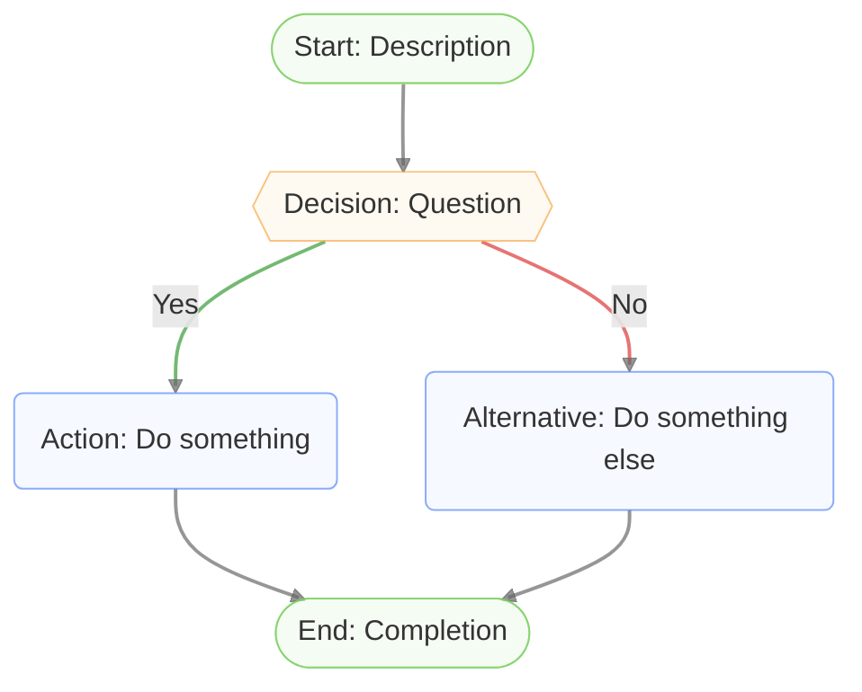
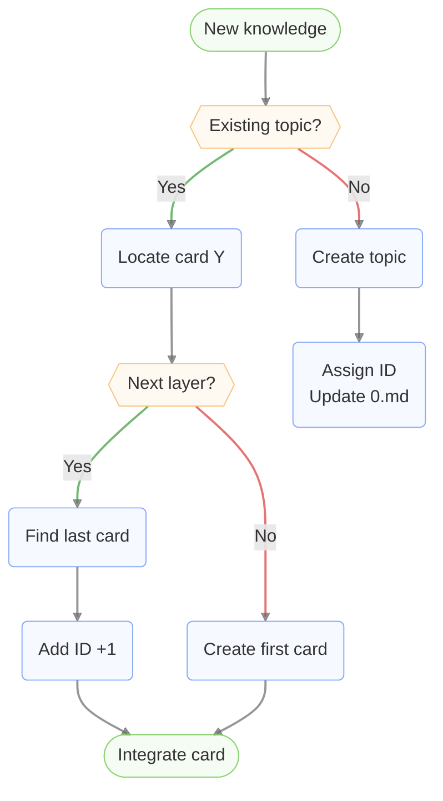

# Mermaid Flowchart Formatter

## Quick Start Template

Copy style lines in this template and replace nodes/connections:



## Core Styling Rules

### Node Shapes
- **Start/End**: `([Text])` - Capsule
- **Decision**: `{{Text}}` - Hexagon
- **Regular**: `(Text)` - Rounded rectangle

### Node Classes

Assign classes to nodes at the end of the flowchart using `class` statements:

- `class StartNode,EndNode endNode` - Start/End nodes
- `class Decision decisionNode` - Decision nodes
- Regular nodes use `default` class (no class needed)
- **Tip**: Don't modify caption text of node, only change shapes and classes

### Link Styles
- **Default**: `linkStyle default stroke:#666666AF` (gray)
- **"Yes" conditions**: `linkStyle X,Y,Z stroke:#339933AF` (green)
- **"No" conditions**: `linkStyle X,Y,Z stroke:#DD3333AF` (red)
- **Tip**: Group same-colored links with commas: `linkStyle 1,4,7 stroke:green`
- **Tip**: Link indices start from 0 (first link = 0, second = 1, etc.)
- **Tip**: Don't modify caption text of link, only change colors

### Required Style Definitions

**Include only what exists:**

- **If there are links**: `linkStyle default stroke:#666666AF,stroke-width:2px`
- **If start/end nodes exist**: `classDef endNode fill:#DDF4D84F,stroke:#7DCF62AF`
- **If decision nodes exist**: `classDef decisionNode fill:#FCEBD34f,stroke:#F6AA4BAF`
- **If decision nodes exist**: `linkStyle 1 stroke:#339933AF,stroke-width:2px` and `linkStyle 2 stroke:#DD3333AF,stroke-width:2px`
- **If regular nodes exist**: `classDef default fill:#E2EAFE4F,stroke:#5A88F6AF`
- **Node classes**: `class StartNode,EndNode endNode` and `class Decision decisionNode`

**Omit styles for missing elements:**
- No links → omit `linkStyle` lines
- No start/end nodes → omit `classDef endNode` and `class` statements for end nodes
- No decision nodes → omit `classDef decisionNode`, conditional link styles, and `class` statements for decision nodes
- No regular nodes → omit `classDef default`

**Note**: In a typical flowchart with one decision:
- Link 0: Start → Decision (default gray)
- Link 1: Decision "Yes" → Action (green)
- Link 2: Decision "No" → Alternative (red)
- Link 3+: Other connections (default gray)

## Link Index Validation

**Critical: Prevent rendering failures and wrong colors by index**

**Step 1: Count total links** - Count all `-->` symbols
**⚠️ IMPORTANT: Count line-by-line from top to bottom. Write down each link as you count it.**
**Step 2: Determine index range** - Valid indices: 0 to (N-1)
**Step 3: Apply styles safely** - Only use existing indices
**Step 4: Verify before finalizing** - Check indices are within range

**Example**: 15 links → index range 0-14. **DO NOT** use index 15 or higher.

**Safe Mode**: If unsure, start with only `linkStyle default`, then add conditional styles one at a time.

**TIP: Add Link Number Comments for check**
- Add `%% Link X` comment above each link during counting on a draft copy of the flowchart.
- Example:
  ```plantext
  flowchart TD
      %% Link 0
      A --> B
      %% Link 1
      B --> C
      %% Link 2
      B --> D
  ```
- After counting, verify:
  1. **Check for continuity**: All link numbers from 0 to N-1 are present (no gaps)
  2. **Check yes/no links**: Verify that "Yes" and "No" link numbers match the comment numbers
- This prevents common counting errors and ensures correct indices

## Optimization Guidelines

### When Modifying Existing Flowcharts

**Rule 1: Preserve structure** - Only change styling, not nodes/connections
**Rule 2: Detect non-flowcharts** - For trees/hierarchies/mind maps, use only default styling

**Pre-optimization steps:**
1. **Remove existing styles** - Delete all `style`, `linkStyle`, `classDef`, `class` statements
2. **Reorder logically** - Group related nodes/connections to match visual flow
3. **Add styles at end** - Append `classDef`, `linkStyle`, and `class` statements at the end

## Common Errors & Solutions

**Error: Link index out of bounds**
- **Solution**: Recalculate total links, ensure indices are within range

**Error: Style conflicts**
- **Solution**: Ensure each index is covered by only one linkStyle

**Error: Wrong link order**
- **Solution**: Count links from top to bottom

## Example



**Note**: Links 1 and 4 are "Yes" conditions (green). Links 2 and 6 are "No" conditions (red). All others use default gray.