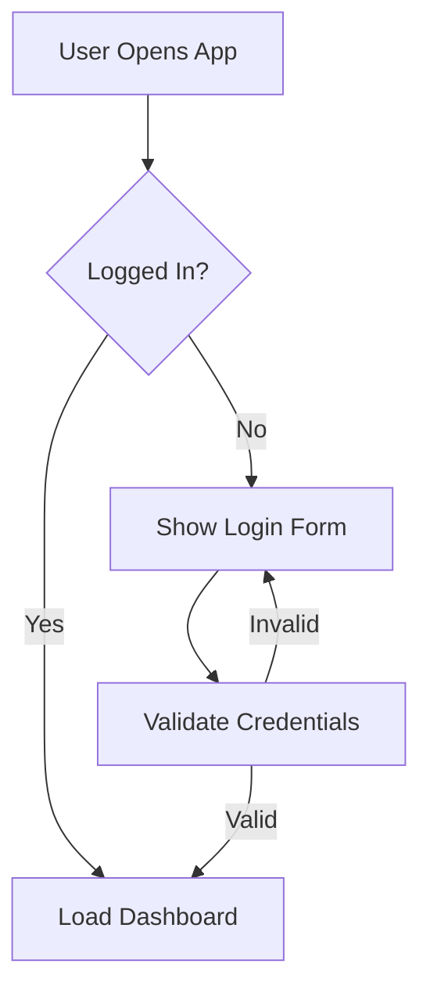
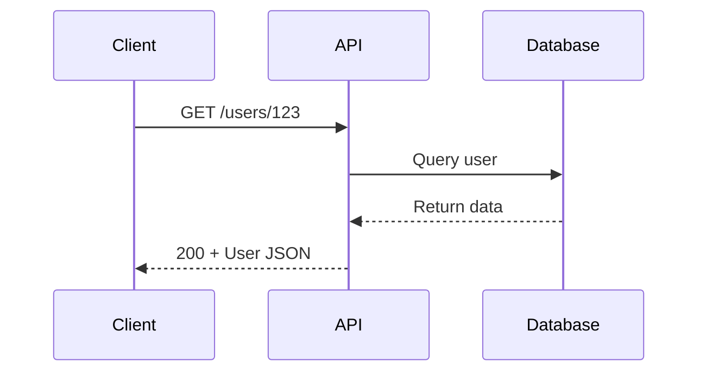
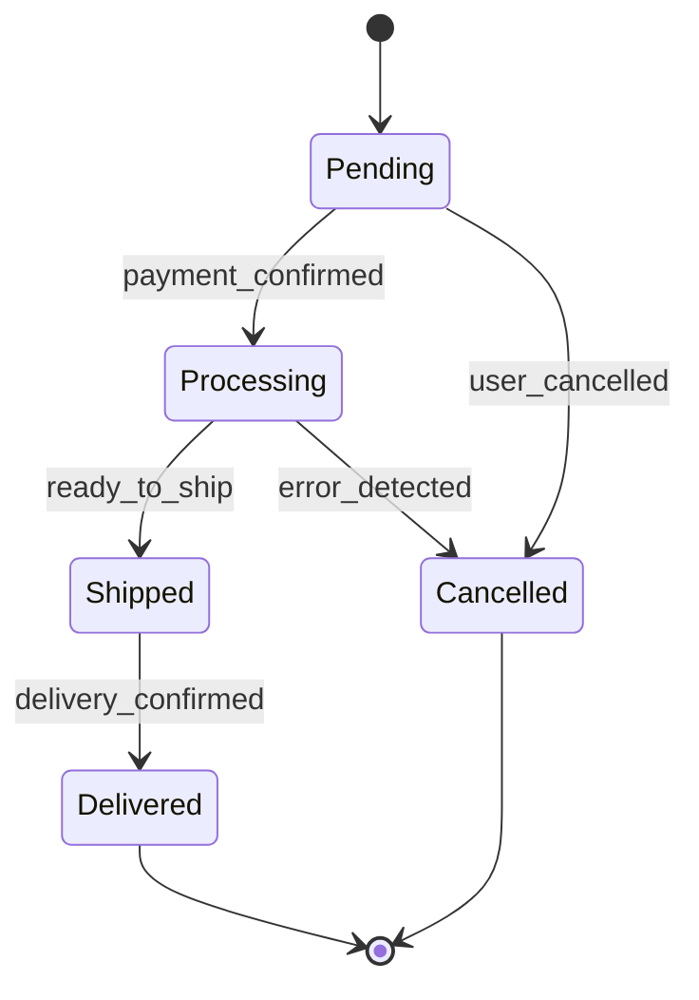
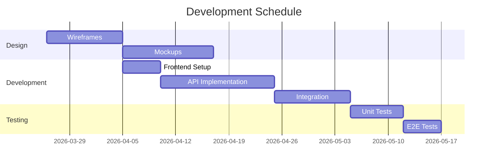

# Mermaid Terminal

> Generate, render, and export Mermaid diagrams directly from CLI. Create flowcharts, sequence diagrams, state machines, and more with terminal preview support.

[](https://opensource.org/licenses/MIT)
[](https://www.npmjs.com/package/@fused-gaming/mermaid-terminal)

## Features

- 🎨 **Real-time Terminal Preview**: See diagrams rendered in your terminal instantly
- 📊 **Multiple Diagram Types**: Flowcharts, sequences, state machines, ERD, Gantt, and more
- 💾 **Batch Export**: Convert multiple diagrams to PNG, SVG, PDF in one command
- 🎭 **Theme Support**: Built-in and custom themes for consistent styling
- 🔄 **Watch Mode**: Auto-render on file changes during editing
- 🚀 **CLI-First**: No GUI needed - work entirely in your terminal
- 📝 **Markdown Integration**: Export diagrams as code blocks for documentation

## Installation

```bash
npm install -g @fused-gaming/mermaid-terminal
```

Or locally in a project:

```bash
npm install --save-dev @fused-gaming/mermaid-terminal
```

## Quick Start

### Create a Diagram

```bash
mermaid create --type flowchart --name my-process
```

### Preview in Terminal

```bash
mermaid view my-process.mmd
```

### Export to Images

```bash
mermaid export my-process.mmd --format png svg pdf
```

## Usage Examples

### Flowchart Diagram

```bash
# Create a flowchart
mermaid create --type flowchart --name user-auth

# In editor, write:
```



```bash
# View in terminal
mermaid view user-auth.mmd

# Export to PNG, SVG, PDF
mermaid export user-auth.mmd --format png svg pdf --output ./diagrams/
```

### Sequence Diagram

```bash
mermaid create --type sequence --name api-interaction
```



### State Machine

```bash
mermaid create --type state --name order-workflow
```



### Gantt Timeline

```bash
mermaid create --type gantt --name project-schedule
```



## CLI Commands

### Create Diagram

```bash
mermaid create --type <type> --name <name> [--template <template>]

# Options:
# --type: flowchart, sequence, state, class, er, gantt, pie, git
# --name: filename (without extension)
# --template: Use a template as starting point
```

### Preview

```bash
mermaid view <file.mmd> [--zoom 2] [--theme dark]

# Options:
# --zoom: Zoom level (1-5)
# --theme: Theme name
```

### Export

```bash
mermaid export <file.mmd> --format <format> [--output <dir>]

# Formats: png, svg, pdf, json, markdown, html, ascii
# --output: Output directory (default: current)
# --theme: Color theme to apply
# --width: Image width
# --height: Image height
```

### Batch Processing

```bash
mermaid batch <dir> --format <format> [--output <dir>]

# Converts all .mmd files in directory
# --watch: Enable watch mode (auto-render on changes)
```

### Validate

```bash
mermaid validate <file.mmd>

# Checks syntax without rendering
# Returns detailed error messages with fixes
```

### List Templates

```bash
mermaid templates list

# Shows all available diagram templates
```

## Configuration

Create `.mermaidrc.json` in your project:

```json
{
  "theme": "dark",
  "fontSize": 14,
  "fontFamily": "arial",
  "lineWidth": 2,
  "export": {
    "width": 1024,
    "height": 768,
    "background": "white"
  }
}
```

## Watch Mode

Monitor for changes and auto-export:

```bash
# Watch single file
mermaid view my-diagram.mmd --watch --format png

# Watch directory
mermaid batch ./diagrams --watch --format svg --output ./exports/
```

## Integration Examples

### Git Pre-Commit Hook

```bash
#!/bin/bash
# .git/hooks/pre-commit

# Validate all diagrams
mermaid validate diagrams/*.mmd

if [ $? -ne 0 ]; then
    echo "❌ Diagram validation failed"
    exit 1
fi

# Export diagrams
mermaid batch diagrams --format svg --output public/

git add diagrams/*.mmd public/*.svg
```

### GitHub Actions

```yaml
name: Generate Diagrams

on: [push, pull_request]

jobs:
  diagrams:
    runs-on: ubuntu-latest
    steps:
      - uses: actions/checkout@v3

      - name: Install dependencies
        run: npm install -g @fused-gaming/mermaid-terminal

      - name: Generate diagrams
        run: |
          mermaid batch ./diagrams --format png svg pdf
          mermaid batch ./diagrams --format markdown --output ./docs/

      - name: Upload artifacts
        uses: actions/upload-artifact@v3
        with:
          name: diagrams
          path: diagrams/exports/
```

### NPM Script

```json
{
  "scripts": {
    "diagram:create": "mermaid create --type flowchart --name",
    "diagram:view": "mermaid view",
    "diagram:export": "mermaid batch diagrams --format png svg pdf",
    "diagram:watch": "mermaid batch diagrams --watch --format svg"
  }
}
```

## Output Formats

### PNG/SVG/PDF
High-quality image exports for presentations and documentation.

```bash
mermaid export diagram.mmd --format png svg pdf
```

### JSON
Programmatic access to diagram structure:

```bash
mermaid export diagram.mmd --format json
# Outputs: { "type": "flowchart", "nodes": [...], "edges": [...] }
```

### Markdown
Embed diagrams in documentation:

```bash
mermaid export diagram.mmd --format markdown --output ./docs/
# Creates: docs/diagram.md with code block
```

### HTML
Standalone interactive viewer:

```bash
mermaid export diagram.mmd --format html
# Outputs: diagram.html (can be opened in browser)
```

## Best Practices

1. **Simple, Clear Diagrams**: Avoid overcrowding - use multiple smaller diagrams
2. **Consistent Naming**: Use descriptive node labels
3. **Version Control**: Commit `.mmd` files to Git
4. **Theme Consistency**: Use configuration file for project-wide styling
5. **Batch Export**: Generate all formats at once
6. **Watch During Editing**: Use watch mode for real-time feedback
7. **Markdown Export**: Include diagrams in README files automatically

## Troubleshooting

### Chrome/Browser Required
Mermaid rendering requires Chrome/Chromium. Install if missing:

```bash
# macOS
brew install chromium

# Ubuntu/Debian
sudo apt-get install chromium-browser

# Windows
choco install chromium
```

### Large Diagrams
For complex diagrams, increase memory:

```bash
NODE_OPTIONS="--max-old-space-size=4096" mermaid export large-diagram.mmd
```

### Theme Not Found
Ensure theme name matches available themes:

```bash
mermaid templates list  # Shows available themes
```

## API Reference

See the SKILL.md file for detailed API documentation.

## Contributing

Contributions welcome! Open an issue or pull request.

## License

MIT - See [LICENSE.txt](./LICENSE.txt) file.

## Attribution

Created by [Fused Gaming](https://github.com/fused-gaming)

## Support

- [GitHub Issues](https://github.com/fused-gaming/skills/issues)
- [Discussions](https://github.com/fused-gaming/skills/discussions)
