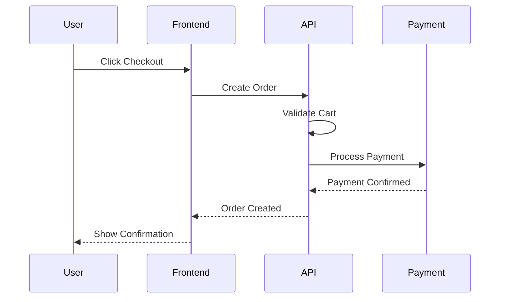
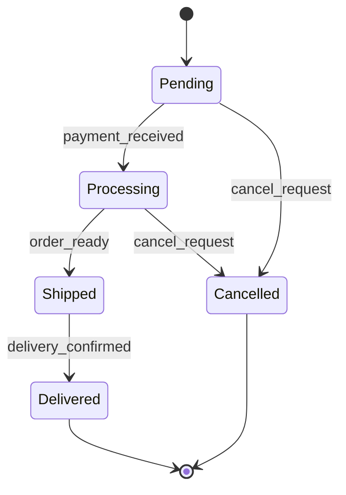
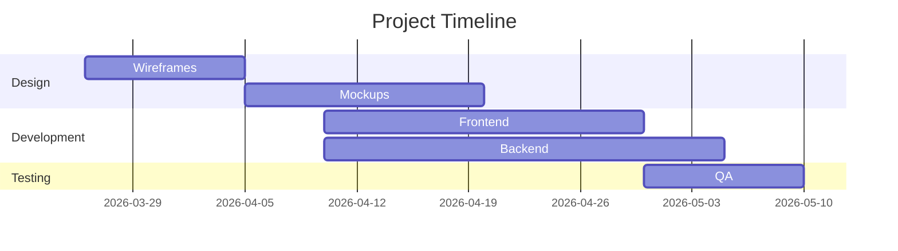

# Mermaid Terminal

Create, edit, and export Mermaid diagrams directly from your terminal. Instantly preview complex diagrams, convert between formats, and generate publication-ready images without leaving the command line.

## When to Use

- Designing system architecture quickly
- Creating flowcharts for documentation
- Generating sequence diagrams for API documentation
- Building state machine visualizations
- Converting diagrams between formats
- Batch processing multiple diagrams
- Embedding diagrams in README files

## Core Capabilities

### 1. Diagram Types Supported

- **Flowcharts**: Rectangular boxes, decision diamonds, process flows
- **Sequence Diagrams**: Actor interactions, message flows, timing
- **State Machines**: States, transitions, guards, actions
- **Class Diagrams**: Object hierarchies, relationships, attributes
- **Entity-Relationship Diagrams**: Database schema visualization
- **Gantt Charts**: Project timelines and dependencies
- **Pie Charts**: Data distribution visualization
- **Git Graphs**: Repository branching and merging

### 2. Terminal Rendering

Real-time ASCII preview in terminal with:
- Syntax highlighting
- Error messages and fixes
- Live editing mode
- Zoom and pan controls

### 3. Export Formats

Output to:
- PNG / SVG / PDF
- JSON (diagram data)
- Markdown (diagram code blocks)
- HTML (standalone or embedded)
- ASCII (terminal display)

### 4. Advanced Features

- Batch processing multiple files
- Watch mode for auto-rendering
- Theme customization
- Configuration inheritance
- Template system

## Usage Examples

### Create a Flowchart

```bash
mermaid create --type flowchart --name user-signup
```

Then edit in your preferred editor. Example diagram:

```
flowchart TD
    A["User Opens App"] --> B{Logged In?}
    B -->|No| C["Show Login Form"]
    B -->|Yes| D["Load Dashboard"]
    C --> E["Validate Credentials"]
    E -->|Valid| D
    E -->|Invalid| C
    D --> F["Display User Data"]
```

### Render in Terminal

```bash
mermaid view user-signup.mmd
# Shows ASCII preview in terminal
```

### Export to Multiple Formats

```bash
# PNG export
mermaid export user-signup.mmd --format png --output ./diagrams/

# SVG export
mermaid export user-signup.mmd --format svg --output ./diagrams/

# PDF with custom theme
mermaid export user-signup.mmd --format pdf --theme dark --output ./diagrams/

# Markdown code block
mermaid export user-signup.mmd --format markdown --output ./docs/
```

### Batch Processing

```bash
# Convert all .mmd files in directory
mermaid batch ./diagrams --format png --output ./exports/

# Watch mode - auto-render on changes
mermaid watch ./diagrams --format svg --output ./exports/
```

### Create from Template

```bash
# List available templates
mermaid templates list

# Create from template
mermaid template --type sequence --name api-flow
```

## Input Schema

### Diagram Configuration

```yaml
# diagram.mmd or diagram.config.yaml
diagram:
  type: flowchart|sequence|state|class|er|gantt|pie|git
  title: "Diagram Title"
  direction: TD|LR|TB|RL  # (for flowcharts)
  theme: default|dark|forest|neutral

rendering:
  fontSize: 14
  fontFamily: arial
  lineWidth: 2
  curve: linear|basis|cardinal|monotone

export:
  formats: [png, svg, pdf, json, markdown]
  width: 1024
  height: 768
  background: white|transparent
```

## Diagram Examples

### Sequence Diagram

```bash
mermaid create --type sequence --name checkout-flow
```



### State Machine

```bash
mermaid create --type state --name order-lifecycle
```



### Gantt Chart

```bash
mermaid create --type gantt --name project-timeline
```



## Output Structure

Each diagram generates:
- `.mmd` - Mermaid source code
- `.png/.svg/.pdf` - Rendered image
- `.json` - Diagram metadata
- `.html` - Standalone web viewer
- `.md` - Markdown code block for documentation

## CLI Commands

```bash
# Create new diagram
mermaid create --type flowchart --name diagram-name

# View/preview in terminal
mermaid view diagram.mmd [--zoom 2]

# Export to formats
mermaid export diagram.mmd --format png --output ./diagrams/

# Batch process
mermaid batch ./diagrams --format svg

# Watch for changes
mermaid watch ./diagrams --format png

# Validate syntax
mermaid validate diagram.mmd

# List templates
mermaid templates list

# Get help
mermaid --help
```

## Best Practices

1. **Keep diagrams simple**: Avoid overcrowding - use multiple smaller diagrams
2. **Consistent naming**: Use descriptive names for nodes and flows
3. **Use themes**: Match your project's visual style
4. **Version control**: Commit .mmd files to track changes
5. **Embed in docs**: Use markdown export for README files
6. **Watch mode**: Use for continuous preview during editing
7. **Batch export**: Generate all formats at once for distribution

## Integration Examples

### In Git Workflow

```bash
# Pre-commit hook
mermaid validate *.mmd
mermaid batch ./diagrams --format svg --output ./public/

git add diagrams/*.mmd public/*.svg
```

### In CI/CD Pipeline

```yaml
# .github/workflows/diagrams.yml
- name: Generate diagrams
  run: |
    npm install -g @fused-gaming/mermaid-terminal
    mermaid batch ./diagrams --format png,svg,pdf

- name: Upload artifacts
  uses: actions/upload-artifact@v2
  with:
    name: diagrams
    path: ./diagrams/exports/
```

### In Documentation

```bash
# Generate all diagrams and embed in docs
mermaid batch ./architecture --format markdown --output ./docs/architecture.md

# Automatically embed diagrams in README
cat ./docs/architecture.md >> README.md
```

## Attribution

Created by [Fused Gaming](https://github.com/fused-gaming)
