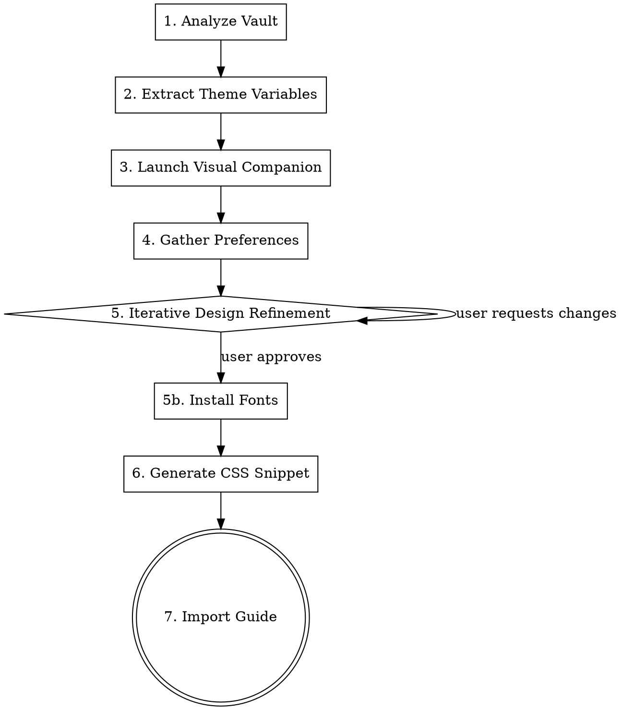

# Obsidian Theme Designer

Help users iteratively design Obsidian themes through visual browser previews, then generate an importable CSS snippet.

**Language:** Respond in the same language the user writes in. If they write in Chinese, reply in Chinese. If English, reply in English.

## Process Flow



## Step 1: Analyze Vault

Read the following files to understand current configuration:

- `.obsidian/appearance.json` — current theme, font size, light/dark mode
- `.obsidian/community-plugins.json` — installed plugins (check for Style Settings)
- `.obsidian/themes/` — downloaded community themes
- `.obsidian/snippets/` — existing custom CSS

Also scan the vault directory structure to understand note types (papers, journals, project management, etc.) so preview content reflects real usage.

## Step 2: Extract Theme CSS Variables

Use grep to extract key variables from each installed theme's `theme.css`:

| Category | Key Variables |
|----------|--------------|
| Background | `--background-primary`, `--background-secondary`, `--color-base-00` |
| Text | `--text-normal`, `--text-muted`, `--text-accent` |
| Accent | `--interactive-accent`, `--color-accent` |
| Font | `--font-text-theme`, `--font-interface-theme` |
| Headings | `--h1-color` ~ `--h6-color`, `--size-h1` ~ `--size-h6` |
| Typography | `line-height`, `--p-spacing`, `font-size` |

Extract values for both `.theme-light` and `.theme-dark`. Use an Explore agent for parallel extraction.

## Step 3: Launch Visual Companion

Use the superpowers brainstorming Visual Companion to show options in the browser.

**Windows:**
```bash
# run_in_background: true
scripts/start-server.sh --project-dir /path/to/vault
```
Then read `$STATE_DIR/server-info` for URL.

## Step 4: Gather Preferences

**Ask one question at a time with multiple choices.** Always provide a recommended default for users who are unsure ("if you're not sure, I recommend X because...").

### 4a. Reference Collection (ask first)

Before showing style options, ask the user:
> "Do you have any references you like — a screenshot, website, or app whose look you want to emulate? If not, no worries, I'll show you some options."

If the user provides a reference, analyze its visual characteristics (color temperature, font style, density, decoration level) and use them to guide subsequent choices. **If the reference clearly determines style direction and/or color preference, skip the corresponding sub-steps (4b, 4c) and go directly to the next undecided question.** Don't ask what the user has already shown you.

### 4b. Overall Style Direction

Show style directions **visually in the browser** with mini mockups, not just text labels. Each option should include a relatable analogy so non-designers can understand:

| Direction | Analogy for non-designers |
|-----------|--------------------------|
| Academic | "Like a LaTeX PDF or printed journal" |
| Minimal | "Like Apple Notes — clean, lots of white space" |
| Dark immersive | "Like a code editor at night — easy on the eyes" |
| Cyberpunk-dev | "Like VS Code or a hacker terminal" |
| Warm texture | "Like writing on real paper — soft, warm tones" |

If the user says "I don't know" or "any is fine", recommend the direction that best matches their vault content (e.g., academic for research-heavy vaults).

### 4c. Color Preference

Ask in plain terms, NOT hex codes:
> "Do you prefer cool tones (blue, teal, gray), warm tones (gold, orange, brown), or neutral (pure black & white)?"

Then show 2-3 color palette options **visually in the browser** with the chosen direction applied. Never ask users to pick hex values directly.

### 4d. Light/Dark Mode

- Dark only / Light only / Dual mode
- If dual mode: each mode can have a different accent color — show side-by-side in browser

### 4e. Font Selection with frontend-design

**REQUIRED:** Invoke the `frontend-design:frontend-design` skill to select distinctive font pairings.

**Critical:** NEVER present font names in the terminal as the primary selection method. Users don't know what "Playfair Display" looks like. Always show fonts **rendered in the browser** — users choose by visual appearance, not by name.

**Principles (from frontend-design):**
- NEVER use generic fonts (Arial, Inter, Roboto, system-ui defaults). Choose fonts with character.
- Each variant should use a DIFFERENT font combination to give real contrast.
- For CJK + Latin bilingual content, pair Latin fonts with matching CJK fonts (e.g., Playfair Display + Noto Serif SC, DM Sans + Noto Sans SC).
- Load fonts via Google Fonts `<link>` tags in previews. In the final CSS snippet, use locally-installable font names with fallbacks.

| Role | Examples |
|------|---------|
| Heading (display) | Playfair Display, DM Sans, Outfit, Libre Baskerville, Sora |
| Body (reading) | Source Serif 4, Literata, DM Sans, Outfit |
| CJK pairing | Noto Serif SC (with serif), Noto Sans SC (with sans-serif), LXGW WenKai |
| Code (monospace) | JetBrains Mono, IBM Plex Mono, Fira Code, Cascadia Code |

**Font showcase format:** Create a full-page HTML gallery (not content fragments) with 8-10 font cards. Each card should render the SAME sample content (including bilingual text AND numbers/data) in that card's font pairing. Include a Dark/Light mode toggle at the top. Users can click cards to select. The sample text must include:
- A Chinese heading
- A paragraph with mixed Chinese and English
- A line with numbers and data (e.g., "从 127.4s 降至 48.6s，优化率达 61.8%")
- A code snippet in the monospace font
- Tags

**Users may mix-and-match:** A user may like the Chinese rendering from one card and the English/number rendering from another. Support this — the final CSS can combine fonts from different cards (e.g., Spectral for Latin + Noto Serif SC for CJK).

## Step 5: Iterative Design Refinement

Show full simulation in browser (sidebar + editor), confirm step by step.

**Critical rules (MUST follow):**

- **Bilingual content**: Preview MUST include both Chinese and English text — headings, body, and quotes
- **Dual-mode side-by-side**: Use `<div class="split">` to show light/dark modes next to each other
- **Unified fonts**: Light and dark modes MUST use the same font family — only change colors
- **Real elements**: Preview must cover h1-h3 headings, body text, blockquotes, code blocks, inline code, tags, tables, and links
- **Use real content**: Read actual notes from the vault for preview text

Write a new file for each iteration (e.g., `design-v2.html`). Never overwrite previous versions.

## Step 5b: Install Fonts

After the user approves the font selection, download and install the chosen fonts to the system so Obsidian can use them.

**Download from Google Fonts CSS API:**
```bash
# 1. Fetch the CSS which contains direct .ttf URLs
CSS=$(curl -s "https://fonts.googleapis.com/css2?family=FontName:wght@400;600;700" \
  -H "User-Agent: Mozilla/5.0 (Windows NT 10.0; Win64; x64)")

# 2. Extract and download all .ttf URLs
echo "$CSS" | grep -o 'https://[^)]*' | while read url; do
  curl -sL "$url" -o "/tmp/fonts/$(basename "$url")"
done
```

**Install per platform:**

- **Windows:** Copy `.ttf` files to `$HOME/AppData/Local/Microsoft/Windows/Fonts/` and register in registry:
  ```bash
  FONTDIR="$HOME/AppData/Local/Microsoft/Windows/Fonts"
  cp /tmp/fonts/*.ttf "$FONTDIR/"
  # Register each font in HKCU registry
  for f in /tmp/fonts/*.ttf; do
    fname=$(basename "$f")
    powershell.exe -Command "New-ItemProperty -Path 'HKCU:\SOFTWARE\Microsoft\Windows NT\CurrentVersion\Fonts' -Name '$fname' -Value '$(cygpath -w "$FONTDIR")\\$fname' -PropertyType String -Force"
  done
  ```
- **macOS:** Copy to `~/Library/Fonts/`
- **Linux:** Copy to `~/.local/share/fonts/` then run `fc-cache -f`

**Important:** Remind user to restart Obsidian after font installation for changes to take effect.

## Step 6: Generate CSS Snippet

Once the user approves, generate a CSS snippet file to `.obsidian/snippets/`.

**CSS structure template:**

```css
/* Shared fonts */
body {
  --font-text-theme: '...';
  --font-interface-theme: '...';
}

/* Light mode */
.theme-light {
  --background-primary: ...;
  --text-accent: ...;
  --h1-color: ...; --h2-color: ...;
}

/* Dark mode */
.theme-dark {
  --background-primary: ...;
  --text-accent: ...;
  --h1-color: ...; --h2-color: ...;
}

/* Element-specific styles: headings, blockquotes, code, tags, etc. */
```

**Notes:**
- Use Obsidian's native CSS variable names for compatibility
- Use `!important` only when necessary to override a base theme
- Separate light/dark with `.theme-light` / `.theme-dark`

## Step 7: Import Guide

Tell the user how to enable the snippet:

1. Open Obsidian **Settings** (Ctrl+,)
2. Go to **Appearance**
3. Optionally switch CSS theme back to default (or keep a base theme)
4. Scroll to **CSS Snippets** at the bottom
5. Click the refresh button, then toggle the new snippet on
6. Use Obsidian's built-in light/dark mode toggle to see both color schemes

## Common Mistakes

| Mistake | Correct Approach |
|---------|-----------------|
| Asking user to pick hex colors or font names in terminal | Always show colors and fonts visually in browser — users choose by appearance |
| Using generic fonts (Inter, Arial, Roboto) | Invoke frontend-design skill for distinctive font pairings per variant |
| Showing text-only style options without visual examples | Every style direction must have a visual mockup in browser |
| No fallback when user says "I don't know" | Always provide a recommended default with reasoning |
| Not asking for references first | Ask if user has screenshots/websites they like before showing options |
| Preview in English only | Must include bilingual content (Chinese + English) in headings and body |
| Different fonts in light/dark modes | Font family must be unified; only change colors |
| Too many options at once | Show 3-4 options max per screen |
| Oversimplified preview | Must include headings, body, quotes, code, tables, tags |
| Generate CSS without preview | Always confirm design in browser before generating |
| Snippet in wrong directory | Must be placed in `.obsidian/snippets/` |
