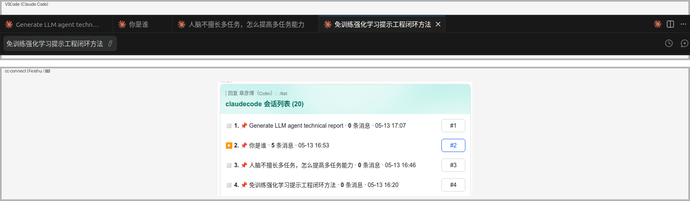

# 会话名称同步

[English](README.md) | **中文**

> 双向同步 Claude Code（CLI/VSCode）与 cc-connect（飞书）的会话名称。

---

## 概述

三个命名系统共享两个存储位置：

| 命名系统 | 存储位置 | 触发方式 |
|---|---|---|
| Claude Code CLI `/rename` | JSONL `custom-title` 条目 | CLI 中 `/rename <名称>` |
| VSCode 会话重命名 | JSONL `custom-title` 条目 | 侧边栏右键重命名 |
| cc-connect `/name`（飞书） | cc-connect JSON（`sessions[sN].name` + `session_names[UUID]`） | 飞书聊天中 `/name <名称>` |

保持这两个存储位置一致 = 三个命名系统统一。

**VSCode ↔ cc-connect 对应关系**（示例）：VSCode 中带名称的会话对应 cc-connect 飞书聊天中的选项卡，通过本技能保持同步：



---

## 功能特性

### 5 种模式

| 模式 | 功能 | 触发示例 |
|---|---|---|
| `set <名称>` | 同时在两个存储位置设置名称 | "给会话命名xxx"、`/session-name-sync set xxx` |
| `sync` | 比较两边名称，询问用户保留哪个，然后传播 | "同步会话名"、`/session-name-sync sync` |
| `list` | 并排显示所有会话在两个系统中的名称 | "列出会话名"、`/session-name-sync list` |
| `bind` | 从一侧复制名称到另一侧的空白/缺失位置 | "绑定会话名"、`/session-name-sync bind` |
| `register` | 将本地 VSCode 会话注册到 cc-connect，使飞书 `/list` 可见 | "注册会话"、`/session-name-sync register` |

### 关键设计决策

- **原子写入**：cc-connect JSON 使用 `os.replace()`（临时文件 + 重命名）
- **守护进程安全**：写入前停止 daemon，写入后重启
- **早期退出优化**：register 模式若无实质变更则跳过重启，保护飞书连接
- **双位置更新**：始终同时更新 `sessions[sN].name` 和 `session_names[agent_session_id]`
- **零硬编码路径**：所有路径通过 `resolve_paths.py` 动态推导——完全可移植

### 名称优先级

读取 Claude Code 标题时：`custom-title`（最高）> `ai-title` > 首条用户消息。

---

## 快速开始

1. 将技能安装到 Claude Code 技能目录：`.claude/skills/session-name-sync/`
2. 在 Claude Code 中触发：`/session-name-sync`
3. 选择模式：`set`、`sync`、`list`、`bind` 或 `register`
4. 按照交互提示操作

### 常用操作

```
# 给当前会话命名（同时更新 VSCode 和飞书）
/session-name-sync set 项目名称

# 同步 VSCode 和飞书之间的名称
/session-name-sync sync

# 列出所有会话在两个系统中的名称
/session-name-sync list

# 注册本地会话到飞书 /list
/session-name-sync register
```

---

## 脚本

操作代码在 `scripts/` 目录中，每个脚本通过 `resolve_paths.py` 动态推导路径：

| 脚本 | 功能 |
|---|---|
| `resolve_paths.py` | 推导项目目录 + cc-connect 文件路径 |
| `scan_sessions.py` | register 模式：扫描 + 对比 + 分类 |
| `register_apply.py` | register 模式：原子写入所有变更 |
| `write_custom_title.py` | 写 custom-title 到 JSONL |
| `read_title.py` | 读 Claude Code 会话标题 |
| `write_cc_name.py` | 写名称到 cc-connect JSON |
| `read_cc_name.py` | 读 cc-connect 中的名称 |
| `list_sessions.py` | list 模式：对比表 |

---

## 已知问题

### "重启后忽略旧消息" Bug（cc-connect 上游问题）

每次 cc-connect daemon 重启后，飞书机器人会忽略所有消息约 2-5 分钟（极端情况可达 ~10 分钟）。原因是 `core/dedup.go` 中的 `IsOldMessage()` 使用包级变量 `StartTime = time.Now()` 作为截断时间戳，而非实际 WebSocket 连接建立时间。

**临时方案**：`register_apply.py` 在原子写入中包含 `past_id_tracking=False`。重启后，预期约 5 分钟恢复窗口期飞书消息才能正常处理。

---

## 架构

```
┌─────────────────┐     ┌──────────────────┐
│  Claude Code    │     │   cc-connect     │
│  (CLI/VSCode)   │     │   (飞书)          │
│                 │     │                  │
│  JSONL 文件：   │     │  Session JSON：  │
│  custom-title   │◄───►│  sessions[sN]    │
│  ai-title       │     │  .name           │
│                 │     │  session_names    │
│                 │     │  [UUID]           │
└─────────────────┘     └──────────────────┘
         │                       │
         │    session-name-sync  │
         │    （本技能）          │
         └──────────────────────┘
```

---

## 许可

MIT

---

*已发布至 [ClawHub](https://clawhub.ai/skills/session-name-sync) 和 [anthropics/skills](https://github.com/anthropics/skills/pull/1131)*