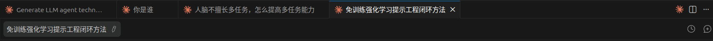

# Session Name Sync

Bidirectionally sync session names between Claude Code (CLI + VSCode) and cc-connect (飞书).

Three naming systems → two storage locations:
- **Claude Code CLI `/rename`** and **VSCode** → both read/write JSONL `custom-title` entry
- **cc-connect `/name`** (飞书) → writes own JSON file (`sessions[sN].name` + `session_names[UUID]`)

Keeping these two storage locations consistent = all three naming systems are unified.

**VSCode ↔ cc-connect correspondence**: Named sessions in VSCode correspond to tabs in cc-connect's Feishu chat:




## Modes

### 1. `set <name>` — Set name in BOTH storage locations simultaneously

Set a session name in the JSONL custom-title entry AND the cc-connect JSON file at the same time.

Trigger examples: "给会话命名xxx", "/session-name-sync set xxx", "把这个会话叫xxx"

Steps:
1. Determine current session UUID from `$CLAUDE_CODE_SESSION_ID` env var
2. Append `custom-title` entry to the session JSONL file (Claude Code side)
3. Update `sessions[sN].name` AND `session_names[UUID]` in cc-connect JSON (cc-connect side)
4. Report success with both locations confirmed

### 2. `sync` — Read both sides, report mismatches, ask user, then fix

Compare names from both storage locations. If they differ, ask which to keep, then propagate.

Trigger examples: "同步会话名", "/session-name-sync sync", "sync session names"

Steps:
1. Determine current session UUID
2. Read Claude Code title: grep for `custom-title` (highest priority), then `ai-title`, then first user message
3. Read cc-connect name: find session_key by agent_session_id, read `sessions[key].name`
4. Compare and report; if mismatch, ask user which name to use (or enter a new one)
5. Apply chosen name to both storage locations

### 3. `list` — Show all sessions with names from both systems side by side

Display a comparison table of all sessions across both naming systems.

Trigger examples: "列出会话名", "/session-name-sync list", "session name list"

Steps:
1. Scan all JSONL files in Claude Code project dir, extract custom-title/ai-title for each
2. Scan cc-connect session JSON, extract name for each session with agent_session_id
3. Join by agent_session_id = sessionId, build comparison table
4. Show sessions only in one system separately (local-only vs cc-connect-only)

### 4. `bind` — Sync current session name from one side to the other

For the current active session, copy the existing name from one side to the empty/missing side.

Trigger examples: "绑定会话名", "/session-name-sync bind"

Steps:
1. Determine current session UUID
2. Read name from both sides
3. If one side has a name and the other is empty, copy the name to the empty side
4. If both have names (and they match), report "already bound"
5. If both have names but differ, ask which to use (same as sync mode)

### 5. `register` — Register local VSCode sessions into cc-connect so they appear in Feishu `/list`

Add local Claude Code sessions (those with names) to the cc-connect JSON file, so they are visible when the user types `/list` in the Feishu chat.

Trigger examples: "注册会话", "register sessions", "/session-name-sync register", "注册本地会话"

**Optimized flow — avoid daemon restart unless necessary:**

1. **Scan first, decide later**: Run ONE Python script that scans Claude Code sessions AND reads cc-connect JSON, then outputs a summary of what needs doing:
   - New sessions to register (count + list)
   - Daemon-cleared names to restore (count + list)
   - Name mismatches (count + list)
   - History count drifts (count + list)
2. **Early exit**: If there are **no new sessions, no cleared names, and no name mismatches** → skip daemon stop/restart entirely. History count drifts are purely cosmetic (`/list` display numbers), not worth breaking the Feishu connection for. Report the drifts and let the user decide if they want a full restart to fix them.
3. **Only if action needed**: Stop daemon → make all changes in one atomic write (register + restore + mismatches + history + `past_id_tracking=False`) → restart daemon → warn user about 5-minute recovery delay.

**Only register sessions WITH names.** Unnamed sessions are skipped — showing unnamed entries in `/list` has no value.

**Important caveat**: Registered sessions appear in `/list`, but **cannot receive messages from Feishu** (no running process). If cc-connect daemon restarts, it may attempt to `session/load` these UUIDs (internal recovery), which could spawn new processes resuming the session state — but this behavior is not guaranteed.

**Never re-register**: Skip sessions whose `agent_session_id` already exists in cc-connect JSON.

**History count**: cc-connect `/list` shows message count from the `history` array length, not from JSONL files. Registered sessions need history populated with minimal entries (role + "." content) matching JSONL message count, so `/list` shows correct numbers. The actual conversation content is still served from JSONL via `--resume UUID`. These "." entries do NOT appear in model context — Claude Code only loads `type=human/assistant/user` messages from JSONL.

**Single-pass scan + compare script:**
```python
import json, os, glob
from datetime import datetime, timezone

cc_project_dir = os.path.expanduser('~/.claude/projects/-code-owner-xiaowangzi/')
cc_file = os.path.expanduser('~/.cc-connect/sessions/xiaowangzi_ba14278d.json')

# Scan Claude Code sessions
cc_sessions = {}
for f in glob.glob(os.path.join(cc_project_dir, '*.jsonl')):
    sid = os.path.basename(f).replace('.jsonl', '')
    title = None; msg_count = 0
    with open(f) as fh:
        for line in fh:
            try:
                d = json.loads(line)
                if d.get('type') == 'custom-title' and d.get('sessionId') == sid: title = d.get('customTitle')
                elif d.get('type') == 'ai-title' and d.get('sessionId') == sid and title is None: title = d.get('aiTitle')
                elif d.get('type') in ('human', 'user', 'assistant'): msg_count += 1
            except: pass
    if title and title != 'None': cc_sessions[sid] = {'title': title, 'msg_count': msg_count}

# Read cc-connect JSON
with open(cc_file) as f: data = json.load(f)
existing_aids = {sess.get('agent_session_id','') for sess in data['sessions'].values() if sess.get('agent_session_id','')}

# Classify changes needed
registered = []; restored = []; mismatches = []; history_drifts = []

# New sessions
for sid, info in cc_sessions.items():
    if sid not in existing_aids: registered.append((sid[:12], info['title'], info['msg_count']))

# Existing sessions: check names + history
for key, sess in data['sessions'].items():
    aid = sess.get('agent_session_id', '')
    if not aid: continue
    info = cc_sessions.get(aid)
    if not info: continue
    current_name = sess.get('name', '')
    if not current_name: restored.append((key, aid[:12], info['title']))
    elif current_name != info['title']: mismatches.append((key, aid[:12], current_name, info['title']))
    current_hlen = len(sess.get('history') or []) if sess.get('history') else 0
    if current_hlen != info['msg_count']: history_drifts.append((key, current_name or info['title'], current_hlen, info['msg_count']))

# Print summary
print(f"=== Register Summary ===")
print(f"New sessions to register: {len(registered)}")
for sid, title, count in registered: print(f"  {sid}... -> \"{title}\" ({count} msgs)")
print(f"Cleared names to restore: {len(restored)}")
for key, aid, title in restored: print(f"  {key}: {aid}... -> \"{title}\"")
print(f"Name mismatches: {len(mismatches)}")
for key, aid, cc_name, jsonl_name in mismatches: print(f"  {key}: cc=\"{cc_name}\" vs jsonl=\"{jsonl_name}\"")
print(f"History count drifts: {len(history_drifts)}")
for key, name, old, new in history_drifts: print(f"  {key} \"{name}\": {old} -> {new}")

needs_restart = len(registered) > 0 or len(restored) > 0 or len(mismatches) > 0
print(f"\nDaemon restart required: {needs_restart}")
if not needs_restart and history_drifts:
    print("NOTE: History drifts are cosmetic only (affects /list display numbers).")
    print("Skipping daemon restart — Feishu connection preserved.")
```

**If restart IS needed, apply all changes in one shot:**
```python
import json, os, glob
from datetime import datetime, timezone

# (same scan code as above, then mutate data dict)

def build_history(msg_count, timestamp):
    return [{'role': 'user' if i%2==0 else 'assistant', 'content': '.', 'timestamp': timestamp} for i in range(msg_count)]

cc_file = os.path.expanduser('~/.cc-connect/sessions/xiaowangzi_ba14278d.json')
with open(cc_file) as f: data = json.load(f)
# ... scan + classify (same as above) ...

# Apply: register new, restore cleared, resolve mismatches (AskUserQuestion first), update history, set past_id_tracking=False
# Then atomic write + restart daemon
```

## File Paths

| Item | Path / Derivation |
|------|-------------------|
| Claude Code project dir | `~/.claude/projects/$(echo $(pwd) | sed 's|/|-|g')/` — for this project: `~/.claude/projects/-code-owner-xiaowangzi/` |
| Current session UUID | `$CLAUDE_CODE_SESSION_ID` env var |
| Session JSONL | `~/.claude/projects/-code-owner-xiaowangzi/<sessionId>.jsonl` |
| cc-connect session file | Derive from config: project name from `~/.cc-connect/config.toml` + `SHA256(work_dir)[:8]`. For this project: `~/.cc-connect/sessions/xiaowangzi_ba14278d.json` |
| cc-connect config | `~/.cc-connect/config.toml` |

**cc-connect file path derivation:**
```bash
PROJECT_NAME=$(python3 -c "
import re
with open('~/.cc-connect/config.toml') as f:
    content = f.read()
m = re.search(r'\[\[projects\]\]\s*\nname\s*=\s*\"([^\"]+)\"', content)
print(m.group(1) if m else '')
")
WORK_DIR=$(python3 -c "
import re
with open('~/.cc-connect/config.toml') as f:
    content = f.read()
m = re.search(r'work_dir\s*=\s*\"([^\"]+)\"', content)
print(m.group(1) if m else '')
")
HASH=$(python3 -c "import hashlib; print(hashlib.sha256('${WORK_DIR}'.encode()).hexdigest()[:8])")
CC_CONNECT_FILE=~/.cc-connect/sessions/${PROJECT_NAME}_${HASH}.json
```

## Claude Code Side Operations

**Write custom-title (CLI + VSCode both read this):**
```bash
python3 -c "
import json, os
entry = json.dumps({
    'type': 'custom-title',
    'customTitle': '${NAME}',
    'sessionId': '${SESSION_UUID}'
})
jsonl_path = os.path.expanduser('~/.claude/projects/-code-owner-xiaowangzi/${SESSION_UUID}.jsonl')
with open(jsonl_path, 'a') as f:
    f.write(entry + '\n')
print('Claude Code title set: ${NAME}')
"
```

**Read Claude Code title (priority: custom-title > ai-title > firstPrompt):**
```bash
python3 -c "
import json, os, glob

jsonl_path = os.path.expanduser('~/.claude/projects/-code-owner-xiaowangzi/${SESSION_UUID}.jsonl')
title = None
with open(jsonl_path) as f:
    for line in f:
        try:
            d = json.loads(line)
            if d.get('type') == 'custom-title' and d.get('sessionId') == '${SESSION_UUID}':
                title = d.get('customTitle')
            elif d.get('type') == 'ai-title' and d.get('sessionId') == '${SESSION_UUID}':
                if title is None:
                    title = d.get('aiTitle')
        except: pass

if title:
    print(title)
else:
    print('(unnamed)')
"
```

## cc-connect Side Operations

**Write name (atomic, updates both locations):**
```python
import json, os

session_uuid = '${SESSION_UUID}'
name = '${NAME}'
cc_file = os.path.expanduser('~/.cc-connect/sessions/xiaowangzi_ba14278d.json')

with open(cc_file, 'r') as f:
    data = json.load(f)

# Find session key matching our UUID
session_key = None
for key, sess in data['sessions'].items():
    if sess.get('agent_session_id') == session_uuid:
        session_key = key
        break

if session_key:
    data['sessions'][session_key]['name'] = name
    data['session_names'][session_uuid] = name

    # Atomic write: temp file + os.replace()
    tmp = cc_file + '.tmp'
    with open(tmp, 'w') as f:
        json.dump(data, f, indent=2, ensure_ascii=False)
    os.replace(tmp, cc_file)
    print(f'cc-connect name set: {name} (session {session_key})')
else:
    print(f'WARNING: No cc-connect session found for UUID {session_uuid}')
    print('Name set only in Claude Code (JSONL)')
```

**Read cc-connect name:**
```python
import json, os

session_uuid = '${SESSION_UUID}'
cc_file = os.path.expanduser('~/.cc-connect/sessions/xiaowangzi_ba14278d.json')

with open(cc_file, 'r') as f:
    data = json.load(f)

# Find session by agent_session_id
for key, sess in data['sessions'].items():
    if sess.get('agent_session_id') == session_uuid:
        name = sess.get('name', '') or data.get('session_names', {}).get(session_uuid, '')
        print(name if name else '(unnamed)')
        break
else:
    print('(not in cc-connect)')
```

## List Mode: Full Comparison Table

```python
import json, os, glob, hashlib

# 1. Scan Claude Code sessions
cc_project_dir = os.path.expanduser('~/.claude/projects/-code-owner-xiaowangzi/')
cc_sessions = {}
for f in glob.glob(os.path.join(cc_project_dir, '*.jsonl')):
    sid = os.path.basename(f).replace('.jsonl', '')
    title = None
    with open(f) as fh:
        for line in fh:
            try:
                d = json.loads(line)
                if d.get('type') == 'custom-title' and d.get('sessionId') == sid:
                    title = d.get('customTitle')
                elif d.get('type') == 'ai-title' and d.get('sessionId') == sid:
                    if title is None:
                        title = d.get('aiTitle')
            except: pass
    cc_sessions[sid] = title or '(unnamed)'

# 2. Scan cc-connect sessions
cc_connect_file = os.path.expanduser('~/.cc-connect/sessions/xiaowangzi_ba14278d.json')
with open(cc_connect_file) as f:
    cc_data = json.load(f)

cc_connect_sessions = {}
unlinked_sessions = []  # sessions with no agent_session_id
for key, sess in cc_data['sessions'].items():
    aid = sess.get('agent_session_id', '')
    if aid:
        name = sess.get('name', '') or cc_data.get('session_names', {}).get(aid, '')
        cc_connect_sessions[aid] = (key, name or '(unnamed)')
    else:
        unlinked_sessions.append((key, sess.get('name', '(unnamed)')))

# 3. Build comparison table
all_uuids = set(cc_sessions.keys()) | set(cc_connect_sessions.keys())
print('| UUID | CLI/VSCode Title | cc-connect Name | Status |')
print('|------|-----------------|----------------|--------|')
for uuid in sorted(all_uuids):
    cc_title = cc_sessions.get(uuid, '—')
    cc_key, cc_name = cc_connect_sessions.get(uuid, ('—', '—'))
    if cc_title == cc_name and cc_title != '(unnamed)':
        status = 'SYNC'
    elif cc_title != '—' and cc_name != '—' and cc_title != cc_name:
        status = 'MISMATCH'
    elif cc_title == '(unnamed)' and cc_name == '(unnamed)':
        status = 'both unnamed'
    else:
        status = 'partial'
    print(f'| {uuid[:8]}... | {cc_title} | {cc_name} | {status} |')

# 4. Show unlinked cc-connect sessions
if unlinked_sessions:
    print('\ncc-connect only (no Claude Code session):')
    for key, name in unlinked_sessions:
        print(f'  {key}: {name}')

# 5. Show local-only Claude Code sessions
for uuid in cc_sessions:
    if uuid not in cc_connect_sessions:
        print(f'\nClaude Code only: {uuid[:8]}... = {cc_sessions[uuid]}')
```

## Daemon Overwrite Problem

**cc-connect daemon periodically writes its internal state to the session JSON file**, overwriting any external modifications. This means:
- Names set externally get cleared
- Registered sessions can be deleted entirely

**Solution**: Always **stop cc-connect daemon before writing to its JSON file**, then restart it after. The daemon reads the JSON on startup, so our changes persist in its internal state.

**One-shot kill + restart** (minimize round trips):
```bash
# Stop daemon — aggressive single pass
kill $(pgrep -f 'cc-connect') 2>/dev/null; sleep 1; kill -9 $(pgrep -f 'cc-connect') 2>/dev/null; rm -f ~/.cc-connect/.config.toml.lock; sleep 1

# ... make changes to JSON file (include past_id_tracking=False in the same write) ...

# Restart daemon
nohup cc-connect --force > /tmp/cc-connect.log 2>&1 & disown; sleep 3

# ⚠️ WARN USER: Feishu messages will be ignored for ~5 minutes after restart (past_id_tracking bug).
# New messages sent after that window will be processed normally.
```

**If you write while the daemon is running**: Changes will be overwritten within seconds to minutes. Always stop first.

## "Ignoring Old Message" Bug

cc-connect has a bug where after every daemon restart, it marks **all** Feishu WebSocket messages as "old" and ignores them for approximately **2-5 minutes** — even messages sent after the restart. This is caused by the `PastIDTracking` mechanism using a stale timestamp as cutoff instead of the actual daemon start time.

**Workaround**: Set `past_id_tracking = False` in the session JSON file **as part of the same atomic write** that makes other changes (don't do it separately). This reduces but does not fully prevent the bug — the daemon may overwrite it back to `True` after its first state save.

**Post-restart behavior**: After restart, warn the user:
- Feishu messages sent in the first ~5 minutes will be **silently dropped** (no error shown to sender)
- After that window, new messages are processed normally
- The delay varies (2-5 min typical, up to ~10 min in edge cases) depending on how stale the cutoff timestamp is

**Root fix needed**: This is a cc-connect bug that should be reported upstream. The `PastIDTracking` logic incorrectly uses the session file's timestamp as the cutoff, rather than the actual daemon start time.

## Edge Cases

| Scenario | Action |
|----------|--------|
| cc-connect session has empty agent_session_id (e.g. s1 "default") | Cannot sync to Claude Code — label as "cc-connect only" in list |
| Claude Code session not in cc-connect | Register it via `register` mode, or name set only in JSONL with warning |
| Both names empty | Suggest setting a name |
| Both names differ | Ask user which to keep or enter a new name — never silently overwrite |
| cc-connect daemon concurrently writes JSON | **STOP daemon before writing, restart after** — atomic writes alone don't prevent overwrite |
| Daemon cleared a name after external write | Re-apply via stop→write→restart cycle |
| Existing custom-title entry in JSONL | New appended entry takes priority (VSCode reads last custom-title) |
| Session JSONL title is literal string "None" | Skip — not a meaningful title |

## Important Rules

1. **STOP cc-connect daemon before writing its JSON file, restart after** — the daemon overwrites external changes
2. **Early exit: skip daemon restart if no substantive changes** — no new registrations, no cleared names, no mismatches → just report history drifts as cosmetic and preserve Feishu connection
3. When writing cc-connect JSON, always update BOTH `sessions[sN].name` AND `session_names[agent_session_id]` in one atomic operation — never update only one
4. Only add to `session_names` when `agent_session_id` is non-empty — skip for sessions like s1
5. Use `os.replace()` (atomic on same filesystem) for cc-connect JSON writes, never write directly to target file
6. **Include `past_id_tracking=False` in the same atomic write** — don't do it as a separate step
7. When reading Claude Code titles, always check `custom-title` first (highest priority), then `ai-title`
8. For `set` and `bind` modes on the current session, use `$CLAUDE_CODE_SESSION_ID` as the UUID source
9. For `list` mode, scan all sessions (not just current)
10. Always report what was done to both storage locations after any write operation
11. Never silently overwrite a name — if both sides have different names, always ask the user first
12. **After daemon restart, warn user**: Feishu messages will be silently dropped for ~5 minutes (past_id_tracking bug)