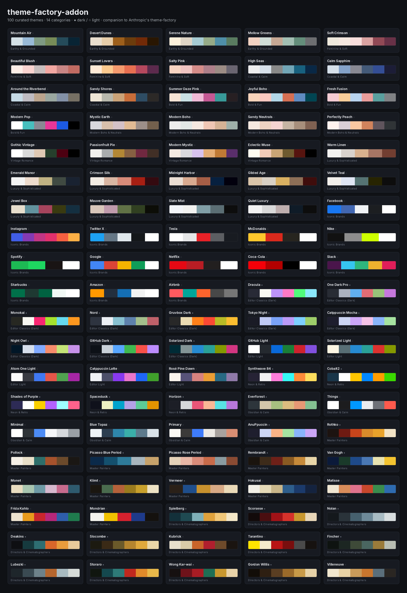
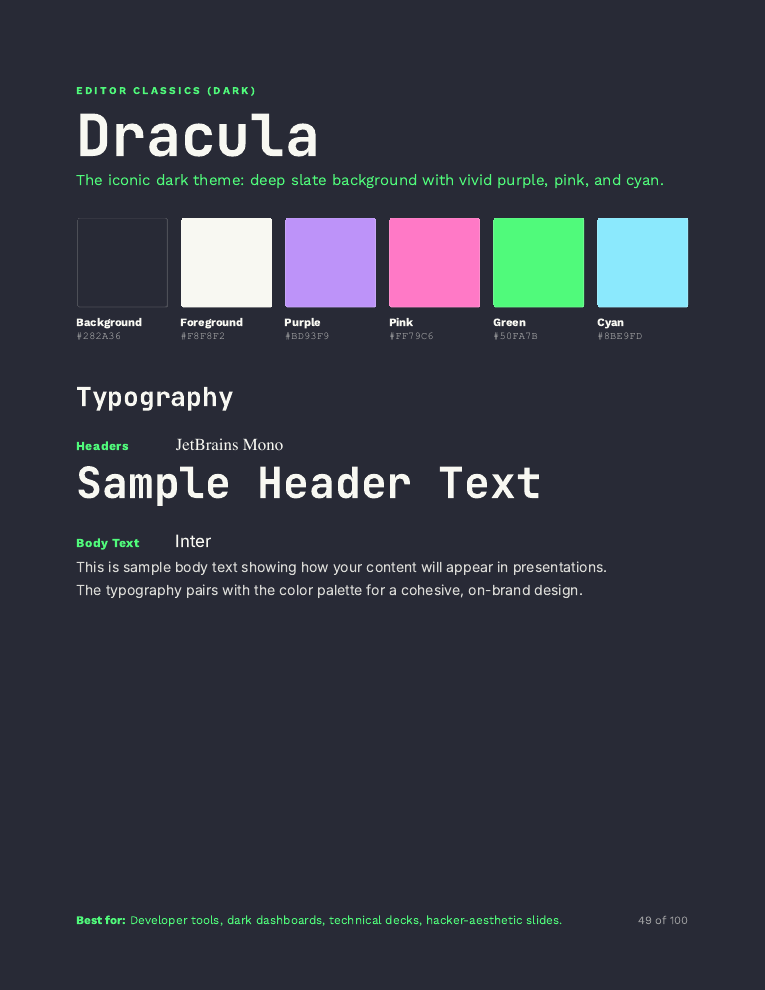
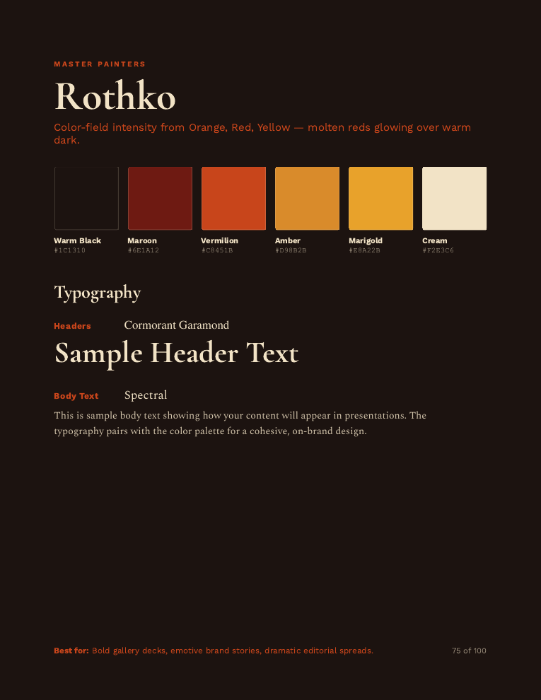
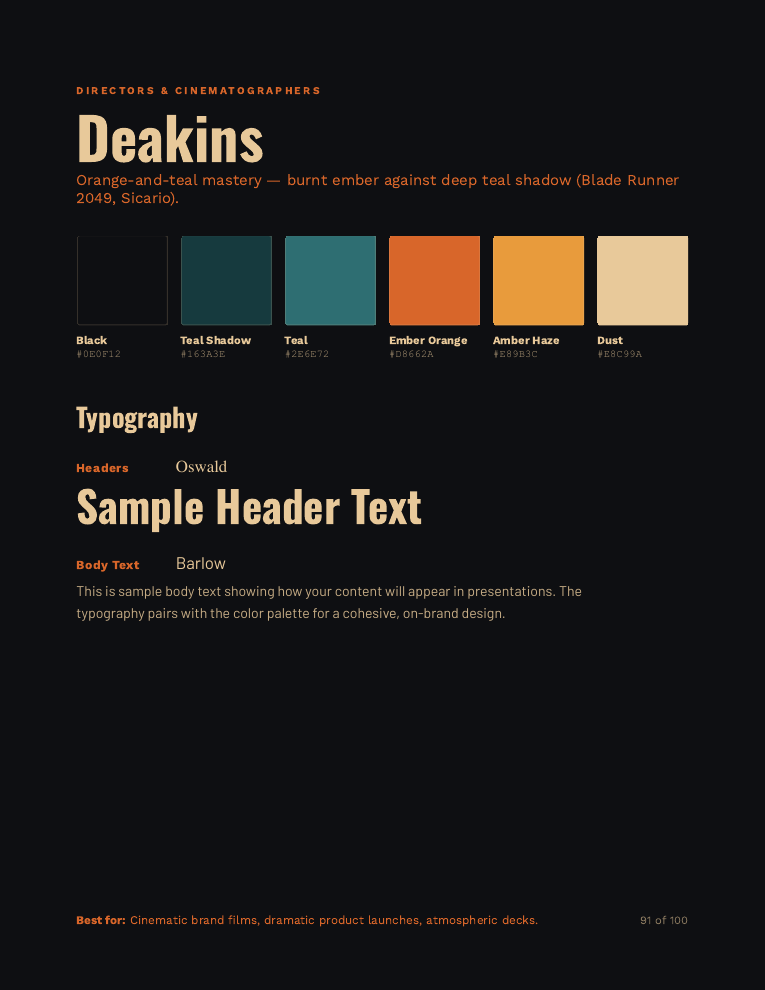

# Theme Factory Add-On

[](./LICENSE)


[](https://agentskills.io)

An expansion pack for Anthropic's [`theme-factory`](https://github.com/anthropics/skills/tree/main/theme-factory) skill. Adds **100 curated color/font themes** across **14 categories**, in the exact same file format as the built-in themes, so they apply through theme-factory's normal workflow.

This is a *companion* skill — it doesn't modify or replace theme-factory. Use both together as one combined theme catalogue.

## Preview

All 100 themes at a glance (● dark · ○ light):



Each theme renders as its own showcase page in [`theme-showcase.pdf`](./theme-showcase.pdf) — sample pages:

| Editor — **Dracula** | Painter — **Rothko** | Director — **Deakins** |
|:---:|:---:|:---:|
|  |  |  |

## Contents

| | |
|---|---|
| `SKILL.md` | Skill definition + usage instructions |
| `themes/` | 100 theme files (`<name>.md`), one per theme |
| `theme-showcase.pdf` | Visual catalogue — one page per theme, rendered in each theme's real fonts |
| `theme-showcase.html` | Intermediate the PDF is printed from |
| `generate_themes.py` | Source-of-truth generator — edit the table, rerun to rebuild `themes/` |
| `generate_showcase.py` | Builds `theme-showcase.html` from the same data |

## Categories (100 themes)

- **Earthy & Grounded** (4) — Mountain Air, Desert Dunes, Serene Nature, Mellow Greens
- **Feminine & Soft** (4) — Soft Crimson, Beautiful Blush, Sunset Lovers, Salty Pink
- **Coastal & Calm** (4) — High Seas, Calm Sapphire, Around the Riverbend, Sandy Shores
- **Bold & Fun** (4) — Summer Daze Pink, Joyful Boho, Fresh Fusion, Modern Pop
- **Modern Boho & Neutrals** (4) — Mystic Earth, Modern Boho, Sandy Neutrals, Perfectly Peach
- **Vintage Romance** (4) — Gothic Vintage, Passionfruit Pie, Modern Mystic, Eclectic Muse
- **Luxury & Sophisticated** (10) — Warm Linen, Emerald Manor, Crimson Silk, Midnight Harbor, Gilded Age, Velvet Teal, Jewel Box, Mauve Garden, Slate Mist, Quiet Luxury
- **Iconic Brands** (14) — Facebook, Instagram, Twitter X, Tesla, McDonald's, Nike, Spotify, Google, Netflix, Coca-Cola, Slack, Starbucks, Amazon, Airbnb
- **Editor Classics (Dark)** (10) — Dracula, One Dark Pro, Monokai, Nord, Gruvbox Dark, Tokyo Night, Catppuccin Mocha, Night Owl, GitHub Dark, Solarized Dark
- **Editor Light** (5) — GitHub Light, Solarized Light, Atom One Light, Catppuccin Latte, Rosé Pine Dawn
- **Neon & Retro** (5) — Synthwave 84, Cobalt2, Shades of Purple, Spaceduck, Horizon
- **Obsidian & Calm** (6) — Everforest, Things, Minimal, Blue Topaz, Primary, AnuPpuccin
- **Master Painters** (13) — Rothko, Pollock, Picasso Blue Period, Picasso Rose Period, Rembrandt, Van Gogh, Monet, Klimt, Vermeer, Hokusai, Matisse, Frida Kahlo, Mondrian
- **Directors & Cinematographers** (13) — Spielberg, Scorsese, Nolan, Deakins, Slocombe, Kubrick, Tarantino, Fincher, Lubezki, Storaro, Wong Kar-wai, Gordon Willis, Villeneuve

> **Iconic Brands** and the editor/terminal categories reproduce publicly documented colors as a design reference only — all names/colors belong to their respective owners. The Obsidian-native themes (Things, Minimal, Blue Topaz, Primary, AnuPpuccin) are approximations; the rest use official specs. **Master Painters** and **Directors & Cinematographers** palettes are derived from each artist's iconic work — evocations, not reproductions. Themes are tagged `Mode: light`/`Mode: dark`.

## Install

Copy this folder into your active agent's skills directory (next to `theme-factory`), e.g.:

```bash
cp -R Theme-Factory-AddOn ~/.claude/skills/theme-factory-addon
```

Then ask the agent for "more themes", a "luxury theme", a "boho theme", etc., or invoke `theme-factory-addon` by name.

## Regenerate

```bash
python3 generate_themes.py      # rewrites themes/ from the table in the script
python3 generate_showcase.py    # rewrites theme-showcase.html from the same table
# print the HTML to PDF with headless Chrome:
"/Applications/Google Chrome.app/Contents/MacOS/Google Chrome" --headless=new \
  --disable-gpu --no-pdf-header-footer --run-all-compositor-stages-before-draw \
  --virtual-time-budget=25000 --print-to-pdf=theme-showcase.pdf \
  "file://$PWD/theme-showcase.html"
```

> Note: **Sunset Lovers** was re-tinted into a true golden-hour gradient because the
> source published it identical to **Beautiful Blush**. Every other palette is lifted verbatim.

## Sources

Palettes lifted from [The Brand Alchemists – 24 Aesthetic Colour Palettes](https://thebrandalchemists.com/blogs/news/holistic-brand-color-palettes-2025) and [Steph Corrigan Design – 10 Sophisticated Colour Palettes](https://stephcorrigan.com/sophisticated-color-palettes/). Brand colors cross-checked against usbrandcolors.com, brandpalettes.com, and encycolorpedia. Editor/terminal palettes use each project's published spec. Master Painters and Directors & Cinematographers palettes are derived from each artist's iconic work. Names, color roles, font pairings, and usage notes authored for this pack.

## License & attribution

Licensed under the **Apache License 2.0** (see [`LICENSE`](./LICENSE)). The same license Anthropic uses for community skills.

Third-party names and marks (brands in *Iconic Brands*, theme names in the editor/terminal categories, and artist/filmmaker names in *Master Painters* and *Directors & Cinematographers*) are the property of their respective owners and are used here only as a **design reference** — no affiliation or endorsement is implied. See [`NOTICE`](./NOTICE) for the full attribution statement.
