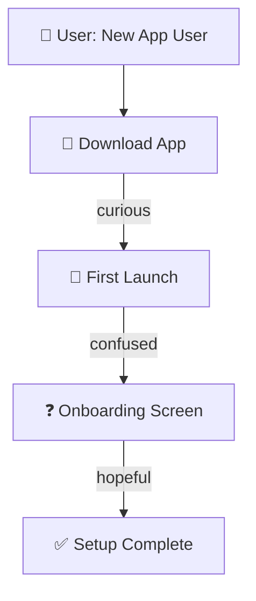

# UX Journey Mapper

> Create detailed, versioned UX journey maps with multi-format export (Mermaid, JSON, HTML, Markdown).

[](https://opensource.org/licenses/MIT)
[](https://www.npmjs.com/package/@fused-gaming/ux-journey-mapper)

## Features

- 📊 **Multi-format Export**: Mermaid diagrams, JSON, HTML, Markdown
- 🔄 **Git-Backed Versioning**: Semantic versioning with automatic diffs and changelogs
- 💭 **Emotional Arc Mapping**: Track user emotions across journey stages
- 🎯 **Pain Point & Opportunity Tracking**: Identify friction and improvement areas
- 🔗 **System Integration Mapping**: Show how your product responds at each touchpoint
- 📱 **Multi-channel Support**: web, mobile, email, in-app, phone, etc.

## Installation

```bash
npm install @fused-gaming/ux-journey-mapper
```

Or with yarn:

```bash
yarn add @fused-gaming/ux-journey-mapper
```

## Quick Start

### CLI Usage

```bash
# Create a new journey
journey create --persona "New User" --stage awareness

# Export to formats
journey export --format mermaid --output ./journeys/
journey export --format html --output ./journeys/
journey export --format json --output ./journeys/

# View version history
journey log
```

### Programmatic Usage

```typescript
import { JourneyMapper } from '@fused-gaming/ux-journey-mapper';

const mapper = new JourneyMapper();

const journey = mapper.create({
  persona: 'Enterprise Admin',
  stage: 'decision',
  touchpoints: [
    {
      name: 'Demo Request',
      channel: 'web',
      emotion: 'interested',
      system: 'Contact Form'
    },
    {
      name: 'Sales Call',
      channel: 'phone',
      emotion: 'cautious',
      system: 'CRM Integration'
    }
  ],
  painPoints: [
    'Unclear pricing model',
    'Long sales cycle'
  ],
  opportunities: [
    'Offer tiered pricing transparency',
    'Provide implementation timeline'
  ]
});

// Export to multiple formats
await journey.export('mermaid');
await journey.export('html');
await journey.export('json');

// Get journey data
const data = journey.toJSON();
console.log(data);
```

## Input Schema

### JourneyConfig

```typescript
interface JourneyConfig {
  persona: string;           // User persona name
  stage: JourneyStage;       // 'awareness' | 'consideration' | 'decision' | 'retention' | 'advocacy'
  touchpoints: Touchpoint[]; // User interaction points
  painPoints: string[];      // Areas of friction
  opportunities: string[];   // Improvement areas
  metadata?: {
    project?: string;
    createdBy?: string;
    tags?: string[];
  };
}

interface Touchpoint {
  name: string;              // Touchpoint name
  channel: Channel;          // 'web' | 'mobile' | 'email' | 'in-app' | 'phone' | 'social'
  emotion: Emotion;          // User emotional state
  system: string;            // System/tool involved
  duration?: string;         // Estimated time at this touchpoint
  notes?: string;           // Additional context
}

type JourneyStage = 'awareness' | 'consideration' | 'decision' | 'retention' | 'advocacy';
type Channel = 'web' | 'mobile' | 'email' | 'in-app' | 'phone' | 'social' | 'in-person';
type Emotion = 'confused' | 'curious' | 'frustrated' | 'delighted' | 'confident' | 'anxious' | 'hopeful';
```

## Output Formats

### Mermaid Diagram

Interactive swimlane diagram showing:
- User actions (horizontal)
- System responses (vertical)
- Emotional state transitions
- Touchpoint interactions



### JSON Export

```json
{
  "version": "1.0.0",
  "persona": "First-time Mobile User",
  "stage": "awareness",
  "createdAt": "2026-03-26T10:00:00Z",
  "touchpoints": [...],
  "painPoints": [...],
  "opportunities": [...]
}
```

### HTML Export

Interactive web view with:
- Timeline visualization
- Hover tooltips
- Responsive design
- Print-friendly styling
- Shareable link generation

### Markdown Export

Git-friendly format suitable for:
- Version control (Git)
- Documentation
- Pull request reviews
- Stakeholder sharing

## Versioning

Journeys automatically track versions:

```bash
# View changelog
journey log my-journey

# Output:
# v1.0.0 - Initial journey map
# v1.1.0 - Added mobile channel touchpoints
# v1.2.0 - Updated pain points based on user research
```

## Best Practices

1. **One journey per session**: Focus on a single persona and stage
2. **Include emotions**: Emotional arcs reveal opportunities
3. **Map system interactions**: Show how your product responds
4. **Version iterations**: Track changes over time
5. **Share exports**: Use HTML/Markdown for stakeholder feedback
6. **Review diffs**: Compare versions to track evolution

## Examples

### E-commerce Customer Journey

```typescript
const ecommerce = mapper.create({
  persona: 'Price-Conscious Shopper',
  stage: 'consideration',
  touchpoints: [
    { name: 'Google Search', channel: 'web', emotion: 'curious', system: 'Search Engine' },
    { name: 'Product Comparison', channel: 'web', emotion: 'analytical', system: 'Product Page' },
    { name: 'Price Review', channel: 'mobile', emotion: 'anxious', system: 'Mobile App' },
    { name: 'Coupon Search', channel: 'web', emotion: 'hopeful', system: 'Marketing Email' }
  ],
  painPoints: [
    'Shipping costs unclear until checkout',
    'No price comparison between alternatives'
  ],
  opportunities: [
    'Show shipping cost upfront',
    'Display competitor prices',
    'Offer loyalty discount'
  ]
});
```

### SaaS Onboarding Journey

```typescript
const saas = mapper.create({
  persona: 'Enterprise IT Manager',
  stage: 'decision',
  touchpoints: [
    { name: 'Demo Request', channel: 'web', emotion: 'interested', system: 'Contact Form' },
    { name: 'Product Demo', channel: 'in-person', emotion: 'cautious', system: 'Sales Team' },
    { name: 'Security Review', channel: 'email', emotion: 'skeptical', system: 'Legal' },
    { name: 'Contract Negotiation', channel: 'phone', emotion: 'cautious', system: 'Sales' }
  ],
  painPoints: [
    'Long sales cycle (3+ months)',
    'SOC2 documentation requirements',
    'Custom pricing discussion'
  ],
  opportunities: [
    'Streamlined security review process',
    'Self-serve pricing calculator',
    'Automated contract generation'
  ]
});
```

## API Reference

See the SKILL.md file for detailed API documentation.

## Contributing

Contributions welcome! Open an issue or pull request.

## License

MIT - See [LICENSE.txt](./LICENSE.txt) file.

## Attribution

Created by [Fused Gaming](https://github.com/fused-gaming)

## Support

- [GitHub Issues](https://github.com/fused-gaming/skills/issues)
- [Discussions](https://github.com/fused-gaming/skills/discussions)
