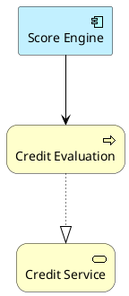

# ArchiMate en TOGAF ADM

## Propósito

Este documento explica cómo usar ArchiMate (Architecture Modeling Language) dentro del marco TOGAF ADM para crear diagramas de arquitectura empresarial estandarizados y comprensibles.

---

## ¿Qué es ArchiMate?

**ArchiMate** es un lenguaje de modelado de arquitectura empresarial desarrollado por The Open Group (mismo grupo que TOGAF). Es el estándar de facto para visualizar, analizar y comunicar arquitecturas empresariales.

### ¿Por qué usar ArchiMate con TOGAF?

1. **Mismo ecosistema:** The Open Group mantiene ambos (TOGAF y ArchiMate)
2. **Estandarización:** Notación visual consistente y reconocida mundialmente
3. **Capas claras:** Separa Business, Application, Technology layers
4. **Relationships precisas:** Define tipos específicos de relaciones entre elementos
5. **Interoperabilidad:** Compatible con herramientas EA como Archi, Sparx EA, BiZZdesign

---

## Capas de ArchiMate

ArchiMate organiza la arquitectura en capas (layers) que mapean perfectamente con las fases TOGAF ADM:

### 1. Strategy Layer (Estrategia)

**Elementos:**
- **Resource:** Activo o capacidad que la organización posee o controla
- **Capability:** Habilidad que la organización posee o puede adquirir
- **Course of Action:** Enfoque o plan para configurar capacidades y recursos
- **Value Stream:** Secuencia de actividades que crean valor

**Uso en TOGAF:**
- **Phase Preliminary:** Definir principios estratégicos
- **Phase A (Architecture Vision):** Capability models, Value streams

**Ejemplo:**
```
Capability: "Credit Scoring"
Value Stream: "Credit Origination"
Resource: "ML Models"
```

---

### 2. Business Layer (Negocio)

**Elementos:**
- **Business Actor:** Entidad que puede realizar behavior (humano, bot, organización)
- **Business Role:** Responsabilidad asignada a un actor
- **Business Process:** Secuencia de behaviors que produce resultado
- **Business Function:** Agrupación de behavior basada en skills/recursos
- **Business Service:** Servicio que ofrece valor a clientes
- **Business Object:** Concepto del dominio de negocio
- **Business Event:** Algo que ocurre e influye el behavior
- **Business Capability:** (Strategy layer pero se usa mucho aquí)

**Uso en TOGAF:**
- **Phase B (Business Architecture):** Procesos, roles, capacidades, servicios de negocio

**Ejemplo:**
```
Business Actor: "Credit Analyst"
Business Role: "Risk Evaluator"
Business Process: "Credit Evaluation"
Business Service: "Credit Scoring Service"
Business Object: "Credit Application"
```

---

### 3. Application Layer (Aplicaciones)

**Elementos:**
- **Application Component:** Sistema, módulo o aplicación que provee funcionalidad
- **Application Interface:** Punto de acceso donde la aplicación provee servicios
- **Application Service:** Servicio automatizado que ofrece la aplicación
- **Application Function:** Behavior automatizado que realiza la aplicación
- **Data Object:** Datos procesados/producidos por la aplicación

**Uso en TOGAF:**
- **Phase C (Information Systems - Application Architecture):** Sistemas, APIs, servicios

**Ejemplo:**
```
Application Component: "Score Engine"
Application Interface: "Score API"
Application Service: "Credit Scoring Service"
Data Object: "Credit Score"
```

---

### 4. Technology Layer (Tecnología)

**Elementos:**
- **Node:** Recurso computacional donde se ejecutan artifacts (servidor, contenedor, VM)
- **Device:** Hardware físico (servidor físico, smartphone, IoT device)
- **System Software:** Software de infraestructura (OS, DBMS, middleware)
- **Technology Service:** Servicio de infraestructura (compute, storage, network)
- **Technology Interface:** Punto de acceso a servicios de tecnología
- **Technology Function:** Behavior de la infraestructura
- **Artifact:** Pieza física de información (código, binario, config file)
- **Path:** Enlace de comunicación entre nodos
- **Communication Network:** Red de comunicación

**Uso en TOGAF:**
- **Phase D (Technology Architecture):** Infraestructura, plataformas, deployment

**Ejemplo:**
```
Node: "ECS Fargate Container"
Device: "AWS EC2 Instance"
System Software: "PostgreSQL 14"
Technology Service: "AWS RDS"
Artifact: "score-engine.jar"
```

---

### 5. Physical Layer (Físico)

**Elementos:**
- **Equipment:** Hardware físico
- **Facility:** Ubicación física (data center, oficina)
- **Distribution Network:** Red física de distribución
- **Material:** Materiales físicos

**Uso en TOGAF:**
- **Phase D (Technology Architecture):** Cuando se modela infraestructura física (data centers, edge locations)

---

### 6. Motivation Layer (Motivación)

**Elementos:**
- **Stakeholder:** Persona, equipo u organización con interés en el sistema
- **Driver:** Factor externo o interno que motiva cambio
- **Assessment:** Resultado del análisis de algún driver
- **Goal:** Estado final de alto nivel que la organización desea alcanzar
- **Outcome:** Resultado observable de un goal
- **Principle:** Declaración normativa de propiedad que debe cumplirse
- **Requirement:** Declaración de necesidad que debe cumplirse
- **Constraint:** Restricción en la forma de satisfacer requirements
- **Meaning:** Conocimiento o expertise en el contexto de negocio
- **Value:** Importancia relativa, utilidad o valor de algo

**Uso en TOGAF:**
- **Phase Preliminary:** Stakeholders, Principles
- **Phase A (Architecture Vision):** Drivers, Goals, Requirements
- **Requirements Management:** Requirements traceability

**Ejemplo:**
```
Stakeholder: "CFO"
Driver: "Regulatory Compliance (Basel III)"
Goal: "Reduce credit risk by 30%"
Requirement: "Credit scoring must complete in < 1 second"
Constraint: "Must use on-premise infrastructure (data residency)"
Principle: "Security First"
```

---

### 7. Implementation & Migration Layer (Implementación y Migración)

**Elementos:**
- **Work Package:** Serie de acciones para lograr objetivos específicos
- **Deliverable:** Output precisamente definido de un work package
- **Implementation Event:** Cambio de estado en la implementación
- **Plateau:** Estado relativamente estable de la arquitectura durante tiempo definido

**Uso en TOGAF:**
- **Phase E (Opportunities and Solutions):** Work packages
- **Phase F (Migration Planning):** Roadmap, Plateaus, Deliverables

**Ejemplo:**
```
Work Package: "Release 1: Foundation"
Deliverable: "AWS Infrastructure as Code"
Plateau: "Baseline Architecture (AS-IS)"
Plateau: "Target Architecture (TO-BE)"
Implementation Event: "Go-Live Production"
```

---

## Relationships (Relaciones) en ArchiMate

ArchiMate define relaciones específicas entre elementos:

### Structural Relationships (Relaciones Estructurales)

1. **Composition (Composición):**
   - Relación todo-parte donde la parte no puede existir sin el todo
   - Ejemplo: `Business Process` compuesto de `Business Function`
   - Notación: Línea con diamante relleno

2. **Aggregation (Agregación):**
   - Relación todo-parte donde la parte puede existir independientemente
   - Ejemplo: `Business Actor` agregado en `Location`
   - Notación: Línea con diamante vacío

3. **Assignment (Asignación):**
   - Asigna responsabilidad de behavior a un elemento activo
   - Ejemplo: `Business Role` asignado a `Business Process`
   - Notación: Línea con círculo relleno

4. **Realization (Realización):**
   - Un elemento realiza/implementa otro más abstracto
   - Ejemplo: `Application Service` realiza `Business Service`
   - Notación: Línea punteada con triángulo vacío

### Dependency Relationships (Relaciones de Dependencia)

5. **Serving (Servicio):**
   - Un elemento provee servicios a otro
   - Ejemplo: `Application Component` sirve `Business Process`
   - Notación: Línea con flecha vacía

6. **Access (Acceso):**
   - Un elemento accede/lee/escribe otro (generalmente data objects)
   - Ejemplo: `Application Component` accede `Data Object`
   - Notación: Línea punteada con flecha vacía
   - Modifiers: Read (R), Write (W), Read-Write (RW)

7. **Influence (Influencia):**
   - Un elemento influye en otro (típicamente en Motivation layer)
   - Ejemplo: `Driver` influye `Goal`
   - Notación: Línea punteada con flecha vacía

8. **Association (Asociación):**
   - Relación no especificada
   - Ejemplo: Relación genérica entre elementos
   - Notación: Línea simple

### Dynamic Relationships (Relaciones Dinámicas)

9. **Triggering (Disparo):**
   - Un elemento temporal dispara otro
   - Ejemplo: `Business Event` dispara `Business Process`
   - Notación: Línea con flecha rellena

10. **Flow (Flujo):**
    - Transferencia de información, valor, material
    - Ejemplo: Flujo de `Business Object` entre procesos
    - Notación: Línea punteada con flecha rellena

### Other Relationships

11. **Specialization (Especialización):**
    - Relación de herencia (generalización/especialización)
    - Ejemplo: `Mobile App` especializa `Application Component`
    - Notación: Línea con triángulo vacío

12. **Junction (Unión):**
    - Operador lógico AND/OR para combinar relaciones
    - Notación: Círculo negro (AND) o círculo blanco (OR)

---

## Mapeo TOGAF ADM Phases → ArchiMate Layers

| TOGAF Phase | ArchiMate Layers a Usar | Elementos Clave |
|-------------|------------------------|-----------------|
| **Preliminary** | Motivation | Stakeholders, Principles, Drivers |
| **Phase A: Architecture Vision** | Strategy, Motivation, Business (high-level) | Capabilities, Value Streams, Goals, Requirements, Business Services |
| **Phase B: Business Architecture** | Business, Strategy | Business Processes, Actors, Roles, Services, Capabilities, Value Streams |
| **Phase C: Data Architecture** | Application (Data Objects) | Data Objects, Application Components, Access relationships |
| **Phase C: Application Architecture** | Application | Application Components, Services, Interfaces |
| **Phase D: Technology Architecture** | Technology, Physical | Nodes, Devices, System Software, Technology Services, Artifacts |
| **Phase E: Opportunities and Solutions** | Implementation & Migration | Work Packages, Deliverables |
| **Phase F: Migration Planning** | Implementation & Migration | Plateaus, Work Packages, Implementation Events |
| **Phase G: Implementation Governance** | Implementation & Migration | Work Packages, Deliverables |
| **Requirements Management** | Motivation | Requirements, Constraints, Goals |

---

## Viewpoints en ArchiMate

ArchiMate define **viewpoints** (puntos de vista) predefinidos para diferentes stakeholders:

### Viewpoints Comunes en TOGAF

1. **Strategy Viewpoint:**
   - Audiencia: Executives, estrategas
   - Capas: Strategy, Motivation
   - Elementos: Capabilities, Value Streams, Goals, Drivers
   - **Uso TOGAF:** Phase A (Vision)

2. **Business Process Cooperation Viewpoint:**
   - Audiencia: Process owners, business analysts
   - Capa: Business
   - Elementos: Business Processes, Actors, Roles, Services, Interactions
   - **Uso TOGAF:** Phase B

3. **Application Cooperation Viewpoint:**
   - Audiencia: Architects, developers
   - Capa: Application
   - Elementos: Application Components, Interfaces, Data Objects
   - **Uso TOGAF:** Phase C

4. **Technology Viewpoint:**
   - Audiencia: Infrastructure architects, ops
   - Capa: Technology
   - Elementos: Nodes, Devices, System Software, Networks
   - **Uso TOGAF:** Phase D

5. **Layered Viewpoint:**
   - Audiencia: Enterprise architects
   - Capas: Business + Application + Technology
   - Muestra relaciones entre las 3 capas
   - **Uso TOGAF:** Phase A (high-level), Cross-phase analysis

6. **Migration Viewpoint:**
   - Audiencia: Project managers, implementers
   - Capa: Implementation & Migration
   - Elementos: Plateaus, Work Packages, Gaps
   - **Uso TOGAF:** Phase F

---

## Notación Visual ArchiMate

### Colores por Capa (convención)

ArchiMate recomienda colores para facilitar identificación:

- **Strategy:** Gris claro (#E0E0E0)
- **Business:** Amarillo (#FFFFB5)
- **Application:** Azul claro (#B5FFFF)
- **Technology:** Verde claro (#B5FFB5)
- **Physical:** Verde (#C9E7B7)
- **Motivation:** Lila claro (#CCCCFF)
- **Implementation & Migration:** Naranja claro (#FFE0C9)

### Formas por Tipo de Elemento

ArchiMate usa formas específicas:

- **Elementos Activos (Active Structure):** Rectángulo con esquinas cuadradas
  - Ejemplos: Business Actor, Application Component, Node

- **Elementos de Behavior:** Rectángulo con esquinas redondeadas
  - Ejemplos: Business Process, Application Service, Technology Function

- **Elementos Pasivos (Passive Structure):** Rectángulo con esquina derecha doblada
  - Ejemplos: Business Object, Data Object, Artifact

- **Motivación:** Formas especiales
  - Stakeholder: Persona (icono)
  - Driver: Rombo
  - Goal: Óvalo puntiagudo
  - Requirement: Rectángulo con texto centrado
  - Principle: Círculo con borde

---

## Ejemplos de Diagramas ArchiMate en TOGAF ADM

### Ejemplo 1: Business Process View (Phase B)

```
┌─────────────────┐
│ Credit Analyst  │ (Business Actor)
│  (Business)     │
└────────┬────────┘
         │ performs (Assignment)
         ▼
┌─────────────────────────┐
│ Credit Evaluation       │ (Business Process)
│  (Business)             │
└────────┬────────────────┘
         │ realizes (Realization)
         ▼
┌─────────────────────────┐
│ Credit Assessment       │ (Business Service)
│  Service (Business)     │
└─────────────────────────┘
```

### Ejemplo 2: Application Support for Business (Phase C)

```
┌─────────────────────────┐
│ Credit Evaluation       │ (Business Process)
│  (Business Layer)       │
└────────┬────────────────┘
         │ served by
         ▼
┌─────────────────────────┐
│ Score Engine            │ (Application Component)
│  (Application Layer)    │
└────────┬────────────────┘
         │ accesses (read)
         ▼
┌─────────────────────────┐
│ Credit Score            │ (Data Object)
│  (Application Layer)    │
└─────────────────────────┘
```

### Ejemplo 3: Technology Infrastructure (Phase D)

```
┌─────────────────────────┐
│ Score Engine            │ (Application Component)
│  (Application Layer)    │
└────────┬────────────────┘
         │ deployed on (Assignment)
         ▼
┌─────────────────────────┐
│ ECS Fargate Container   │ (Node)
│  (Technology Layer)     │
└────────┬────────────────┘
         │ hosted on (Composition)
         ▼
┌─────────────────────────┐
│ AWS ECS Cluster         │ (System Software)
│  (Technology Layer)     │
└─────────────────────────┘
```

### Ejemplo 4: Capability Map (Phase A/B)

```
┌──────────────────────────────────────────┐
│          Credit Management               │ (Capability - Strategy)
└─────────────┬────────────────────────────┘
              │ aggregates
     ┌────────┼────────┬──────────┐
     ▼        ▼        ▼          ▼
┌─────────┐ ┌──────┐ ┌────────┐ ┌──────────┐
│ Credit  │ │Credit│ │ Credit │ │ Credit   │
│Scoring  │ │ Deci-│ │Disbur- │ │Servicing │
│         │ │ sion │ │sement  │ │          │
└─────────┘ └──────┘ └────────┘ └──────────┘
(Capabilities - Strategy Layer)
```

### Ejemplo 5: Migration Plateau (Phase F)

```
[Plateau: AS-IS]         [Plateau: Transition]      [Plateau: TO-BE]
┌─────────────┐          ┌─────────────┐            ┌─────────────┐
│ Monolith    │          │ Monolith +  │            │ Microserv.  │
│ PHP App     │  ────>   │ Score Engine│  ────>     │ Architecture│
│             │          │ (new)       │            │             │
└─────────────┘          └─────────────┘            └─────────────┘
     │                         │                          │
     │ [Work Package]          │ [Work Package]           │
     │ "Baseline"              │ "Migration"              │ "Optimization"
```

---

## Value Chain en ArchiMate

Para representar **Value Chain (Cadena de Valor)** en ArchiMate:

**Opción 1: Usar Value Stream (Strategy Layer)**
```
Value Stream: "Product Development Value Chain"
├─ Course of Action: "R&D"
├─ Course of Action: "Manufacturing"
├─ Course of Action: "Marketing"
├─ Course of Action: "Distribution"
└─ Course of Action: "After Sales Service"
```

**Opción 2: Usar Business Functions**
```
Business Function: "Inbound Logistics"
  → Business Function: "Operations"
    → Business Function: "Outbound Logistics"
      → Business Function: "Marketing & Sales"
        → Business Function: "Service"
```

**Relaciones:** Flow relationships entre funciones

---

## Value Stream en ArchiMate

**Value Stream** es un elemento nativo de ArchiMate (Strategy Layer):

```
Value Stream: "Credit Origination"
├─ realizes → Value: "Fast credit decision"
├─ serves → Stakeholder: "Customer"
└─ composed of:
    ├─ Business Process: "Application Capture"
    ├─ Business Process: "Credit Evaluation"
    ├─ Business Process: "Credit Approval"
    └─ Business Process: "Disbursement"
```

**Relaciones:**
- Value Stream `realizes` Value
- Value Stream `serves` Stakeholder
- Value Stream `aggregates` Business Processes (stages)

---

## Capability Map en ArchiMate

**Capability** es un elemento nativo de ArchiMate (Strategy Layer):

```
Capability: "Credit Management" (Level 1)
└─ aggregates (composition)
    ├─ Capability: "Credit Origination" (Level 2)
    │   └─ aggregates
    │       ├─ Capability: "Credit Scoring" (Level 3)
    │       ├─ Capability: "KYC Verification" (Level 3)
    │       └─ Capability: "Credit Decision" (Level 3)
    ├─ Capability: "Credit Disbursement" (Level 2)
    └─ Capability: "Credit Servicing" (Level 2)
```

**Relaciones clave:**
- Capability `aggregates` Capability (jerarquía)
- Capability `realizes` Business Service
- Capability `serves` Stakeholder
- Resource `assigned to` Capability

**Maturity:**
- Usar propiedades/metadata para indicar maturity level
- Usar colores personalizados para heat map

---

## Herramientas para ArchiMate

### PlantUML con ArchiMate

PlantUML soporta sintaxis ArchiMate nativa:



**Ventajas:**
- Texto plano (versionable en Git)
- Renderiza en PNG/SVG
- Soporta todos los elementos ArchiMate
- Gratis y open source

### Archi Tool

Archi es la herramienta open source más popular para ArchiMate:

**Ventajas:**
- Interfaz gráfica drag-and-drop
- Export a XML (ArchiMate Exchange Format)
- Free y open source
- Plugins extensibles

**Uso con TOGAF:**
- Crear modelos ArchiMate por fase
- Exportar XML para compartir
- Generar reportes

---

## Best Practices: ArchiMate + TOGAF

### 1. Empezar Simple

- No intentar modelar todo
- Comenzar con viewpoints específicos por fase
- Incrementar detalle solo cuando necesario

### 2. Usar Viewpoints Apropiados

- Adaptar diagramas a audiencia (executives vs developers)
- Phase A: Strategy Viewpoint
- Phase B: Business Process Cooperation
- Phase C: Application Cooperation
- Phase D: Technology Viewpoint
- Phase F: Migration Viewpoint

### 3. Mantener Consistencia

- Usar nomenclatura consistente
- Seguir convención de colores
- Definir relaciones precisas (no abusar de Association)

### 4. Relacionar Capas

- Usar Layered Viewpoint para mostrar realización end-to-end
- Business Service → Application Service → Technology Service

### 5. Documentar Decisiones

- Usar Motivation Layer para requirements y constraints
- Trazar Drivers → Goals → Requirements → Architecture Elements

### 6. Versionar Modelos

- Usar Plateaus para AS-IS, Transition, TO-BE
- Modelar Work Packages en Phase F

---

## Resumen: ArchiMate Quick Reference

| Capa | Color | Uso TOGAF | Elementos Clave |
|------|-------|-----------|-----------------|
| **Strategy** | Gris | Phase A, B | Capability, Value Stream, Resource |
| **Business** | Amarillo | Phase B | Process, Actor, Role, Service, Function |
| **Application** | Azul | Phase C | Component, Service, Interface, Data Object |
| **Technology** | Verde | Phase D | Node, Device, System Software, Artifact |
| **Motivation** | Lila | Preliminary, A, Requirements | Stakeholder, Driver, Goal, Requirement |
| **Implementation** | Naranja | Phase E, F | Work Package, Deliverable, Plateau |

**Relaciones más usadas:**
- Composition (◆): Todo-parte
- Realization (⋯▷): Implementa
- Serving (→): Provee servicio
- Assignment (●—): Asigna responsabilidad
- Access (⋯→): Accede datos
- Flow (⋯▶): Flujo de información

---

## Recursos

- **ArchiMate 3.1 Specification:** https://pubs.opengroup.org/architecture/archimate3-doc/
- **PlantUML ArchiMate:** https://plantuml.com/archimate-diagram
- **Archi Tool:** https://www.archimatetool.com/
- **TOGAF + ArchiMate Integration:** https://pubs.opengroup.org/togaf-standard/
