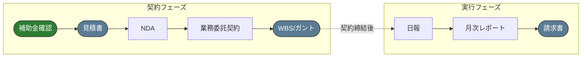
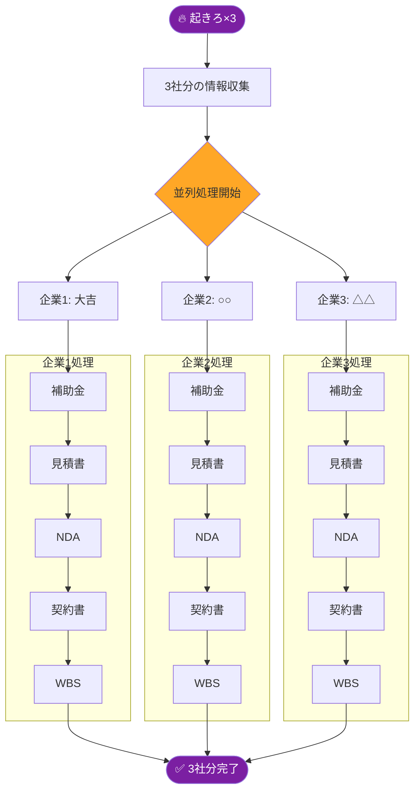
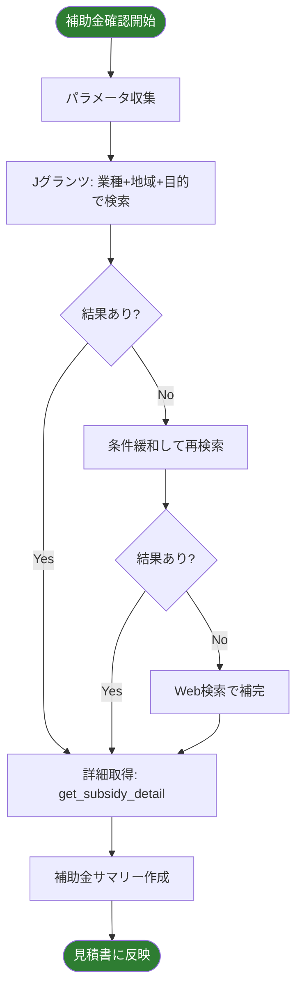

# 株式会社けんけん 業務ワークフロー定義 v3.3

## 会社情報
- **会社名**: 株式会社けんけん
- **住所**: 香川県高松市
- **事業**: IT/DXコンサルティング、生成AIアドバイザリー
- **主要クライアント**: 合同会社大吉、地域企業（香川県）

---

## デザインガイドライン

全ての文書は **Jony Iveデザイン哲学** に準拠する。

| 項目 | 仕様 |
|------|------|
| フォント | メイリオ統一 |
| カラー | グレースケール基調 + アクセント1色（#5B7B94） |
| 原則 | シンプル、余白重視、完璧な整列 |

**参照スキル**: `jony-ive-design-system`

---

## ワークフロー全体構成


---

## マスタートリガー一覧

| トリガー | 実行範囲 | ステップ数 | パラレル実行 |
|---------|---------|-----------|------------|
| **「起きろ」** | 契約フェーズ全体 | 5ステップ | 最大10社同時 |
| **「月締め」** | 実行フェーズ全体 | 3ステップ | 最大20社同時 |
| **「フル実行」** | 契約＋実行フェーズ | 8ステップ | 最大5社同時 |
| **「起きろ×3」** | 3社分の契約フェーズ | 5ステップ×3社 | 3社並列 |
| **「月締め×5」** | 5社分の実行フェーズ | 3ステップ×5社 | 5社並列 |

---

## マスタートリガー①: 「起きろ」（契約フェーズ）

### 実行フロー
```
起きろ → 補助金確認 → 見積 → NDA → 契約 → WBS
```

### 情報収集（契約フェーズ）

#### 単一企業の場合
```
🔥 マスタートリガー「起きろ」を受信しました。

📋 確認事項

【契約情報】
| 項目 | 入力してください |
|------|-----------------|
| クライアント名 | 例：合同会社大吉 |
| 業務内容 | 例：生成AIアドバイザリー |
| 月額金額 | 例：300,000円 |
| 契約期間 | 例：2025年12月〜2026年2月（3ヶ月） |

【補助金検索用】
| 項目 | 入力してください |
|------|-----------------|
| 業種 | 例：サービス業 |
| 従業員数 | 例：5名以下 |
| 対象地域 | 例：香川県 or 全国 |
| 導入目的 | 例：生成AI導入、IT導入 |
```

#### 複数企業の場合（パラレル実行）
```
🔥 マスタートリガー「起きろ×3」を受信しました。

📋 3社分の確認事項（並列処理します）

【企業1】
| 項目 | 入力してください |
|------|-----------------|
| クライアント名 | 例：合同会社大吉 |
| 業務内容 | 例：生成AIアドバイザリー |
| 月額金額 | 例：300,000円 |
| 契約期間 | 例：3ヶ月 |
| 業種 | 例：サービス業 |

【企業2】
| 項目 | 入力してください |
|------|-----------------|
| クライアント名 | 例：株式会社○○ |
| 業務内容 | 例：IT導入支援 |
| 月額金額 | 例：200,000円 |
| 契約期間 | 例：6ヶ月 |
| 業種 | 例：製造業 |

【企業3】
| 項目 | 入力してください |
|------|-----------------|
| クライアント名 | 例：△△商店 |
| 業務内容 | 例：DX推進支援 |
| 月額金額 | 例：150,000円 |
| 契約期間 | 例：12ヶ月 |
| 業種 | 例：小売業 |
```

### 出力ファイル（契約フェーズ）

| ステップ | ファイル名 | 形式 |
|---------|-----------|------|
| 0. 補助金確認 | （見積書に情報反映） | - |
| 1. 見積書 | `quotation_{client}_{date}.xlsx` / `.pdf` | Excel + PDF |
| 2. NDA | `nda_{client}_{date}.docx` | Word |
| 3. 契約書 | `contract_{client}_{date}.docx` | Word |
| 4. WBS | `gantt_{client}_{date}.xlsx` | Excel |

---

## マスタートリガー②: 「月締め」（実行フェーズ）

### 実行フロー
```
月締め → 日報集計 → 月次レポート → 請求書
```

### 情報収集（実行フェーズ）

#### 単一企業の場合
```
🔥 マスタートリガー「月締め」を受信しました。

📋 確認事項

| 項目 | 入力してください |
|------|-----------------|
| クライアント名 | 例：合同会社大吉 |
| 対象月 | 例：2025年12月 |
| 請求金額 | 例：300,000円（税別） |
| 支払期限 | 例：2026年1月31日 |
```

#### 複数企業の場合（パラレル実行）
```
🔥 マスタートリガー「月締め×5」を受信しました。

📋 5社分の確認事項（並列処理します）

【企業1: 合同会社大吉】
| 項目 | 入力してください |
|------|-----------------|
| 対象月 | 例：2025年12月 |
| 請求金額 | 例：300,000円 |

【企業2: 株式会社○○】
| 項目 | 入力してください |
|------|-----------------|
| 対象月 | 例：2025年12月 |
| 請求金額 | 例：200,000円 |

【企業3: △△商店】
| 項目 | 入力してください |
|------|-----------------|
| 対象月 | 例：2025年12月 |
| 請求金額 | 例：150,000円 |

【企業4: □□工業】
| 項目 | 入力してください |
|------|-----------------|
| 対象月 | 例：2025年12月 |
| 請求金額 | 例：250,000円 |

【企業5: ◇◇サービス】
| 項目 | 入力してください |
|------|-----------------|
| 対象月 | 例：2025年12月 |
| 請求金額 | 例：180,000円 |

※ 支払期限は全て翌月末日で統一
```

### 出力ファイル（実行フェーズ）

| ステップ | ファイル名 | 形式 |
|---------|-----------|------|
| 5. 日報集計 | （月次レポートに統合） | - |
| 6. 月次レポート | `monthly_report_{client}_{month}.docx` | Word |
| 7. 請求書 | `invoice_{client}_{month}.xlsx` / `.pdf` | Excel + PDF |

---

## マスタートリガー③: 「フル実行」（全フェーズ）

### 実行フロー
```
フル実行 → [契約フェーズ] → [実行フェーズ]
```

---

## パラレル実行の仕組み

### パラレル実行のメリット

| メリット | 説明 |
|---------|------|
| **時間短縮** | 5社分の処理を個別に行うと25ステップ → パラレルで5ステップに短縮 |
| **一括管理** | 複数企業の進捗を同時に確認可能 |
| **効率化** | 補助金検索など共通処理を1回で実行 |
| **統一性** | 同じフォーマット・デザインで一括作成 |

### パラレル実行フロー


### 実行例

#### コマンド例
```
「起きろ×3」
「月締め×5」
「フル実行×2」
```

#### 出力フォルダ構造
```
outputs/
├── 2025-12-01_batch_契約/
│   ├── 大吉/
│   │   ├── quotation_大吉_20251201.xlsx
│   │   ├── quotation_大吉_20251201.pdf
│   │   ├── nda_大吉_20251201.docx
│   │   ├── contract_大吉_20251201.docx
│   │   └── gantt_大吉_20251201.xlsx
│   ├── ○○/
│   │   └── （同様のファイル群）
│   └── △△/
│       └── （同様のファイル群）
└── summary_batch_20251201.txt（処理サマリー）
```

---

## スキル一覧

### 契約フェーズスキル

| ステップ | スキル名 | パス | 出力形式 |
|---------|---------|------|---------|
| 0. 補助金確認 | **jgrants-mcp** | Jグランツ MCP | 見積書への注記 |
| 1. 見積書 | billing-documents | `billing-documents/` | Excel + PDF |
| 2. NDA | nda-generator | `nda-generator/` | Word |
| 3. 契約書 | consulting-contract-generator | `consulting-contract-generator/` | Word |
| 4. WBS/ガント | gantt-chart-generator | `gantt-chart-generator/` | Excel |

### 実行フェーズスキル

| ステップ | スキル名 | パス | 出力形式 |
|---------|---------|------|---------|
| 5. 日報 | daily-report-voice | `daily-report-voice/` | Excel |
| 6. 月次レポート | monthly-report-generator | `monthly-report-generator/` | Word |
| 7. 請求書 | billing-documents | `billing-documents/` | Excel + PDF |

---

## 補助金確認フロー詳細（STEP 0）

### トリガーキーワード
- 「補助金を確認」「助成金を調べて」「使える補助金」
- 「Jグランツで検索」「補助金検索」
- マスタートリガー「起きろ」「フル実行」で自動発動

### 入力パラメータ

| パラメータ | Jグランツ API | 選択肢例 |
|-----------|--------------|---------|
| keyword | 必須 | IT、DX、生成AI、デジタル化 など |
| target_area_search | 任意 | 香川県、四国地方、全国 |
| industry | 任意 | サービス業、製造業、小売業 など |
| target_number_of_employees | 任意 | 5名以下、20名以下、50名以下 など |
| use_purpose | 任意 | 設備整備・IT導入をしたい など |
| acceptance | 任意（デフォルト1） | 1=受付中のみ |

### 検索ロジック


### 見積書への反映

見積書の備考欄または別紙として以下を追記：
```
【補助金・助成金情報】（{検索日}時点）

本サービスは以下の補助金の対象となる可能性があります：

1. {補助金名}
   - 補助上限: {金額}
   - 補助率: {率}
   - 申請締切: {日付}
   
※上記は参考情報です。採択を保証するものではありません。
※詳細は各補助金の公式サイトをご確認ください。
※出典：Jグランツ（https://www.jgrants-portal.go.jp/）
```

---

## スキル発動ルール

### 契約フェーズ

#### 0. 補助金確認（jgrants-mcp）

**トリガーキーワード**:
- 「補助金」「助成金」「Jグランツ」「公的支援」
- マスタートリガー「起きろ」「フル実行」で自動発動

**使用ツール**:
- `jgrants:search_subsidies` - 補助金検索
- `jgrants:get_subsidy_detail` - 詳細取得
- `web_search` - Jグランツで見つからない場合の補完

**出力**: 見積書の備考欄に反映

**次ステップ**: 
> 「補助金情報を確認しました。この情報を反映した見積書を作成します。」

---

#### 1. 見積書（billing-documents → quotation）

**トリガーキーワード**:
- 「見積書を作成」「見積もり」「提案の見積書」

**補助金連携**: STEP 0の結果を備考欄に自動反映

**出力**: Excel + PDF（両方）

**次ステップ提案**: 
> 「見積書を作成しました（補助金情報を反映済み）。続けてNDAを作成します。」

---

#### 2. NDA（nda-generator）

**トリガーキーワード**:
- 「NDA」「機密保持契約」「秘密保持契約」

**出力**: Word（.docx）

**次ステップ提案**: 
> 「NDAを作成しました。続けて業務委託契約書を作成します。」

---

#### 3. 業務委託契約書（consulting-contract-generator）

**トリガーキーワード**:
- 「業務委託契約」「コンサル契約」「顧問契約」

**出力**: Word（.docx）

**次ステップ提案**: 
> 「契約書を作成しました。この契約内容からWBS/ガントチャートを作成します。」

**連携データ**（gantt-chart-generatorへ渡す）:
- 契約期間（開始日・終了日）
- 業務内容リスト
- 想定マイルストーン

---

#### 4. WBS/ガントチャート（gantt-chart-generator）

**トリガーキーワード**:
- 「WBS」「ガントチャート」「スケジュール」「プロジェクト計画」

**入力パターン**:

| パターン | 説明 |
|---------|------|
| A: 契約書から | 直前の契約書から期間・フェーズを自動抽出 |
| B: 自然言語から | ユーザーの説明からタスクを構造化 |

**出力**: Excel（2シート構成）

**完了メッセージ**:
> 「WBS/ガントチャートを作成しました。契約フェーズ完了です。」

---

### 実行フェーズ

#### 5. 日報（daily-report-voice）

**トリガーキーワード**:
- 「日報」「今日の作業報告」「業務報告」
- 音声入力テキスト

**出力**: Excel（5列形式：日付、報告者、作業内容、課題、次回予定）

**連携**: Google Drive自動保存 → Workspace Flows連携

---

#### 6. 月次レポート（monthly-report-generator）

**トリガーキーワード**:
- 「月次レポート」「月報」「活動報告」
- 「今月のまとめ」「〇月分のレポート」
- マスタートリガー「月締め」で自動発動

**入力**: 日報データ（Google Driveから自動取得）

**出力**: Word（A4縦2ページ）

**次ステップ提案**: 
> 「月次レポートを作成しました。続けて請求書を作成します。」

---

#### 7. 請求書（billing-documents → invoice）

**トリガーキーワード**:
- 「請求書」「インボイス」「〇月分の請求」
- マスタートリガー「月締め」で自動発動

**出力**: Excel + PDF（両方）

**完了メッセージ**:
> 「請求書を作成しました。実行フェーズ完了です。」

---

## 補助スキル

| スキル名 | 用途 |
|---------|------|
| mermaid-flow-generator | フロー図・ダイアグラム生成 |
| hearing-sheet-generator | 初回商談ヒアリングシート |
| manual-generator | 業務マニュアル・手順書 |
| seminar-resume-generator | セミナー配布資料 |
| contract-analyzer | 契約書リスク分析 |
| comparison-table-v2 | 新旧対比表 |
| meeting-to-tasksheet | 会議→議事録・タスク管理 |

### データ分析スキル

| スキル名 | 用途 |
|---------|------|
| data-cleaner | データ前処理・クリーニング |
| sales-analyzer-xlsx | 売上分析・ABC分析 |
| smart-chart-generator | 自動チャート生成 |

### 業務運用スキル

| スキル名 | 用途 |
|---------|------|
| shift-scheduler | シフト表自動生成 |

### メタスキル

| スキル名 | 用途 |
|---------|------|
| agent-skill-planner | 新規スキル設計支援 |
| jony-ive-design-system | デザインガイドライン |

---

## 自動連携ルール

### 契約フェーズ（「起きろ」トリガー）
```
0. jgrants-mcp → 補助金確認
1. billing-documents(quotation) → 見積書（補助金情報反映）
2. nda-generator → NDA
3. consulting-contract-generator → 業務委託契約書
4. gantt-chart-generator → WBS/ガントチャート
```

### 実行フェーズ（「月締め」トリガー）
```
5. daily-report-voice → 日報データ確認・集計
6. monthly-report-generator → 月次レポート
7. billing-documents(invoice) → 請求書
```

### フル実行（「フル実行」トリガー）
```
契約フェーズ（0〜4） → 実行フェーズ（5〜7）
```

---

## 補助金検索の条件緩和ロジック

Jグランツで結果が0件の場合、以下の順で条件を緩和して再検索：
```
1回目: 全条件で検索
  ↓ 0件
2回目: 地域を「全国」に変更
  ↓ 0件
3回目: 業種条件を除外
  ↓ 0件
4回目: キーワードを汎用語に変更
  ↓ 0件
5回目: Web検索で補完
```

---

## 注意事項

1. **スキル境界の遵守**: 各スキルは定義された範囲内でのみ動作
2. **デザイン一貫性**: 全文書でJony Iveデザインを適用
3. **補助金情報の免責**: 補助金情報は参考情報であり、採択を保証しない旨を明記
4. **ファイル出力先**: 作成されたファイルは適切な場所に保存
5. **法的免責**: 契約書類は参考文書であり、重要な契約は法務専門家のレビューを推奨
6. **出典明記**: 補助金情報には「Jグランツからの出典」を必ず記載

---

## バージョン履歴

| バージョン | 日付 | 変更内容 |
|-----------|------|----------|
| v3.3 | 2025-12 | 補助金確認フロー（STEP 0）追加、Jグランツ MCP連携、フェーズ分離（契約/実行）、マスタートリガー3種（起きろ/月締め/フル実行） |
| v3.2 | 2025-12 | マスタートリガー応答フォーマット簡素化 |
| v3.1 | 2025-12 | マスタートリガー「起きろ」追加 |
| v3.0 | 2025-12 | スキル統合、Mermaid連携追加 |

---

## スキル総数

| カテゴリ | スキル数 |
|---------|---------|
| 補助金確認（MCP） | 1 |
| 契約フェーズ | 4 |
| 実行フェーズ | 3 |
| 補助スキル | 7 |
| データ分析 | 3 |
| 業務運用 | 1 |
| メタスキル | 2 |
| **合計** | **21** |